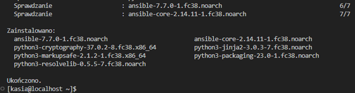

# Sprawozadnie Lab3

## Cel ćwiczenia:
Celem ćwiczenia było zapoznanie się z narzędziami do automatyzacji instalacji maszyn oraz zarządzania nimi zdalnie.

## Wykorzystywane narzędzia:
- VirtualBox -> do wirtualizacji maszyny Fedora w wersji 38
- Git -> do pracy na repozytoriach z Github, domyślnie zainstalowany na Fedorze
- Docker -> do konteneryzacji,
- SSH -> do komunikacji między maszynami, hostem i repozytorium,
- Ansible -> proces instalacji dalej w sprawozdaniu,
- Ngnix -> proces instalacji dalej w sprawozdaniu,
- Visual Studio Code -> do pracy nad sprawozdaniem,

## Komunikajca między maszynami:
Na maszynach ustawiamy hostname: podajemy tu ip maszyny vm1 i jej nazwę.
```
[kasia@vm2 ~]$ sudo yum install ansible

```


Ustawiamy hostname maszyn vm1 i vm2

```
hostnamectl set-hostname vm1
sudo reboot
hostnamectl set-hostname vm2
sudo reboot

```


## Klucze SSH między maszynami:
Generujemy na vm2 klucz RSA. Po wykonaniu tego polecenia, zostaną utworzone dwa pliki: prywatny klucz (id_rsa) i publiczny klucz (id_rsa.pub). Prywatny klucz powinien być trzymany tylko na lokalnym systemie, natomiast publiczny klucz zostanie użyty do uwierzytelniania na zdalnym serwerze. To samo robimy dla vm1
Skonfigurowałam poniżej ruch w obie strony przez klucze.

Wymiana kluczy jest możliwa przy użyciu komendy:

```
[kasia@vm2 .ssh]$ ssh-keygen -t rsa -b 4096
[kasia@vm1 .ssh]$ ssh-keygen -t rsa -b 4096

```


Następnie utworzony klucz publiczny z vm1 kopiujemy na zdalny serwer o nazwie vm2 dla użytkownika kasia, to pozwoli nam na logowanie się na ten serwer bez konieczności wpisywania hasła

```
[kasia@vm1 .ssh]$ ssh-copy-id kasia@vm2
```


To samo dla vm1 

```
[kasia@vm2 .ssh]$ ssh-copy-id kasia@vm1
```
Sprawdzamy połączenie 


## Ansible
Ansible to narzędzie do automatyzacji pracy, które umożliwia zarządzanie konfiguracją, wdrożenia aplikacji, i wykonywanie różnorodnych zadań związanych z zarządzaniem infrastrukturą informatyczną.

Tworzymy plik inventory i wykonujemy pinga

```
[kasia@vm1 ansible]$  vi inventory.ini
[myhosts]
192.168.0.150                      
[kasia@vm1 ansible]$ ansible myhosts -m ping -i inventory.ini

```


## Playbook:
Celem playbooka jest skopiowanie wcześniej utworzonego pliku env.txt na vm2.
Plik towrzymy komendą:

```bash
[kasia@vm1 ansible]$ env > env_file
```


Plik kopiujemy na klienta wykorzystując moduł copy w ansible:

```bash
tasks:
  - name: File Copy
    copy:
      src: /home/kasia/ansible/env.txt
      dest: /home/kasia/uploads/env.txt
```

Po wykonaniu playbooka nasz plik będzie się znajdywał na kliecnie w wskazanej ścieżce
Od razu też przygotowałam reszte playbooka na pozostałe zadania: czyli oprócz kopiowania, wykonamy instalacje dockera, uruchomienie usługi, utworzenie kontenera z Fedora oraz kontenera z nginx


Uruchomienie playbooka:

```bash
[kasia@vm1 ansible]$ ansible-playbook -i inventory.ini -u kasia --ask-become-pass playbook.yml
```

Wynik playbooka:


Jak widzimy całość instrukcji została wykonana bez błędów.
Sprawdzamy maszynę vm2 i widzimy skopiowany plik:


## Kickstarter
Kickstart to mechanizm automatycznego instalowania systemu operacyjnego. Jest to narzędzie, które umożliwia administratorom skonfigurowanie i zautomatyzowanie procesu instalacji systemu, co pozwala na jednolite wdrożenia na wielu maszynach.

W wypadku Fedory po instalacji na maszynie znajduje się plik:
anaconda-ks.cfg

Plik przed edycją


- wskazane repozytorium:
```bash
#repo
url --mirrorlist=http://mirrors.fedoraproject.org/mirrorlist?repo=fedora-38&arch=x86_64
repo --name=updates --mirrorlist=http://mirrors.fedoraproject.org/mirrorlist?repo=updates-released-f38&arch=x86_64
```
- sekcję odpowiedzialną za instalację odpowiednich pakietów:
```bash
#packages
%packages
python3
docker
%end
```
- sekcje post install, która ma uruchomić usługę docker oraz uruchomić wybrany kontener:
```bash
#post
%post
systemctl start docker
systemctl enable docker
docker run -d -p 80:80 --name lighttpd-container jitesoft/lighttpd
%end
```
Plik po edycji


Przygotowany plik wrzuciłam na repozytorium, skąd będę go później linkowała w instalacji z użyciem raw linka.
Na nowo utworzonej maszynie w Virtualboxie dodaje ISO Fedory i ustawiam jako pierwsze do bootowania.

Wklejamy zamiast poprzedniego quiet wartość: https://raw.githubusercontent.com/InzynieriaOprogramowaniaAGH/MDO2024/KB408940/GCL1/KB408940/Lab3/anaconda-ks.cfg


Dzięki temu podczas instalacji zostanie użyty powyższy plik odpowiedzi. Instalator nie pyta nas o nic i samoczynnie rozpoczyna pracę.


Weryfikujemy zainstalowane narzędzia


