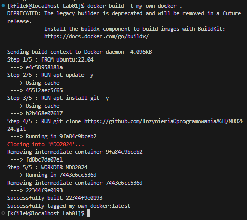

# Sprawozdanie 1 - konteneryzacja docker

## Wstęp, abstrakt sprawozdania

Celem ćwiczenia jest konteneryzacja wybranego programu open source w sposób zawierający:

- image (obraz) budujący repozytorium
- testy jednostkowe na podstawie zbudowanego repozytorium.

Jako przykład wybrano projekt seasocks napisany w zasadniczej części w C++. Autorem tego przedwsięwzięcia jest Matt Godbolt, człowiek odpowiedzialny za inny bardzo znany projekt: [`godbolt`](https://godbolt.org), czyli narzędzie webowe do testowania, wykonywania i analizy kodu generowanego (na poziomie assembly) przez powszechnie dostępne kompilatory np. clang, gcc, icc (wraz z możliwością wyboru wersji, bibliotek, architektur sprzętowych, opcji kompilacji, lub wyboru języka programowania).
Powracając do tematu, jest to biblioteka implementująca serwer obsługujący komunikację protokołu websocket. Repozytorium zawiera przykładowe użycie biblioteki oraz testy jednostkowe. W rozwiązaniu stosowany jest system generowania skryptów budujących oraz testujących znany jako CMake - bardzo popularny o ile nie najpowszechniejszy w przypadku C++. Testy jednostkowe realizowane są za pomocą modułu [catch2](https://github.com/catchorg/Catch2). Wybór repozytorium poparty jest ustanowioną licencją BSD oraz prostotą budowania.

## Przebieg

### Zainstalowana instancja linuxa spod dystrybucji `Fedora`, konfiguracja git i kluczy SSH

```bash
[kfilek@localhost Sprawozdanie1]$ uname -a
Linux localhost.localdomain 6.2.9-300.fc38.x86_64 #1 SMP PREEMPT_DYNAMIC Thu Mar 30 22:32:58 UTC 2023 x86_64 GNU/Linux
[kfilek@localhost Sprawozdanie1]$
```

Dostęp do maszyny odbywa się za pośrednictwem interfejsu rozszerzenia VS code.

Dostęp git przy użyciu protokołu SSH:


Dodano dwa klucze publiczne - jeden z hasłem (passphrase), drugi bez hasła:


***

### Utworzono branch w nazwie posiadającym inicjały autora oraz identyfikator studenckiego albumu:


***

### Utworzono skrypt githook zlokalizowany w `KF408636/Lab01/commit-msg`

Skrypt weryfikuje nazwy commitów. Przykładowo źle wprowadzana nazwa commita:


Właściwe użycie skutkuje utworzeniem commita ze zmianami:


"Wypchnięcie" zmian do zdalnego repozytorium:


***

### Test zabezpieczeń gałęzi repozytorium

Sklonowano repozytorium zajęć do osobnego katalogu:


Przełączono na gałąź autora sprawozdania:


Upewnienie się, co do commitów zawartych w branchu studenta:


Przełączenie się do gałęzi grupowej:


Próba zmerge'owania, zakończona pomyślnie (lokalnie):


Następująca próba wypchnięcia zmian, zakończona fiaskiem. Autor repozytorium (prowadzący), zabezpieczył  branch przed niepożądanym merge'owaniem. </br>
Jedynym sposobem udzielania się w repozytorium, jest tworzenie tzw. pull-request'ów.


***

### Docker podstawy działania

Po zainstalowaniu dockera (za pomocą narzędzia do zarządzania pakietami dnf):


Należy pamiętać by wywołać polecenie włączające serwis (daemon) dockera:

```bash
$ sudo systemctl start docker
```

By nie uruchamiać dockera za każdym razem z poziomu 
administratora (użytkownika root) zastosowano:

```bash
$ sudo groupadd docker
$ sudo usermod -aG docker $USER
```

Po czym zrestartowano system.</br>

Sprawdzenie działania najprostszego obrazu - klasycznego **hello-world**:


Uruchomienie interaktywne kontenera. Praca w "środku" kontenera.


Uruchomione procesy (wszystkie, a także te które już nie pracują). </br>
Widoczny proces busybox:


Proces PID1 w kontenerze to powłoka `sh`:


Aktualizacja repozytoriów pakietów w kontenerze ubuntu:


Bardzo prosty plik `KF408636/Lab01/Dockerfile`, zawierający jako bazowy obraz `ubuntu:22.04`, klonujący repozytorium zajęć. </br>
Budowa nowego obrazu odbywa się za pomocą polecenia:



Obraz został otagowany (nazwany) jako `my-own-docker`. </br>
Uruchomienie interaktywne w nowo utworzonego kontenera:


Po opuszczeniu interaktywnej powłoki, sprawdzono uruchomione instancje kontenerów:


Usunięcie WSZYSTKICH wylistowanych kontenerów, wraz ze sprawdzeniem rezultatu polecenia. </br>
Jak widać przebiegło ono pomyślnie:


***

###

TODO: opis lab02
