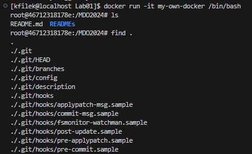
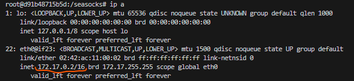

# Sprawozdanie 1 - konfiguracja środowiska, zdalnego dostępu  github oraz konteneryzacja w narzędziu docker

## Wstęp, ogólny zarys ćwiczeń

Celem ćwiczenia jest konteneryzacja wybranego programu open source w sposób zawierający:

- image (obraz) budujący repozytorium
- testy jednostkowe na podstawie zbudowanego repozytorium.

Jako przykład wybrano projekt seasocks napisany w zasadniczej części w C++. Autorem tego przedwsięwzięcia jest Matt Godbolt, człowiek odpowiedzialny za inny bardzo znany projekt: [`godbolt`](https://godbolt.org), czyli narzędzie webowe do testowania, wykonywania i analizy kodu generowanego (na poziomie assembly) przez powszechnie dostępne kompilatory np. clang, gcc, icc (wraz z możliwością wyboru wersji, bibliotek, architektur sprzętowych, opcji kompilacji, lub wyboru języka programowania). </br>
Powracając do tematu, jest to biblioteka implementująca serwer obsługujący komunikację protokołu websocket. Repozytorium zawiera przykładowe użycie biblioteki oraz testy jednostkowe. W rozwiązaniu stosowany jest system generowania skryptów budujących oraz testujących znany jako CMake - bardzo popularny o ile nie najpowszechniejszy w przypadku C++. Testy jednostkowe realizowane są za pomocą modułu [catch2](https://github.com/catchorg/Catch2). Wybór repozytorium poparty jest ustanowioną licencją BSD oraz prostotą budowania. </br>

Pierwsza część tego dokumentu zawiera także informacje o wstępnej konfiguracji systemu, na którym pracuje autor sprawozdania.

## Przebieg

### Zainstalowana instancja linuxa spod dystrybucji `Fedora`, konfiguracja git i kluczy SSH

```bash
[kfilek@localhost Sprawozdanie1]$ uname -a
Linux localhost.localdomain 6.2.9-300.fc38.x86_64 #1 SMP PREEMPT_DYNAMIC Thu Mar 30 22:32:58 UTC 2023 x86_64 GNU/Linux
[kfilek@localhost Sprawozdanie1]$
```

Dostęp do maszyny odbywa się za pośrednictwem interfejsu rozszerzenia VS code.

Dostęp git przy użyciu protokołu SSH:


Dodano dwa klucze publiczne - jeden z hasłem (passphrase), drugi bez hasła:


***

### Utworzono branch w nazwie posiadającym inicjały autora oraz identyfikator studenckiego albumu:


***

### Utworzono skrypt githook zlokalizowany w `KF408636/Lab01/commit-msg`

Skrypt weryfikuje nazwy commitów. Przykładowo źle wprowadzana nazwa commita:


Właściwe użycie skutkuje utworzeniem commita ze zmianami:


"Wypchnięcie" zmian do zdalnego repozytorium:


***

### Test zabezpieczeń gałęzi repozytorium

Sklonowano repozytorium zajęć do osobnego katalogu:


Przełączono na gałąź autora sprawozdania:


Upewnienie się, co do commitów zawartych w branchu studenta:


Przełączenie się do gałęzi grupowej:


Próba zmerge'owania, zakończona pomyślnie (lokalnie):


Następująca próba wypchnięcia zmian, zakończona fiaskiem. Autor repozytorium (prowadzący), zabezpieczył  branch przed niepożądanym merge'owaniem. </br>
Jedynym sposobem udzielania się w repozytorium, jest tworzenie tzw. pull-request'ów.


***

### Docker podstawy działania

Po zainstalowaniu dockera (za pomocą narzędzia do zarządzania pakietami dnf):


Należy pamiętać by wywołać polecenie włączające serwis (daemon) dockera:

```bash
$ sudo systemctl start docker
```

By nie uruchamiać dockera za każdym razem z poziomu 
administratora (użytkownika root) zastosowano:

```bash
$ sudo groupadd docker
$ sudo usermod -aG docker $USER
```

Po czym zrestartowano system.</br>

Sprawdzenie działania najprostszego obrazu - klasycznego **hello-world**:


Uruchomienie interaktywne kontenera. Praca w "środku" kontenera.


Uruchomione procesy (wszystkie, a także te które już nie pracują). </br>
Widoczny proces busybox:


Proces PID1 w kontenerze to powłoka `sh`:


Aktualizacja repozytoriów pakietów w kontenerze ubuntu:


Bardzo prosty plik `KF408636/Lab01/Dockerfile`, zawierający jako bazowy obraz `ubuntu:22.04`, klonujący repozytorium zajęć. </br>
Budowa nowego obrazu odbywa się za pomocą polecenia:


Obraz został otagowany (nazwany) jako `my-own-docker`. </br>
Uruchomienie interaktywne w nowo utworzonego kontenera:



Po opuszczeniu interaktywnej powłoki, sprawdzono uruchomione instancje kontenerów:


Usunięcie WSZYSTKICH wylistowanych kontenerów (kiedykolwiek uruchamianych), wraz ze sprawdzeniem rezultatu polecenia. </br>
Jak widać przebiegło ono pomyślnie:


***

### Konteneryzacja projektu seasocks

Do budowy tego projektu potrzebny jest jakikolwiek kompilator języka C/C++. Postawiono na toolchain `gcc`. </br>
Jako bazę - obraz, do konteneryzacji wykorzystano [`ubuntu`](https://hub.docker.com/_/ubuntu), w wersji 22.04. Wybór ten podyktowany jest przede wszystkim faktem, że jest to dystrybucja Linuxa, posiadająca dobre wsparcie społeczności oraz wydłużony okres wsparcia (LTS). Nie wyklucza to jednak możliwości użycia innego obrazu np. `fedora`, `alpine`, `rockylinux` etc. Oczywiście, w każdym z nich napotkamy się na różny zestaw zainstalowanych narzędzi czy też utylitariów. Będą różniły się także systemy menadżerów pakietów co trzeba mieć na uwadze. Dlatego image `ubuntu` wybrano jako solidny fundament kontenera.
Dobrym wyborem mógłby się także okazać obraz po prostu [`gcc`](https://hub.docker.com/_/gcc/). Jest to gotowy toolchain zawierający kompilator C/C++, bazowany na dystrybucji debian (bullseye lub alpine na stan listopad 2023).</br>

Wpierw rozpoczęto interaktywną pracę w kontenerze `ubuntu`:


Następnie, zaktualizowano repozytoria:


Po czym doinstalowano potrzebne zależności:

- git
- make
- cmake
- build-essential
- zlib1g-dev
- python3


Pomyślny rezultat instalacji:


Pobranie repozytorium seasocks:


Wygenerowanie skryptów budowania, wraz z testami jednostkowymi (opcja `UNITTEST=ON`):


Kompilacja projektu wraz z testami. Flaga `-j` wykorzystana w celu współbieżnej kompilacji źródeł (przyspieszenie procesu):


Pomyślny rezultat kompilacji:


Przeprowadzenie testów jednostkowych. By raport testów nie był zbyt skromny, wykorzystano flagę `--verbose`, dla bardziej szczegółowej i większej ilości informacji:


Plik binarny `AllTests` przeprowadza testy jednostkowe.</br>
Poniżej próba uruchomienia przykładowego demo:


Można przeprowadzić prosty test komunikacji. Sprawdźmy IP docker'owego kontenera (wymaga instalacji pakietu `iproute2`):



Uruchamiamy serwer websocket:


Następnie, z poziomu fedory, łączymy się z uruchomionym kontenerem. Jako klienta websocket można wykorzystać moduł `python3` o nazwie `websockets`. Oczywiście wymagają one instalacji w instancji fedory np. poprzez `pip3`. Przykładowy skrypt klienta zawarty jest w katalogu `Lab02/websocket-cli.py`. W zależności od IP kontenera, może być wymagana odpowiednia jego zmiana w tymże skrypcie. Skrypt po połączeniu wysyła do endpointa websocket liczby.</br>
Rezultat połączenia:


Serwer (na dockerze) websocketów i jego reakcja:


Jak widać komunikacja przebiegła pomyślnie. Serwer przechowuje swój stan liczby, zwiększa ją o 1, gdy jakikolwiek połączony klient spróbuje ją ustawić. Gdy wartość przesłana przez klienta jest większa od obecnego stanu, nowa wartość jest przesyłana do wszystkich połączonych klientów (w tym przypadku jednego).

***

Zbliżając się ku finiszu, utworzono dwa pliki Dockerfile realizujące powyższe zadania:

- `Dockerfile.build`, odpowiedzialny za budowę obrazu wraz z weń zawartą aplikacją.
- `Dockerfile.test`, której bazą jest powyższy obraz. Służy do wykonania testów jednostkowych aplikacji.

Do budowy obrazu użyto polecenia (zakładając że użytkownik znajduje się w katalogu `Lab02/`):

```bash
$ docker build -t seasocks -f Dockerfile.build .
```


Utworzony pomyślnie obraz konteneru `seasocks`:


Następnie należy zbudować obraz testów (na bazie poprzednio zbudowanego `seasocks`):

```bash
$ docker build -t seasocks-test -f Dockerfile.test .
```

Zbudowane obrazu testów, wraz z ich wykonaniem:


Testowe uruchomienie obrazu builda aplikacji:


Uruchomienie testów jednostkowych:


Testy wykonują się pomyślnie, obraz jest gotowy do dalszego wdrożenia. </br>

W pliku `Lab02/cmd.history` zawarta jest historia poleceń VM fedora.
