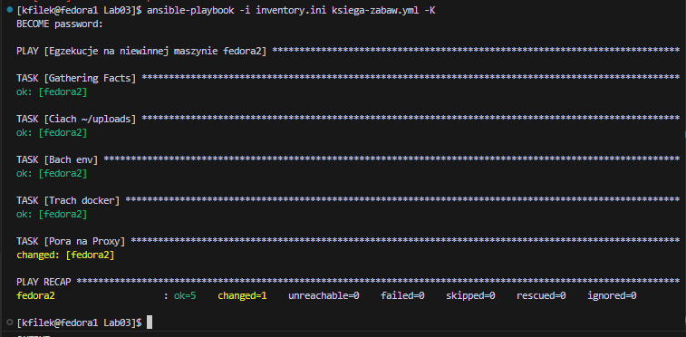
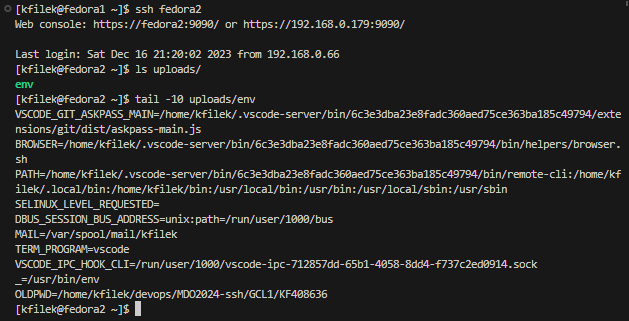
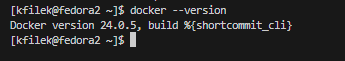
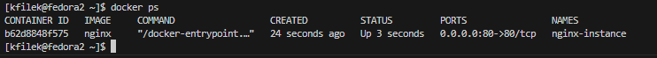
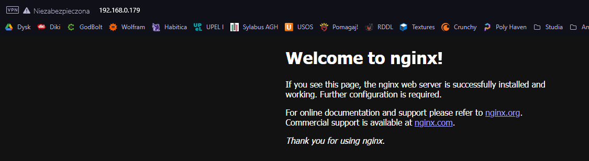
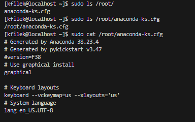
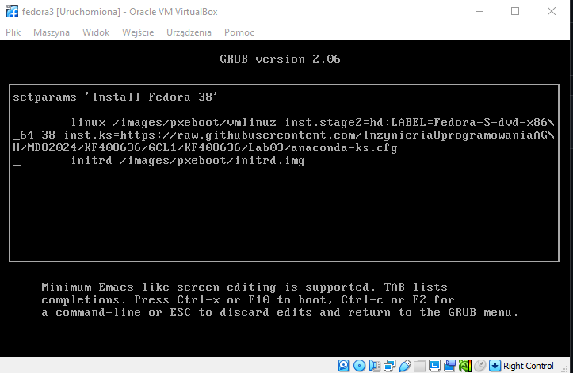
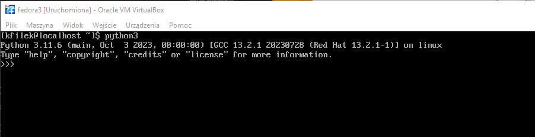
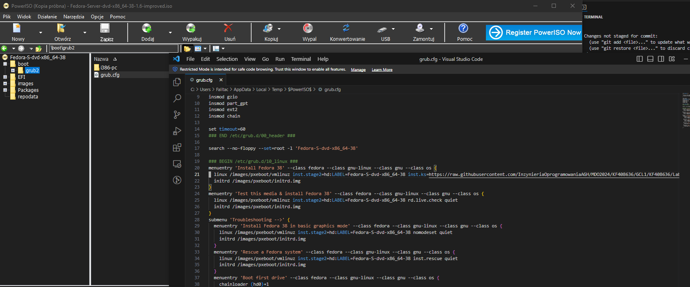

# Sprawozdanie 2

## Wstęp

DevOps, jako nauka/filozofia interydyscyplinarna w IT porusza wiele jej dziedzin.
Temat tego laboratorium dotyczy sfery bliższej przedmiotowi systemom operacyjnym.
</br>

Do głównych zadań należało:

1. Zapoznanie się, instalacja i obsługa narzędzia administracyjnego `Ansible`.
2. Instalacja nowego systemu Fedora, na podstawie wstępnego pliku odpowiedzi (kickstart).

## Przebieg

### Ansible

Utworzono drugą maszynę z Fedora server 38. Widok po zalogowaniu:


Połączone w topologie mostka sieciowego (bridge).</br>
IP maszyn:

1. `fedora1` 192.168.0.66
2. `fedora2` 192.168.0.179


Na pierwotnej maszynie zainstalowano pakiet ansible:


Ustalamy nazwy hostów, na pierwszej i drugiej maszynie:


Ustalenie w pliku `/etc/hosts` "aliasów" nazwa <-> IP:


Analogicznie przeprowadzono modyfikacje na maszynie `fedora2`</br>

Test, polegający na przesłaniu testowego pakietu ICMP z `fedora1` -> `fedora2`


Utworzono plik `Lab03/inventory.ini`, weryfikujemy listując z pomocą `ansible`:


Teraz próba pingu za pomocą ansible (na podstawie pliku w repozytorium (`Lab03/inventory.ini`):


Kopia utworzonych kluczy SSH:


Ten klucz wymaga ciągłego wpisywania hasła wygenerowanego klucza (passphrase).
Pewną "wygodą" w komunikacji może okazać się skonfigurowanie agenta ssh. Jest to [program](https://www.ssh.com/academy/ssh/agent) pomocniczy, zarządzający kluczami prywatnymi (zapisuje passphrase na przyszłość).</br>
Wchodzi on w skład pakietu paczek SSH. Skonfigurowany w poniższy sposób, działa na czas odbywania sesji powłoki `/bin/bash`.


Z kolei na maszynie `fedora2`, należy prawidłowo ustawić uprawnienia dla pliku `~/.ssh/authorized_keys`:


Jak wspomniał autor `ssh-agent` działa **jedynie** podczas sesji powłoki bash. Aby ten program działał w każdej nowej instancji `basha`, należy dodać taki zapis do `~/.bash_profile` ([źródło](https://stackoverflow.com/a/18915067)):

```bash
SSH_ENV="$HOME/.ssh/agent-environment"

function start_agent {
    echo "Initialising new SSH agent..."
    /usr/bin/ssh-agent | sed 's/^echo/#echo/' > "${SSH_ENV}"
    echo succeeded
    chmod 600 "${SSH_ENV}"
    . "${SSH_ENV}" > /dev/null
    /usr/bin/ssh-add;
}

# Source SSH settings, if applicable

if [ -f "${SSH_ENV}" ]; then
    . "${SSH_ENV}" > /dev/null
    #ps ${SSH_AGENT_PID} doesn't work under cywgin
    ps -ef | grep ${SSH_AGENT_PID} | grep ssh-agent$ > /dev/null || {
        start_agent;
    }
else
    start_agent;
fi
```

Skrypt ten sprawdza czy aktualnie działa proces `ssh-agent`, i w razie potrzeby uruchamia go.</br>
By nie restartować systemu do zaaplikowania zmian, można użyć polecenia następującego:


Jak widać możemy bez problemu łączyć się z `fedora2`, bez pytania o hasło i passphrase klucza.</br>

Przechodzimy do finalnych zadań z ansible. Wykonano dump lokalnego środowiska `env` do pliku `Lab03/local-env`:


Teraz pora na ansible playbook. Plik [ksiega-zabaw.yml](ksiega-zabaw.yml), zawiera spis zadań, przeprowadzonych na wszystkich inwentaryzowanych maszynach `myhosts`. Do zadań kolejno należą:

- Utworzenie katalogu `~/uploads`
- Skopiowanie zawartości pliku `local-env` do zdefiniowanych maszyn.
- Instalacja dockera
- Uruchomienie dockera
- Uruchomienie nginx

Playbook zawiera klucz-wartość `become: true`, co oznacza że wykonamy eskalacje przywilejów do poziomu użytkownika `root`.
Uruchamiamy playbook:



I sprawdzamy efekty, plik env na `fedora2`:



Fakt zainstalowanego dockera:



Działający kontener `nginx` (oznaczony jako `nginx-instance`)



A teraz z maszyny gospodarza w przeglądarce możemy sprawdzić:



### Kickstart

Teraz instalujemy maszynę automatycznie, z pomocą pliku odpowiedzi wygenerowanego podczas instalacji maszyny `fedora2`. Znajdujemy go w:



Skopiowany, został zapisany w repozytorium jako [anaconda-ks.cfg](anaconda-ks.cfg)
Niestety, pomimo usilnych prób nie udało się uwzględnić w dodatkowych paczkach `dockera` pod nazwą `moby-engine`(instalator nie może znaleźć potrzebnych zależności). Dołączono paczki `python3`, `nmap`.

Po rozruchu edytowano (przycisk `E`) pierwszą opcję instalacji. Oczom ukazał się następujący edytor:



Wklejono zamiast poprzedniogo `quiet` wartość `inst.ks=https://raw.githubusercontent.com/InzynieriaOprogramowaniaAGH/MDO2024/KF408636/GCL1/KF408636/Lab03/anaconda-ks.cfg`

Dzięki temu podczas instalacji zostanie użyty powyższy plik odpowiedzi.


Instalator nie pyta nas o nic, i samoczynnie rozpoczyna pracę. Instalacja przebiegła pomyślnie


Instalacja śmiga, python zainstalowany:



Jako usprawnienie zmodyfikowano plik ISO z fedora-server38 za pomocą programu powerISO:



Wyedytowano plik konfiguracyjny grub'a. Zmiana analogiczna jak wcześniej
Dzięki temu nasz plik kickstart będzie `scalony` z obrazem, i nie będziemy musieli za każdym razem wklejać jego źródła podczas instalacji na innych maszynach.
