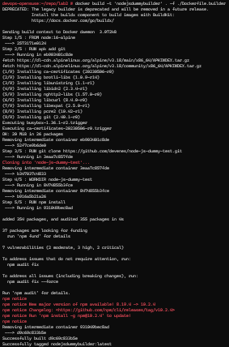
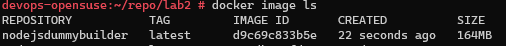
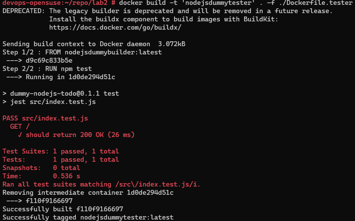
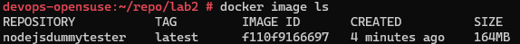

# Sprawozadnie Lab2

## Cel ćwiczenia:
Celem ćwiczenia było zapoznanie się z budową kontenerów przy użyciu narzędzia docker oraz plików dockerfile.

## Wykorzystywane narzędzia:
- Hyper-V -> do wirtualizacji maszyny OpenSuse w wersji 15.5, na której wykonwyana była całość zadania,
- Git -> do pracy na repozytoriach z Github, domyślnie zainstalowany na wersji OpenSuse 15.5 oraz zainstalowany na Alpine 16,
- Docker -> do konteneryzacji, zainstalowany i uruchomiony przy użyciu komend:
```bash
zypper install docker docker-compose
systemctl enable docker
systemctl restart docker
```
Komenda systemctl enable docker została używa w celu uruchamiania serwisu docker wraz z uruchomieniem systemu,
- SSH -> do komunikacji z maszyną i klonowania repozytorium z Github, agent domyślnie zainstalowany na OpenSuse,
- NPM -> menedżer pakietów dla środowiska node.js, domyślnie zainstalowany na użytym w budowie kontenera Alpine 16,
- Visual Studio Code -> do pracy nad sprawozdaniem.

## Wybrane repozytorium:
Na potrzeby zajęć należało znaleźć repozytorium:
- na licencji open suorce,
- posiadające makefile oraz testy.

Wybrałem repozytorium https://github.com/devenes/node-js-dummy-test.
Wybrane repozytorium spełnia powyżej wymienione wymagania oraz posiada w swojej dokumentacji opis tworzenia dockerfile, co ułatwi proces tworzenia swoich plików dockerfile.

## Stowrzenie Dockerfile.builder:
Dockerfile.builder zawiera komendy do stworzenia środowiska z wybraną aplikacją:
```bash
FROM node:16-alpine

RUN apk add git
RUN git clone https://github.com/devenes/node-js-dummy-test.git

WORKDIR node-js-dummy-test
RUN npm install
```

Opis:
Zgodnie z dokumentacją apliakcji wybieramy jako obraz bazowy do naszego kontenera Alpine 16.
Instalujemypakiet git na naszym środowisku.
Następnie kolnujemy wybrane repozytorium z naszą aplikacją.
Zmieniamy folder, w którym będziemy wykonywać komendy na folder naszego repozytorium.
Uruchamiamy budowę apliakcji za pomocą menedżera pakietów do node.js npm, zgodnie z dokumentacją.

## Budowa docker image z pliku Dockerfile.builder:
Obraz zbudowałem komendą:
```bash
docker build -t 'nodejsdummybuilder' . -f ./Dockerfile.builder
```

Opis:
Do budowy docker image wybrałem plik Dockerfile.builder oraz nadałem mu tag nodejsdummybuilder, co pozwoli mi wygodniej wskazywać go w komendach i pliakch oraz wyszukiwać.
Jeśli nie miałbym taga korzystałbym z ID.



Za pomoca komendy:
```bash
docker image ls
```
Sprawdzamy, czy nasz obraz powstał.



## Stowrzenie Dockerfile.tester:
Dockerfile.tester jako obraz testowy bierze wcześniej stworzony przez nas docker image z dockerfile.builer i odpala testy:
```bash
FROM nodejsdummybuilder:latest

RUN npm test
```

Opis:
Obraz bazowy to najnowszy obraz naszego kontenera budującego.
Uruchamiamy testy zgodnie z dokumentacją aplikacji, w tym, przypadku przy użyciu narzędzia npm.

## Budowa docker image z pliu Dockerfile.tester:
Obraz zbudowałem komendą:
```bash
docker build -t 'nodejsdummytester' . -f ./Dockerfile.tester
```
Opis:
Do budowy kontenera wybrałem plik Dockerfile.tester oraz nadałem mu tag nodejsdummytester.



Na screenie widać, że nasze testy przy budowie przechodzą pomyślnie.

Sprawdzamy, czy nasz obraz powstał.



## Podsumowanie:
W powyżej przedstawiony sposób utworzyliśmy 2 obrazy kontenerów, jeden budujący, drugi testujący wybraną przez nas aplikację.
Dla każdej aplikacji zawartość dockerfile będzie się różniła ze względu na potrzeby danego środowiska i aplikacji, 
ale sam proces tworzenia obrazów pozostaje ten sam.
W ten sposób niezależnie do naszego hosta możemy tworzyć środowisko dopasowane ściśle pod potrzeby naszej apliakcji.

## Pytanie "Różnica między obrazem, a kontenerem. Co pracuje w konterze":
Obraz jest plikiem zawierającym informacje koniecznie do utworzenia niezbędnych zależności, a następnie aplikacji, obrazy są statyczne, niemodyfikowalne po utworzeniu, dzięki czemu mamy pewność w zakresie naszego środowiska.

Kontener jest środowiskiem dla naszej apliakcji, jest dynamiczną instancją naszego obrazu, co pozwala na bazie obrazu otwarzać nam potrzebne środowisko niezależnie od hosta oraz możemy edytować nasz kontener (będąc w nim), jednocześnie nie naruszając obrazu.
W konterze pracuje nasza apliakcja, co pozwala sprawdzić jej działanie.