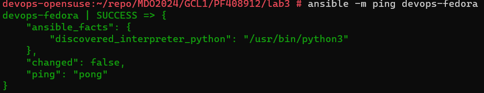
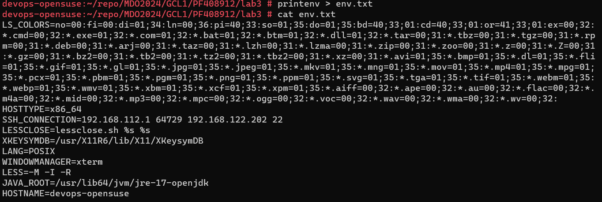
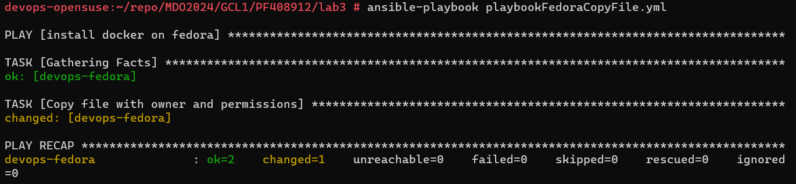
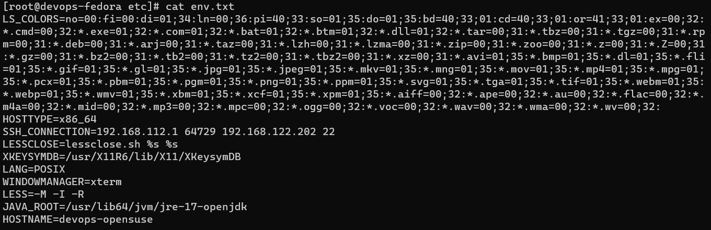
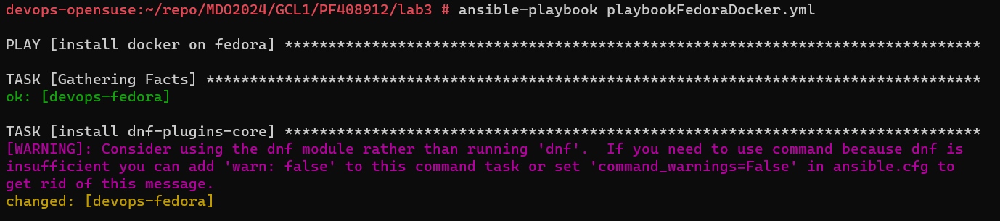
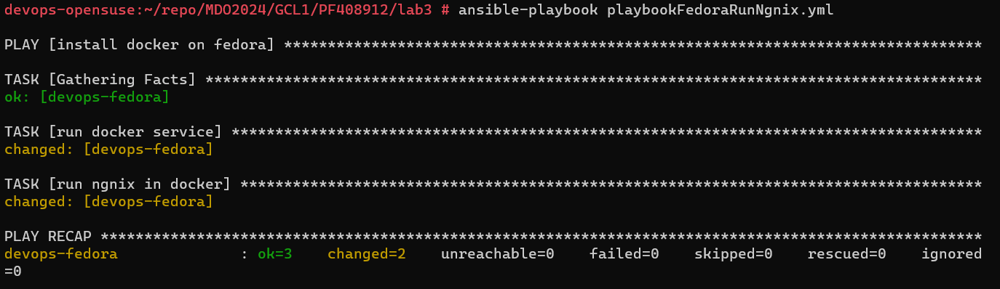
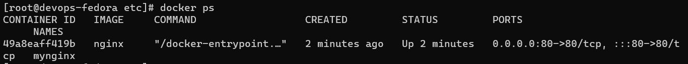
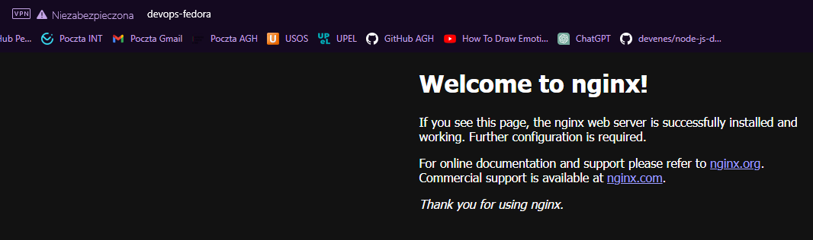

# Sprawozadnie Lab2

## Cel ćwiczenia:
Celem ćwiczenia było zapoznanie się z narzędziami do automatyzacji instalacji maszyn oraz zarządzania nimi zdalnie.

## Wykorzystywane narzędzia:
- Hyper-V -> do wirtualizacji maszyny OpenSuse w wersji 15.5, na której wykonwyana była całość zadania,
- Git -> do pracy na repozytoriach z Github, domyślnie zainstalowany na wersji OpenSuse 15.5 oraz zainstalowany na Alpine 16,
- Docker -> do konteneryzacji,
- SSH -> do komunikacji między maszynami, hostem i repozytorium,
- Ansible -> proces instalacji dalej w sprawozdaniu,
- Ngnix -> proces instalacji dalej w sprawozdaniu,
- Visual Studio Code -> do pracy nad sprawozdaniem,

## Wykorzytsywane maszyny:
W związku z pracą na dytstrybucji OpenSuse w poprzednich ćwiczeniach również tutaj wykorzystuje maszynę OpenSuse, na niej
będę instalował ansible, druga maszyna zgodnie z instrukcją jest to Fedora.

## Komunikajca między maszynami:
Dla wygody pracy w komuniakcji między maszynami zamiast IP wykorzystuję prostą budowę DNS:
- Na hoście dla maszyn wirtualnych edytuje plik hosts Windows z użyciem narzędzia PowerToys:

- Na maszynach wirtualnych dodałem odpowiedni wpis w pliku /etc/hosts,
na rzucie poniżej budowa pliku hosts dla maszyny devops-opensuse, podajemy tu ip maszyny devops-fedora i jej nazwę.
Dla drugiej maszyny zrobimy to samo, ale wpiszemy ip maszyny devops-opensuse i jej nazwę.


## Klucze SSH między maszynami:
Dzięki odpowiedniej konfiguracji kluczy ssh na maszynach możemy łączyć się z jednej do drugiej bez podawania hasła,
co umożliwa konfigurowanie narzędzi do autmoatyzacji zarządzania zdalnego.
W naszym wypadku wystarczyło by wykonanie klucza dla relacji devops-opensuse(ansible) -> fedora(agent),
jednak skonfigurowałem ruch w obie strony przez klucze.
Wymiana kluczy jest możliwa przy użyciu komendy:
```bash
ssh-copy-id
```
W moim wypadku konfigurację wykonałem ręcznie:
Całość działań wykonywałem na obu maszyanch w folderze /root/.ssh.
Wygenerowałem klucze na obu maszynach komendą:
```bash
ssh-keygen -t rsa
```
Nie wykorzystałem domyślnej nazwy na klucz i na obu maszynach nazwałem go ansible,
dla przykładu klucz publiczny z maszyny devops-fedora:

W praktyce takie rozwiązanie jest utrudnieniem w konfiguracji, gdyż potem musimy wskazać ten konkretny klucz w połączeniu
z tą konkretną maszyną, pozwala nam to jednak mocniej kontrolować sposób łączenia się z naszą maszyną,
przykład wskazania klucza do łączności z maszyną w pliku /root/.ssh/config:


Kiedy już mamy gotowe klucze musimy je "wymienić" między maszynami.
Ja dodam wyegnerowane klucze do plików authorized_keys:
Klucz maszyny z devops-fedora do pliku authorized_keys na maszynie devops-opensuse i na odwrót.
Screen z pliku /root/.ssh/authorized_keys na maszynie open-suse:


Po tych czynnościach komunikacja między naszymi maszynami powinna się odbywać po ssh z użyciem wygenerowanych kluczy:


## Ansible
Ansible to narzędzie do automatyzacji pracy na systemach operacyjnych UNIX, pozwala nam to na wykonywanie wielu różnych
działań (instalacji pakietów, stawiania kontenerów itd.) na wielu maszynach jednocześnie z poziomu jednej maszyny. 
Instalację ansible wykonam na maszynie devops-opensuse.
Maszyna devops-fedora posłuży za klienta usługi.

Instalacje ansible na OpenSuse wykonuję komendą:
```bash
zypper install ansible
```

Po instalacji dodajemy naszą drugę maszynę do pliku /etc/ansible/hosts.
W moim wypadku dzięki konfiguracji dns podaję w pliku nazwę maszyny 
(bez rozpoznawania nazwy koniecznie było by korzystanie z ip). Plik dostępny w repozytorium pod nazwą hosts.

Sprawdzamy teraz czy ansible może się kontaktować z maszyną:


Teraz wykonujemy podane w opisie zadania na maszynie devops-fedora.
W tym celu tworzymy playbook zestaw instrukcji dla hosta/hostów w pliku yaml.
Dla wygody testów i dokumentacji podzieliłem instrukcję na 3 pliki, wszytskie dostępne są w repozytorium,
dlatego w sprawozdaniu umieszczam jedynie fragmenty plików.
Dla wszytskich plików hosts wskazany jest devops-fedora.
Playbooki uruchamiam z ścieżki, w której się znajdują, w innej sytuacji powinniśmy w komendzie ansible podać
ścieżkę do pliku.
```bash
hosts: devops-fedora
```
## Plik playbookFedoraCopyFile.yml:
Celem playbooka jest skopiowanie wcześniej utworzonego pliku env.txt na devops-fedora.
Plik towrzymy komendą:
```bash
printenv > env.txt
```

Plik kopiujemy na klienta wykorzystując moduł copy w ansible:
```bash
tasks:
  - name: Copy file with owner and permissions
    copy:
      src: env.txt
      dest: /etc/env.txt
      owner: root
      group: root
      mode: '0644'
```
Po wykonaniu playbooka nasz plik będzie się znajdywał na kliecnie w wskazanej ścieżce - /etc/env.txt
Uruchomienie playbooka:
```bash
ansible-playbook playbookFedoraCopyFile.yml
```
Wynik playbooka:

Jak widzimy całość instrukcji została wykonana bez błędów.
Sprawdzamy maszynę devops-fedora i widzimy skopiowany plik:


## Plik playbookFedoraDocker.yml i playbookFedoraDocker.yml
Oba pliki wykonują ten sam zestaw instrukcji, który ma zainstalować docker na devops-fedora.
Uruchomienie playbooka:
```bash
ansible-playbook playbookFedoraDocker.yml
```
lub
```bash
ansible-playbook playbookFedoraDocker2.yml
```
Plik playbookFedoraDocker.yml wykorzystuje jednak w tym celu moduł komend, przykład:
```bash
  tasks:
    - name: install dnf-plugins-core
      command: dnf -y install dnf-plugins-core
```
Drugi plik wykonuje moduł dnf do instalacji docker'a, przykład:
```bash
  tasks:
    - name: install dnf-plugins-core
      dnf:
        name: dnf-plugins-core
        state: latest
```

W wypadku użycia pierwszego pliku i modułu komend otrzymamy waring z informacją, że preferowaną opcją
instalacji jest korzystanie z modułu dnf:


## Plik playbookFedoraRunNgnix.yml:
Zestaw instrukjci mający na celu uruchomić usługę docker i uruchomić kontener ngnix:
Uruchomienie playbooka:
```bash
ansible-playbook playbookFedoraRunNgnix.yml
```
Instrukcje w pliku:
```bash
  tasks:
    - name: run docker service
      command: systemctl start docker

    - name: run ngnix in docker
      command: docker run --name mynginx -p 80:80 -d nginx
```
Wynik:


Działanie kontenera:
Rzut z maszyny devops-fedora:

Rzut z przeglądarki hosta maszyn:


## Kickstarter
Instalacja maszyn, które w sposób zautomatyzowany już są odpowiedno skonfigurowane i mają zainstalowane odpowiednie narzędzia
jest koniecznością, jeśli nie chcemy wykonywać odtwórczej pracy.
Dla Windows popularne narzędzia do takiej instalacji to WDS/MDT czy SSCM.
Podobnie różne narzędzia umożliwiają nam to na dystrybucjach linux.

W wypadku Fedory po instalacji na maszynie znajduje się plik:
anaconda-ks.cfg

Plik ten po odpowiedniej modyfikacji może nam posłużyć do przygotowania instalacji zawierającej wybrane przez nas dodatkowe komponenty.
Skopiowałem plik nadając mu nazwę anaconda-ext.cfg (plik w całości dostępny na repozytorium)i dodałem: 
- wskazane repozytorium:
```bash
#repo
url --mirrorlist=http://mirrors.fedoraproject.org/mirrorlist?repo=fedora-38&arch=x86_64
repo --name=updates --mirrorlist=http://mirrors.fedoraproject.org/mirrorlist?repo=updates-released-f38&arch=x86_64
```
- sekcję odpowiedzialną za instalację odpowiednich pakietów:
```bash
#packages
%packages
python3
docker
ansible
%end
```
- sekcje post install, która ma uruchomić usługę docker oraz uruchomić wybrany kontener:
```bash
#post
%post
systemctl start docker
systemctl enable docker
docker run -d -p 80:80 --name autolighttpd jitesoft/lighttpd
%end
```
Przygotowany plik wrzuciłem na repozytorium, skąd będę go później linkował w instalacji z użyciem raw linka.
Na nowo utworzonej maszynie w Hyper-V dodaje ISO Fedory i ustawiam jako pierwsze do bootowania.
Dalsza część instalacji na cele sprawozdania zostanie wykonana z użyciem grafinczego interfejsu instalacji
(w ten sposób można łatwo pokazać, że maszyna na etapie instalcji/postistalacji ma już skonfigurowane rzeczy, które domyślnie nie są skonfigurowane, samo zadanie wcześniej zostało wykonane bez ui i quiet czyli bez potrzeby jakichkolwiek działań po stronie użytkownika)
Kiedy mamy okno z instalacją Fedory zmieniamy komendy instalacji tak, by wykorzytsywał nasz plik.
Wskazujemy mu w ten sposób plik sieciowy, kóry podaje mu informację odnośnie instalacji, jest to bardzo podobne do Microsoft
WDS, gdzie komputer również otrzymuje plik odnośnie instalacji, ale z wybranego serwera z usługą WDS.
Jest to możliwe na maszynach dzięki PXE -środowsiku, które pozwala na uruchomienie systemu na danym urządzeniu, mimo, że nie jest ono zainstalowane na nim.

W wypadku Hyper-V, żeby podany przykład użycia pliku odpowiedzi działał koniecznie jest stworzenie maszyny 2 generacji z właczonym secure boot:


Zgodnie z wcześniejszym komentarzem możemy zobaczyć okno podsumowujące naszą instalację, w stosunku do standardowego okna
instalatora fedory w tym miejscu widzimy, że wszystko jest skonfigurowane:


Po uruchomieniu maszyny możemy sprawdzić, że znajduje się na niej m.in docker i ansible, a także nasz kontener


