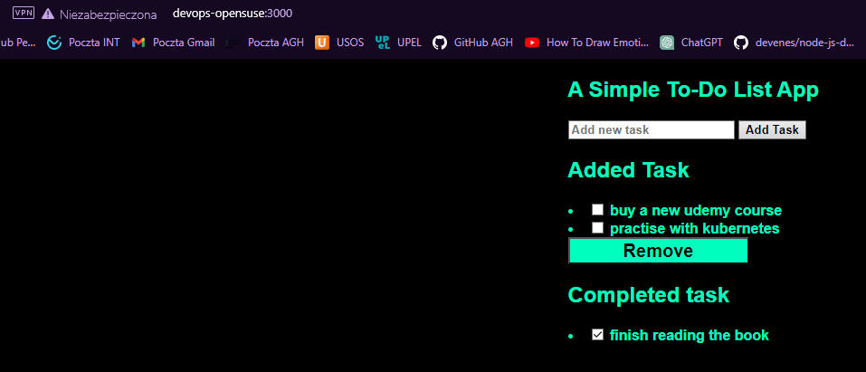
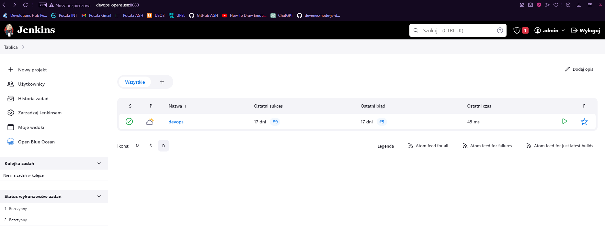

# Sprawozadnie Lab4

## Cel ćwiczenia:
Celem ćwiczenia było zapoznanie się z Jenkins, czyli narzędziem do automatyzacji związanej z tworzeniem oprogramowania. 
W szczególności ułatwia budowanie, testowanie i wdrażanie aplikacji.

## Wykorzystywane narzędzia:
- Hyper-V -> do wirtualizacji maszyny OpenSuse w wersji 15.5, na której wykonwyana była całość zadania,
- Git -> do pracy na repozytoriach z Github, domyślnie zainstalowany na wersji OpenSuse 15.5 oraz instalowana w dockerfile do klonowania wybranej apliakcji z github,
- Docker -> do konteneryzacji,
- SSH -> do komunikacji między maszynami, hostem i repozytorium,
- NPM -> menedżer pakietów dla środowiska node.js, domyślnie zainstalowany na użytym w budowie kontenera Alpine 16,
- Visual Studio Code -> do pracy nad sprawozdaniem.

## Wybrane repozytorium:
Na potrzeby poprzednich zajęć należało znaleźć repozytorium:
- na licencji open suorce,
- posiadające makefile oraz testy.

Wybrane repozytorium: https://github.com/devenes/node-js-dummy-test.

## Budowa plików dockerfile:
Budowa plików docker była tłumaczona w 2 ćwiczeniach i jest zawarta w sprawozdaniu:
[Sprawozdanie zawierające dokumentację na temat budowy kontenerów z wybranego repozytorium](https://github.com/InzynieriaOprogramowaniaAGH/MDO2024/blob/PF408912/GCL1/PF408912/lab2/Sprawozdanie.md)

W skróce posiadamy 2 pliki dockerfile:
- dockerfile.builder służy do stworzenia środowiska z wybraną aplikacją,
- dockerfile.tester służy do testowania wcześniej stworzonego przez nas docker image z dockerfile.builer, uruchamia testy dla naszej aplikacji.

## Testowanie budowania skonteneryzowanej apliakcji z naszego obrazu:
Najpierw odpalimy lokalnie na maszynie nasze pliki dockerfile, by przetestować, czy nie ma błędów konfiguracji.
Przed tworzeniem obrazów usuwamy poprzednie obrazy z naszych plików:


Dockerfile.builder:
```bash
docker build -t 'nodejsdummybuilder' . -f ./Dockerfile.builder
```


Dockerfile.tester:
```bash
docker build -t 'nodejsdummytester' . -f ./Dockerfile.tester
```


Mając gotowy i przetestowany obraz apliakcji tworzymy teraz kolejny plik dockerfile -> Dockerfile.deployer,
który uruchomi naszą apliakcję z obrazu stowrzonego przez Dockerfile.builder:
```bash
FROM nodejsdummybuilder:latest

CMD ["npm", "start"]
```
W tym celu użyłem dokumentacji zawartej na stronie github wybranej aplikacji.
Apliakcja zostanie uruchomiona na porcie 3000.
Budujemy nasz obraz:
```bash
docker build -t 'nodejsdummydeployer' . -f ./Dockerfile.deployer
```


Mając obraz wybudowany z naszego pliku odpalamy nasz kontener:
```bash
docker run -d -p 3000:3000 nodejsdummydeployer
```
Flaga d odpala naszą komendę jako demon - odpowiednik serwisu z systemu Windows, dzięki czemu nie blokujemy sobie pracy w terminalu.
Flaga p służy wskazaniu portów: wewnętrznego w samym kontenerze i zewnętrnzego, który będzie nam potrzeby, by sprawdzić aplikację na hoście maszyny wirtualnej.


Możemy teraz w przeglądarce sprawdzić działanie naszej wdrożonej aplikacji:

Możemy również na samej maszynie wywołać komendę:
```bash
curl localhost:3000
```
Która wyświetli nam zawartość pliku index dla naszej aplikacji:


## Instalacja Jenkins
Instalację jenkins z użyciem docker jest dokładnie opisane na stronie producenta:
https://www.jenkins.io/doc/book/installing/docker/
Na stronie znajduje się punkcie 4a znajduje się dockerfile użyty przeze mnie do budowy obrazu i umiesczony na repo pod nazwą dockerfile.

Na stronie jest również opis uruchomeinia Jenkinsa z własnego obrazu.
W moim wypadku Jenikns udostepniony jest na porcie 8080.


Po wejściu do naszej aplikacji w przeglądarce będziemy musieli podać jednorazowo klucz i dopiero wtedy ustawimy hasło dla admina w Jenkins.
Całość procesu jest opisana na stronie pod Unlocking Jenkins.
Należy pamiętać, że ścieżka do klucza jest wewnąterz naszego kontenera, co również jest opsiane w dokumentacji.
Hasło będzie również dostępne w logach kontenera:


Po stworzeniu stałego hasła dla admina otrzymujemy dostęp do aplikacji, gdzie możemy stworzyć nasz pierwszy pipeline:


