# Sprawozdanie MTG02

## Wstęp

* Celem laboratorium było znalezienie repozytorium dowolnego oprogramowania zawierającego środowisko typu Makefile wraz z testami jednostkowymi, które można uruchomić. Następnie należało przeprowadzić build wybranego programu w kontenerze.
* Po znalezieniu programu stworzyłem uruchomiłem kontener, który potrzebował jak najmniejszą ilość zależności wymaganych do przeprowadzenia builda oraz uruchomiłem testy.
* Po przeprowadzeniu builda stworzyłem dwa pliki Dockerfile, dzięki którym zostały stworzone dwa obrazy kontenerów: jeden do przeprowadzenia builda, drugi do przeprowadzenia testów na podstawie obrazu kontenera z buildem. Dzięki temu czynności które wcześniej należało wykonać ręcznie zostały zautomatyzowane.

## Wykonanie laboratorium

Wybrana przeze mnie aplikacja to: [meson-test](https://github.com/sandervalstar/meson_test), aplikacja tworzy szablon projektu w C++ z wykorzystaniem meson build system. Powodem wyboru takiego repozytorium jest spełnienie wymagań określonych w zadaniu, nieduża ilość testów jednostkowych oraz łatwość przeprowadzenia samego buildu oraz wspomnianych testów.

### Lista wykonanych czynności przed przeprowadzeniem buildu

Zanim przystąpiłem do przeprowadzenia buildu wybranego oprogramowania wykonałem kilka wstępnych kroków:

1. Uruchomiłem program VirtualBox z wirtualną maszyną Fedora.
2. Uruchomiłem PowerShell w okienku CMD za pomocą polecenia `powershell` (powodem dla którego skorzystałem z CMD zamiast .exe PowerShella było korzystanie z jaskrawych kolorów, które znacząco zmniejszały czytelność przy chociażby wyświetlaniu listy katalogów).
3. W CMD połączyłem się po SSH do Fedory. `ssh sglodzinski@192.168.1.105`
4. Po połączeniu się do maszyny wirtualnej zainstalowałem Dockera i pobrałem obraz kontenera [mesonbuild/fedora](https://hub.docker.com/r/mesonbuild/fedora)*.


\* Wybraną aplikację testowałem na obrazie zwykłej Fedory oraz mesonbuild/fedora. Ostatecznie zdecydowałem się na drugi obraz ze względu na brak wymogu konkretnego obrazu ani wersji w dokumentacji oraz mniejszą ilość zależności potrzebnych do doinstalowania, w przeciwieństwie do "czystej" Fedory wybrany przeze mnie obraz posiada już zainstalowanego gita oraz kompilator c++ wymagany w trakcie przeprowadzania buildu.

### Przeprowadzenie buildu w kontenerze

1. Uruchomiłem kontener z obrazem mesonbuild/fedora za pomocą polecenia `sudo docker run -it mesonbuild/fedora`
<br>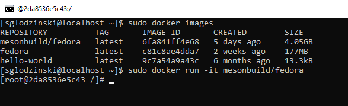
2. Po uruchomieniu kontenera sklonowałem repozytorium z programem. Nie zainstalowałem najpierw wymaganych zależności ponieważ w opisie programu nie znalałem informacji ani listy z wymaganiami wstępnymi (lub też ich nie zauważyłem). Repozytorium sklonowałem z pomocą polecenia `git clone https://github.com/sandervalstar/meson_test`
<br>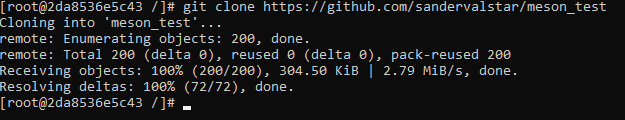
3. Wszedłem do sklonowanego repozytorium z pomocą polecenia `cd meson_test` i przeprowadziłem wstępny build oprogramowania w celu znalezienia wymaganych zależności (polecenie `meson build`).
<br>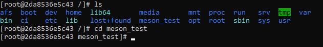
<br>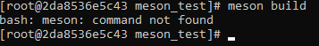<br>
Okazało się, że w obrazie brakuje dość kluczowej zależności czyli samego meson. Doinstalowałem go za pomocą polecenia `dnf -y install meson`.
<br>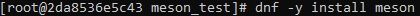<br>
Po instalacji przystąpiłem do ponownego przeprowadzenia buildu, w jego trakcie natrafiłem na kolejną brakującą zależność, tym razem brakowało programu cppcheck, podobnie jak wcześniej doinstalowałem go.
<br>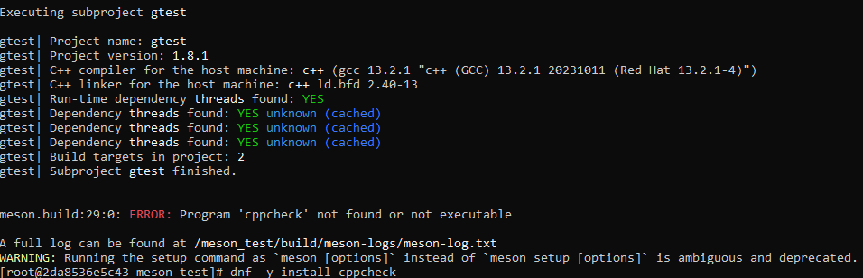<br>
4. Po instalacji wszystkich wymogów build został przeprowadzony poprawnie i przeszedł bez żadnych błędów.
<br>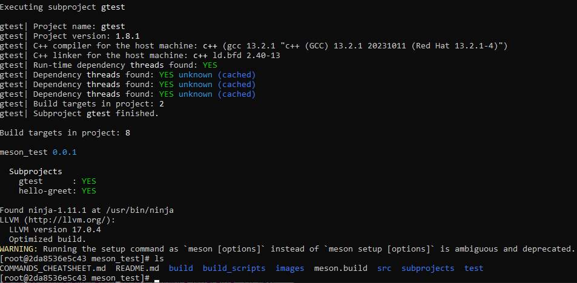
5. Następnie zgodnie z instrukcją oprogramowania przeprowadziłem testy jednostkowe za pomocą polecenia `ninja -C build test` z wykorzystaniem katalogu build stworzonego poprzednim poleceniem `meson build`. Jak widać na zrzucie ekranu testy zostały zakończone pomyślnie bez żadnych problemów.
<br>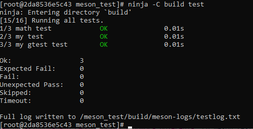
6. Po poprawnym przeprowadzeniu buildu w kontenerze rozpocząłem tworzenie dwóch plików Dockerfile w celu rozdzielenia builda i testów na dwa osobne obrazy w celu automatyzacji powyższych kroków.

#### Tworzenie plików Dockerfile

7. Aby utworzyć pliki Dockerfile wyszedłem z kontenera z powrotem do wirtualnej maszyny z Fedorą. Z pomocą polecenia `touch Dockerfile.build` stworzyłem plik, który tworzy sam build aplikacji bez wykonywania testów.
<br>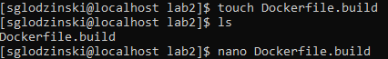<br>
Żeby edytować plik skorzystałem z edytora tekstowego `nano`, można skorzystać oczywiście z dowolnego, który nam odpowiada. W przypadku gdy chcemy skorzystać z nano lecz nasza maszyna wirtualna go nie posiada możemy go zainstalować z repozytorium, w przypadku Fedory polecenie wygląda następująco: `sudo dnf -y install nano`.

Plik po ukończeniu wygląda następująco:

```Dockerfile
FROM mesonbuild/fedora

RUN dnf -y install meson cppcheck
RUN git clone https://github.com/sandervalstar/meson_test

WORKDIR meson_test

RUN meson build
```

8. Następnie przy wykorzystaniu polecenia `sudo DOCKER_BUILDKIT=0 docker build -t meson-bld1 . -f ./Dockerfile.build` stworzyłem obraz kontenera, który automatycznie wykonuje wcześniej opisane przeze mnie kroki. Skorzystałem ze zmiennej `DOCKER_BUILDKIT=0`, aby zmienić builder dockera na starszą wersję, która wypisuje całą listę wykonanych kroków w terminalu zamiast pozostawiania tylko kilku ostatnich linii.
<br>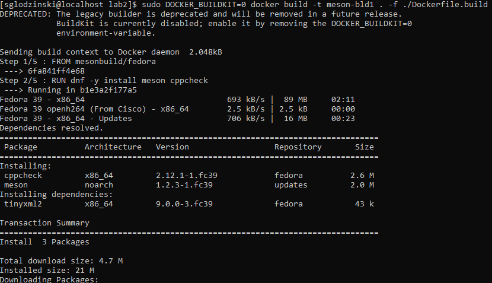
<br>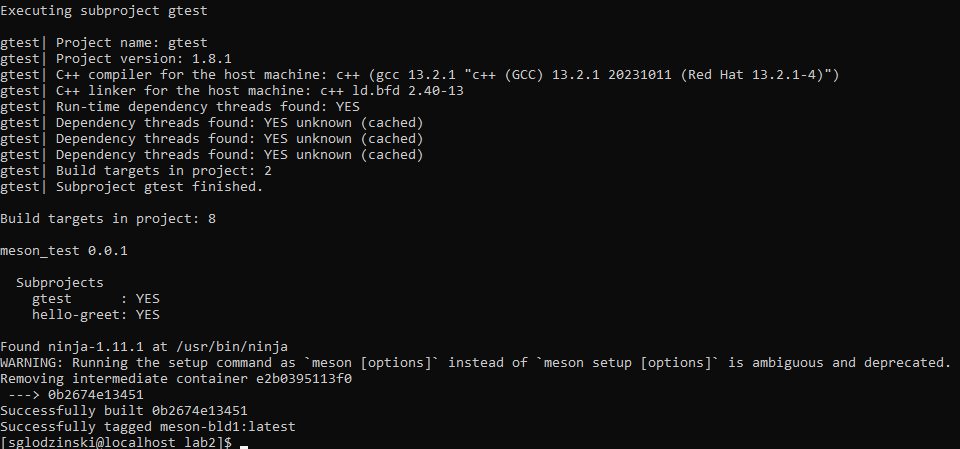

9. Drugi Dockerfile służy tylko i wyłącznie do przeprowadzenia testów jednostkowych aplikacji, nie korzysta on z domyślnego obrazu mesonbuild/fedora, który pobrałem z Docker Huba, lecz z utworzonego przed chwilą obrazu `meson-bld`. W Fedorze utworzyłem plik o nazwie `Dockerfile.test` i w ten sam sposób jak poprzednio i uzupełniłem go.
<br>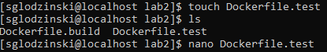

```Dockerfile
FROM meson-bld1

WORKDIR meson_test

RUN ninja -C build test
```
10.  Po zapisaniu pliku skorzystałem z polecenia `sudo docker build -t meson-test . -f ./Dockerfile.test`, aby stworzyć obraz kontenera.
<br>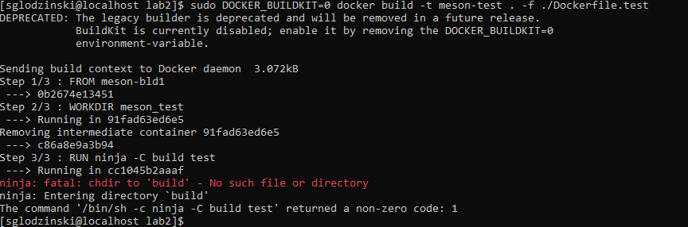<br>
Okazało się, że w trakcie tworzenia obrazu pojawił się błąd, który oznaczał że polecenie ninja nie może odnaleźć katalogu build, wskutek czego testy znajdujące się wewnątrz tego katalogu nie mogły się uruchomić. Przyczyną problemu okazało się niepotrzebne wpisanie linijki `WORKDIR meson_test` w pliku `Dockerfile.test`, ponieważ po przetestowaniu wcześniej stworzonego kontenera `meson-bld` okazało się, że kontener od razu znajduje się w katalogu `meson_test`. Usunięcie linijki rozwiązało problem i stworzyło build z testami, plik po poprawkach wygląda następująco:

```Dockerfile
FROM meson-bld1

RUN ninja -C build test
```
Screenshot z wykonania testów w `meson-test`:
<br>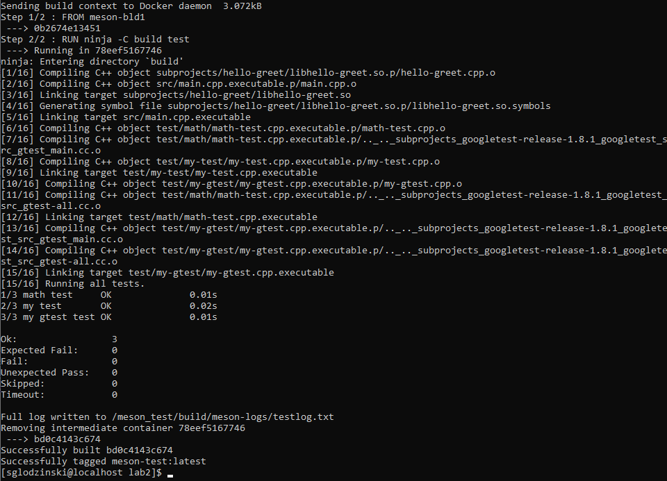<br>

11. Oba obrazy kontenerów pojawiły się na liście dostępnych obrazów (`sudo docker images`):
<br>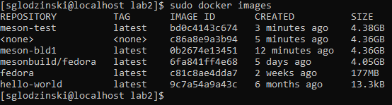

12. Z obu obrazów uruchomiłem po jednym kontenerze w celu sprawdzenia ich działania. Bez określenia polecenia do wykonania kontenery uruchamiają powłokę bash i czekają na dalsze instrukcje, w przeciwnym wypadku wykonują polecenie i kończą działanie.
<br>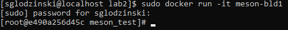
<br>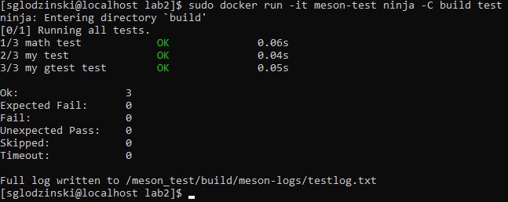<br>

Kontener a obraz różnią się tym, że obraz posiada wszystkie wymagane zależności oraz kod wykorzystywanej aplikacji, natomiast kontener to środowisko utworzone w momencie uruchomienia obrazu, i to właśnie w nim kod aplikacji jest wykonywany.
