# Sprawozdanie MTG03

## Wstęp

Celem laboratorium było zainstalowanie zarządcy Ansible, programu Kickstart w celu zapoznania się z automatyzacją instalacji oraz zdalnego zarządzania maszynami. W trakcie wykonywania zadania wykorzystano dwie maszyny wirtualne z Fedora Server.

## Wykonanie laboratorium

### Instalacja zarządcy Ansible

Na początku zadania zgodnie z treścią utworzyłem drugą maszynę wirtualną z Fedorą, która posiadała minimalny zbiór zainstalowanego oprogramowania. Użytkownik-administrator posiadał taką samą nazwę jak na pierwszej "głównej" maszynie.

#### Ustalenie nazw hostów

Po zainstalowaniu drugiej maszyny zalogowałem się na nią w celu sprawdzenia czy poprawnie się zainstalowała:


Obie maszyny zostały połączone w mostkiem sieciowym z następującymi adresami IP:

1. fedora1 - 192.168.1.114
2. fedora2 - 192.168.1.111

Następnie przystąpiłem do instalacji pakietu ansible na maszynie głównej (fedora1) korzystając z polecenia

`sudo dnf -y install ansible`


Kolejną rzeczą do ustawienia były nazwy hostów obu maszyn z pomocą polecenia `hostnamectl`, zgodnie z opisem wyżej ustaliłem że maszyny będą miały nazwy fedora1 i fedora2.

<br>


Po ustaleniu obu nazw hostów przystąpiłem do modyfikacji pliku `/etc/hosts` w celu umożliwienia maszynom wzajemnego rozpoznawania się po ich nazwach zamiast adresach IP, tą czynność wykonałem na obu maszynach:

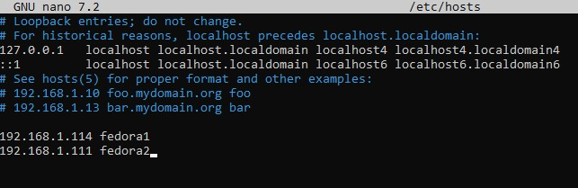

Zweryfikowano połączenie i wykrywanie hostów za pomocą polecenia `ping`:

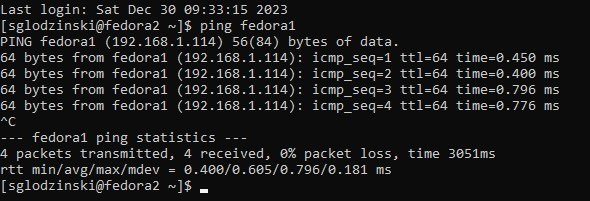
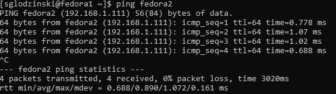

#### Wymiana kluczy SSH

Kolejnym zadaniem zostało stworzenie kluczy SSH i wymiana ich pomiędzy obiema maszynami, dzięki czemu w trakcie próby połączenia zostaniemy automatycznie zalogowani zamiast być proszonym o hasło. W celu wygenerowania kluczy wykorzystałem polecenie:

`ssh-keygen -t ed25519`

Przykład klucza publicznego dla maszyny `fedora1`:

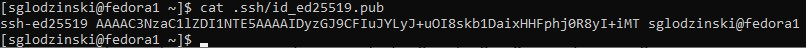

Analogiczne czynności wykonałem na maszynie `fedora2`. Następnie po powrocie na maszynę główną wpisałem polecenie `ssh-copy-id` w celu skopiowania klucza SSH wygenerowanego z `fedora1` na `fedora2`. Efektem tego jest brak zapytania o hasło w trakcie łączenia się po SSH z maszyną:

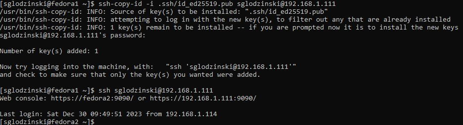

#### Plik inwentaryzacji Ansible

Zgodnie z odnośnikiem w instrukcji stworzyłem plik `inventory.ini` w katalogu `ansible_quickstart` (nie jest to wymagane, równie dobrze plik można utworzyć w dowolnym katalogu), zawartość pliku `inventory.ini` wygląda następująco:
```
[myhosts]
fedora2
```
W pliku wymagane jest wpisane adresu IP hosta lub jego nazwy, skoro ustalenie nazwy hosta było wymagane we wcześniejszej części zadania skorzystałem właśnie z niej zamiast adresu IP. Kolejną rzeczą było zweryfikowanie listy za pomocą polecenia
`ansible-inventory -i inventory.ini --list`

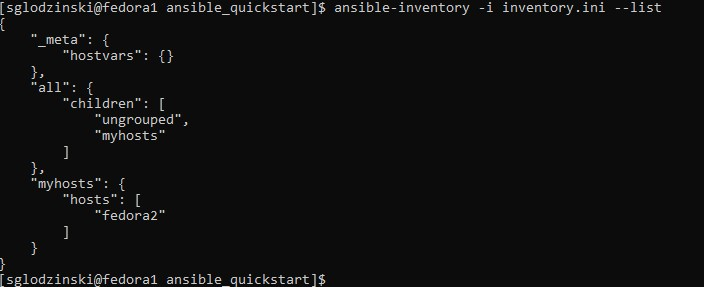

Następnie zweryfikowano łączność między maszynami poleceniem `ansible myhosts -m ping -i inventory.ini`

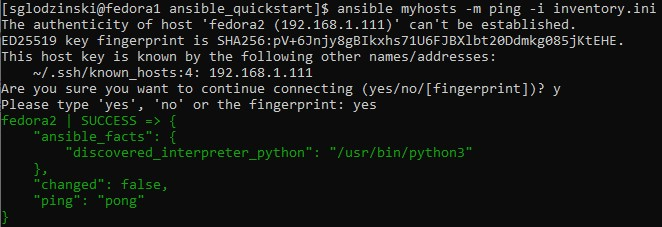

#### Zadanie
Zgodnie z treścią zadania na końcu rozdziału z Ansible utworzyłem plik z zawartością lokalnego środowiska `env`, wykorzystałem do tego polecenie `env > env_local`

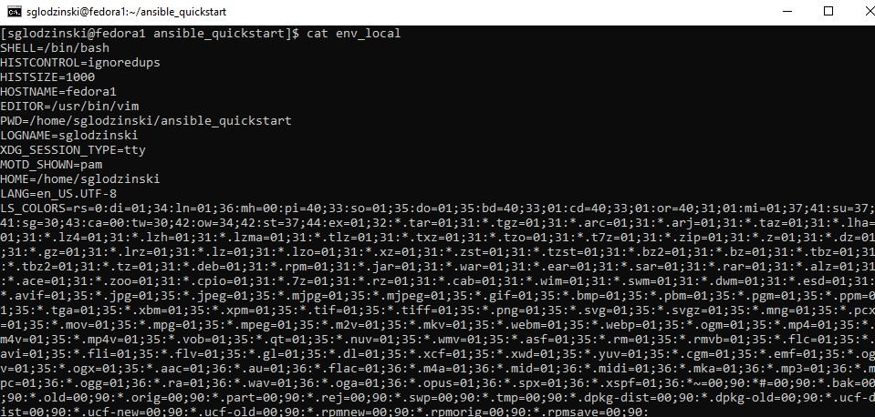

Kolejnym punktem jest utworzenie playbooka w celu skopiowania pliku `env_local` na drugą maszynę, po utworzeniu musimy go zmodyfikować:
```
- name: Playbook1
  hosts: myhosts

  tasks:
    - name: Utworzenie ~/uploads
      file:
        path: ~/uploads
        state: directory
        mode: 0755
    - name: Skopiowanie env_local do ~/uploads
      copy:
        src: env_local
        dest: ~/uploads/env
        mode: 0755
```
Pozostało uruchomić playbooka i sprawdzić czy wykona swoje zadanie. Korzystamy z polecenia `ansible-playbook playbook1.yml`

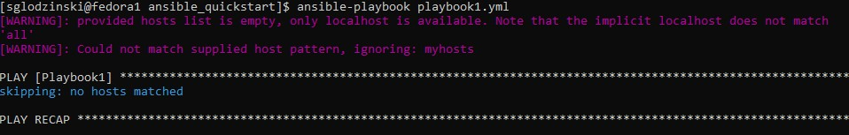

Jak widać uruchomienie playbooka nie powiodło się, powodem tego było niewybranie pliku inwentaryzacji, zostało to naprawione zmodyfikowaniem użytego polecenia, które teraz wygląda tak `ansible-playbook -i inventory.ini playbook1.yml`, problem jak widać został rozwiązany:

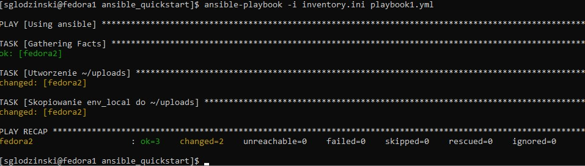

Sprawdzamy, czy rzeczywiście polecenie się wykonało, okazało się że wszystko przeszło poprawnie i mamy co chcieliśmy na maszynie `fedora2`:

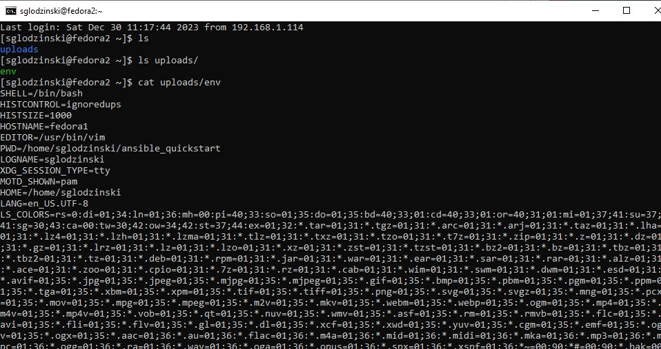

Następnie próbujemy zainstalować Dockera z pomocą Ansible i uruchomić na nim kontener z nginx. Modyfikujemy playbooka dopisując następujące linijki:
```
- name: Instalacja docker
      dnf:
        name: docker
        state: present
      become: true
- name: Uruchomienie docker
  command: systemctl start docker
- name: Uruchomienie nginx w docker
  command: docker run -- name nginx1 -p 80:80 -d nginx
```

Niestety po uruchomieniu otrzymaliśmy błąd, że brakuje nam hasła administratora na drugiej maszynie.

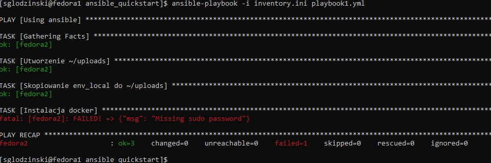

Po dopisaniu flagi `--ask-before-pass` problem się rozwiązał, jednakże pojawił się wtedy inny:

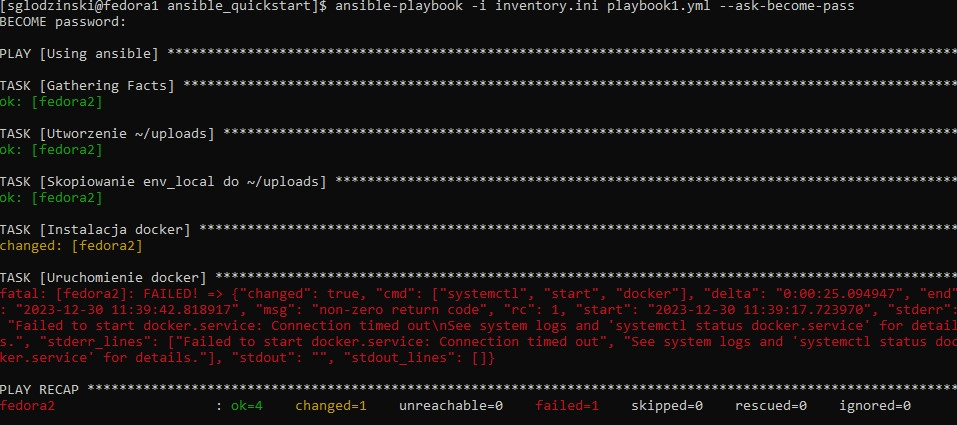

Ponowna modyfikacja playbooka w poniższy sposób (pozycie się poleceń `command` i użycie innej składni, dodanie flagi `become:true` w każdej czynności które sprawiło, że były one wykonywane z przywilejami roota) pozwoliło na rozwiązanie zaistniałych problemów. Pora na zweryfikowanie czy wszystko wykonało się jak zaplanowano zgodnie z plikiem:
```
- name: Instalacja docker
  dnf:
    name: docker
    state: present
  become: true
- name: Uruchomienie docker
  systemd:
    name: docker
    state: started
    enabled: yes
  become: true
- name: Uruchomienie nginx w docker
    docker_container:
    name: nginx1
    image: nginx
    state: started
    ports:
        - "80:80"
  become: true
```

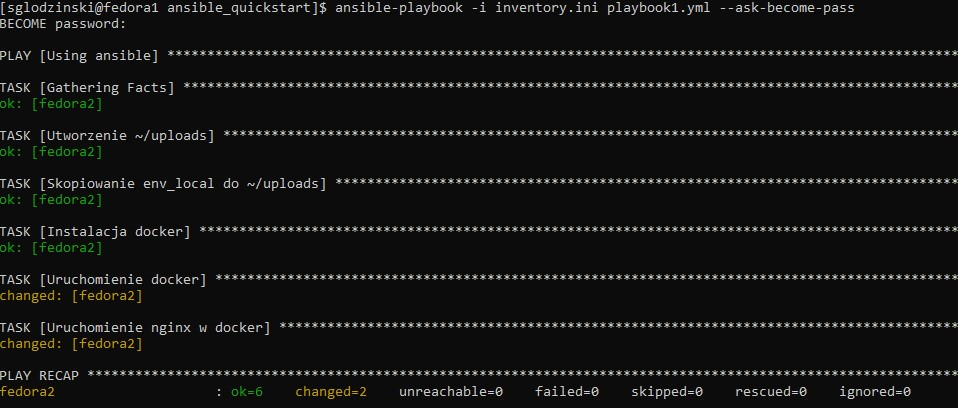

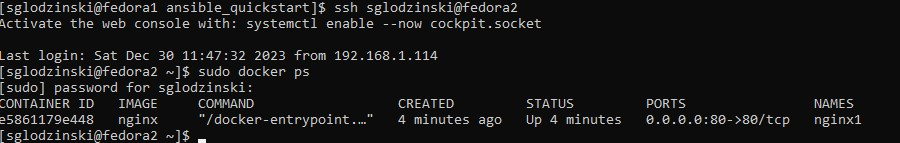

Docker został poprawnie zainstalowany oraz uruchomił się kontener z nginx, pozostało jeszcze tylko sprawdzić czy da się go otworzyć z poziomu przeglądarki:

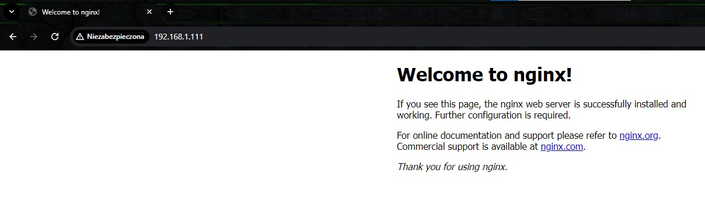

### Kickstart

Dzięki wykorzystaniu Kickstart możemy przeprowadzić automatyczną instalację systemu ze wszystkimi niezbędnymi dla nas narzędziami, dodatkowo otrzymujemy możliwość jednoczesnej instalacji takiego obrazu na wielu maszynach jednocześnie.

Pierwszym krokiem jest wyciągnięcie pliku odpowiedzi `anaconda-ks.cfg` z maszyny `fedora2`, od razu skopiowałem go na maszynę `fedora1` dla ułatwienia, aby to osiągnąć skorzystałem z polecenia
```
sudo scp /root/anaconda-ks.cfg sglodzinski@fedora1:~/ansible_quickstart
```
Następnie skorzystałem z polecenia `rpm -qa > pakiety.txt` w celu wypisania wszystkich zainstalowanych pakietów na maszynie "głównej", w powstałym pliku wyszukałem nazwy pakietów do zawarcia w nowym obrazie, będą to pakiety `docker, git, nano, python3, ansible`.

Przykład zawartości pliku `pakiety.txt`:
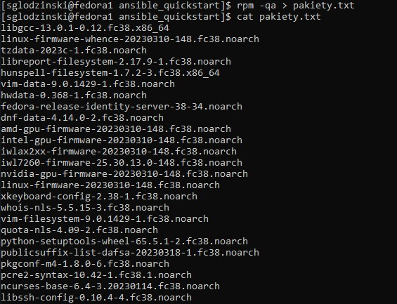

Wrzuciłem wszystkie pliki na swojego brancha i następnie przystąpiłem do modyfikacji pliku odpowiedzi zgodnie z treścią sprawozdania, poszczególne fragmenty wyglądały następująco:

- w sekcji `%packages` dodałem wybrane przez siebie pakiety, które mają się zainstalować wraz z obrazem
```
%packages
@^server-product-environment
python3
nano
git
docker
ansible

%end
```
- zmodyfikowałem polecenie `clearpart --all --initlabel`, aby dysk zawsze był formatowany przed rozpoczęciem instalacji
- dodałem repozytoria online
```
url --mirrorlist=http://mirrors.fedoraproject.org/mirrorlist?repo=fedora-38&arch=x86_64
repo --name=updates --mirrorlist=http://mirrors.fedoraproject.org/mirrorlist?repo=updates-released-f38&arch=x86_64
```
- dodałem również instalację i uruchomienie kontenera `lighttpd` poprzez dopisanie sekcji `%post`
```
%post
systemctl start docker
docker run -d -p 80:80 jitesoft/lighttpd
%end
```

Po wrzuceniu plików na github pozostało wykorzystać zmodyfikowany plik odpowiedzi do instalacji obrazu. Aby zainstalować nasz obraz musimy uruchomić wersję RAW pliku `anaconda-ks.cfg` i przekleić adres URL np.
```
https://raw.githubusercontent.com/InzynieriaOprogramowaniaAGH/MDO2024/SG408727/GCL1/SG408727/Lab03/anaconda-ks.cfg
```
Następnie tworzymy nową maszynę wirtualną i bootujemy ją z ISO, po uruchomieniu się GRUBa nie wybieramy żadnej z opcji. Zgodnie z opisem na dole okna wciskamy klawisz `e`, aby zmodyfikować komendy bootowania.

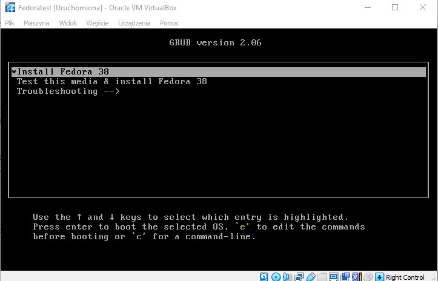

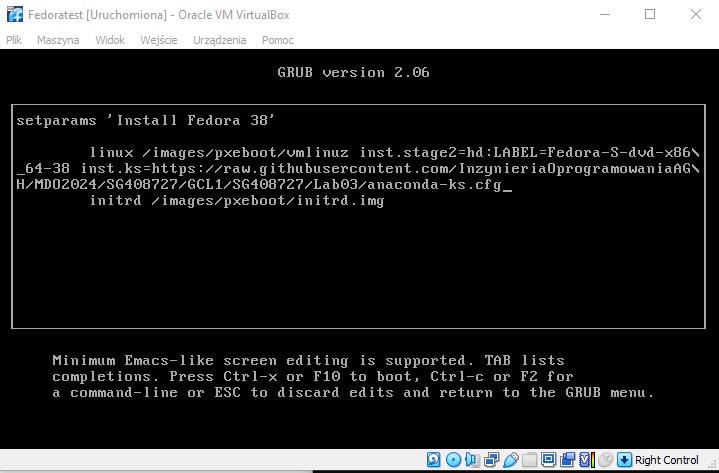

W oknie które się pojawiło w miejscu polecenia `quiet` wpisujemy
```
inst.ks=https://raw.githubusercontent.com/InzynieriaOprogramowaniaAGH/MDO2024/SG408727/GCL1/SG408727/Lab03/anaconda-ks.cfg
```
i klikamy F10 lub Ctrl+X. Flaga `inst-ks` jest odpowiedzialna za przekazanie pliku kickstart instalatorowi. Po chwili czekania w oknie konfiguracyjnym po bootowaniu, instalacja rozpoczęła się sama nie pytając nas o skonfigurowanie czegokolwiek

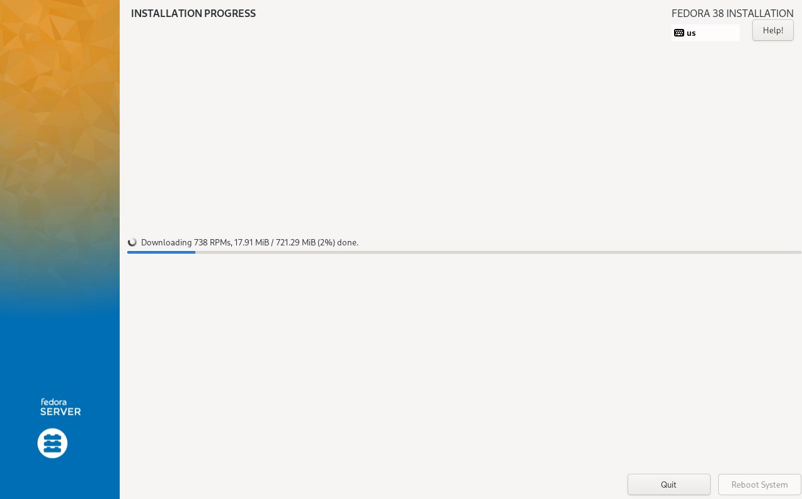

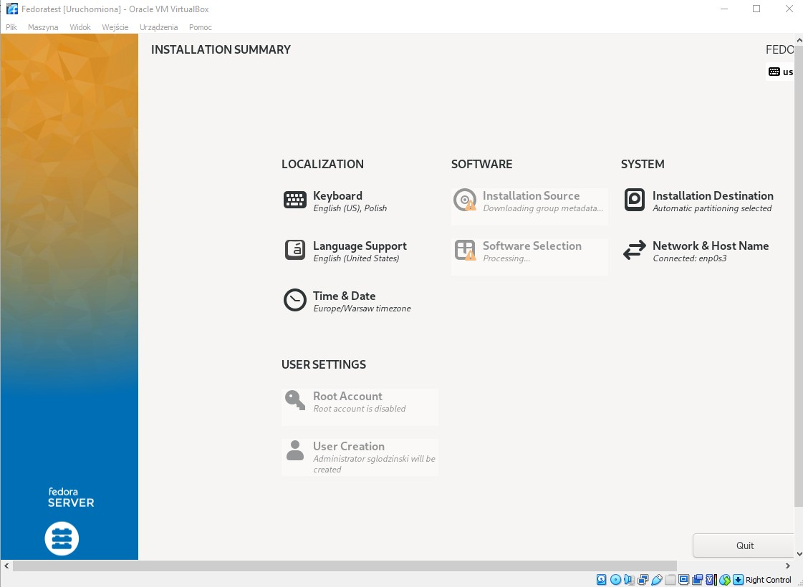

Instalacja przebiegła pomyślnie, wita nas ekran logowania

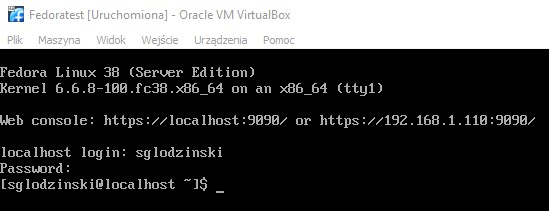

Po sprawdzeniu czy wszystko zainstalowało się pomyślnie i czy działa co potrzeba okazało się, że wszystkie pakiety są zainstalowane jednakże kontener `lighttpd` się nie uruchomił

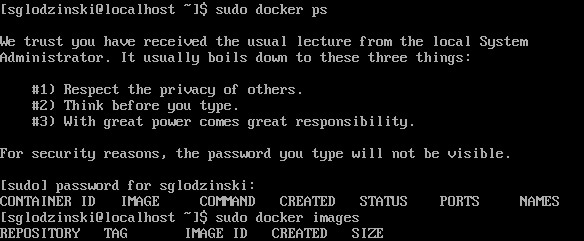

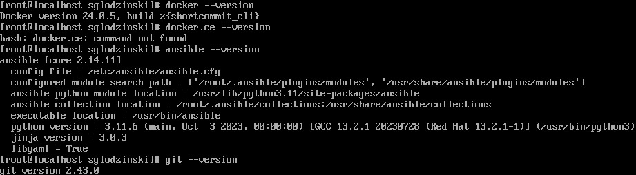

Pomimo kilku prób modyfikacji pliku odpowiedzi i ponownych instalacji z obrazu nie udało się doprowadzić do uruchomienia kontenera.
