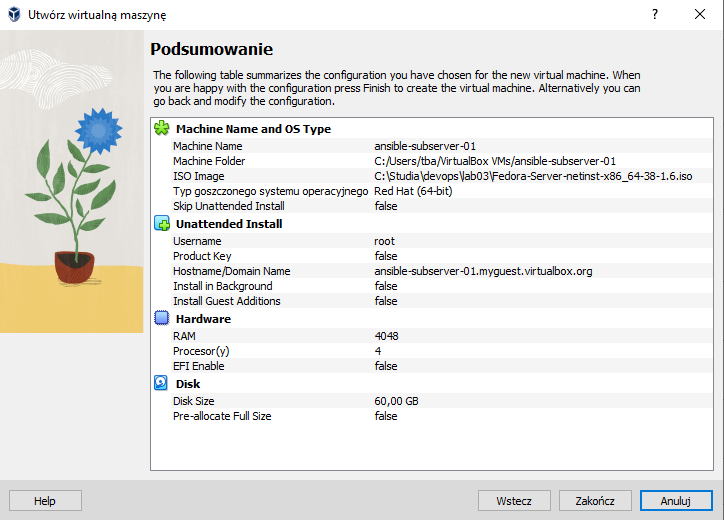
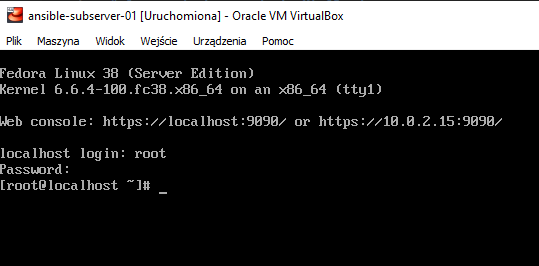
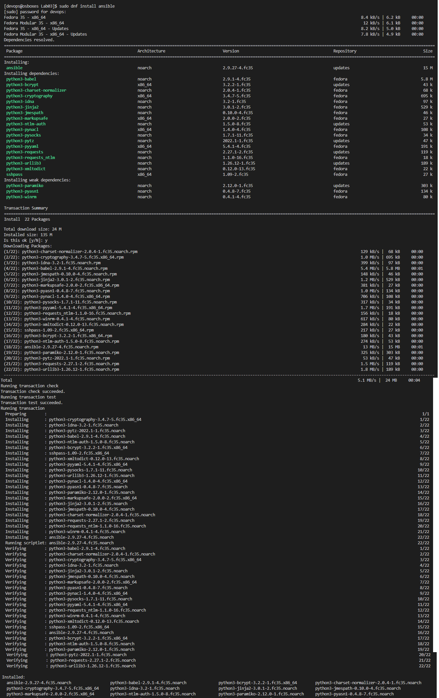
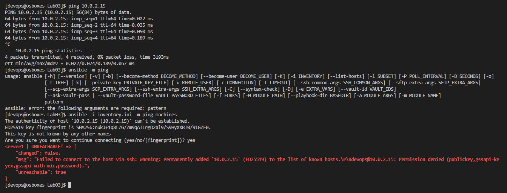
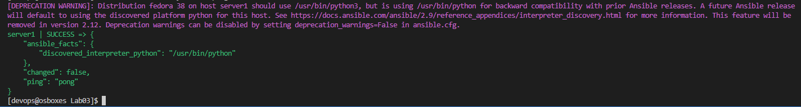
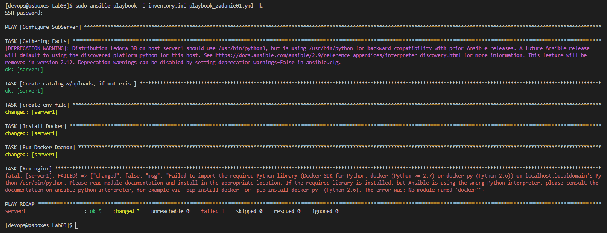

# Sprawozdanie z zadania Mtg03.md
## Tomasz Banaś 408752

1) Instalacja zarządcy Ansible
    - Creating seperate viertual box machine
        

          
    - Install Ansible on main machine by running
        ``` bash
            dnf install ansible
        ```
          
    - Create inventory.ini file with ips of subservers
    - Ping machines with ping and ansible ping
        
        As we can see the machines are not accesible from ansible witch is expected as we do not have SSH keys passed
    - Generate and copy SSH key from server to sub server with ssh-copy-id, and ensure that .ssh folder has correct right 
    ```bash
        chmod 700 ~/.ssh
        chmod 600 ~/.ssh/authorized_keys
        sudo systemctl restart sshd
    ```
    - Try to run ansible ping one more time
        
    - Create playbook (./playbook_zadanie01.yml)
    - Run playbook
    ```bash
        sudo ansible-playbook -i inventory.ini playbook_zadanie01.yml -k
    ```
        

    As we can see first time pipeline failed