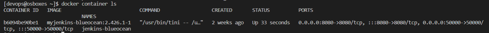
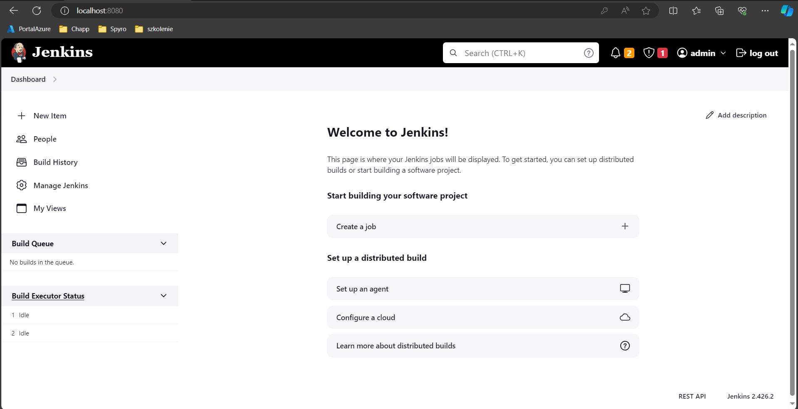

# Sprawozdanie z zadania Mtg04.md
## Tomasz Banaś 408752

#### Disclaimer: We can see localhost on screens as we are forwording ports with usage of vs code extension ports forwarding

1) Jenkins installation

    * Run commands
    ```bash

        docker network create jenkins

        docker run \
            --name jenkins-docker \
            --rm \
            --detach \
            --privileged \
            --network jenkins \
            --network-alias docker \
            --env DOCKER_TLS_CERTDIR=/certs \
            --volume jenkins-docker-certs:/certs/client \
            --volume jenkins-data:/var/jenkins_home \
            --publish 2376:2376 \
            docker:dind \
            --storage-driver overlay2


        docker run --name jenkins-docker --rm --detach \
            --privileged --network jenkins --network-alias docker \
            --env DOCKER_TLS_CERTDIR=/certs \
            --volume jenkins-docker-certs:/certs/client \
            --volume jenkins-data:/var/jenkins_home \
            --publish 2376:2376 \
            docker:dind --storage-driver overlay2

        docker run \
            --name jenkins-blueocean \
            --restart=on-failure \
            --detach \
            --network jenkins \
            --env DOCKER_HOST=tcp://docker:2376 \
            --env DOCKER_CERT_PATH=/certs/client \
            --env DOCKER_TLS_VERIFY=1 \
            --publish 8080:8080 \
            --publish 50000:50000 \
            --volume jenkins-data:/var/jenkins_home \
            --volume jenkins-docker-certs:/certs/client:ro \
            myjenkins-blueocean:2.426.2-1
    ```

    * Creare Dockerfile

    ```dockerfile
    FROM jenkins/jenkins:2.426.2-jdk17
    USER root
    RUN apt-get update && apt-get install -y lsb-release
    RUN curl -fsSLo /usr/share/keyrings/docker-archive-keyring.asc \
    https://download.docker.com/linux/debian/gpg
    RUN echo "deb [arch=$(dpkg --print-architecture) \
    signed-by=/usr/share/keyrings/docker-archive-keyring.asc] \
    https://download.docker.com/linux/debian \
    $(lsb_release -cs) stable" > /etc/apt/sources.list.d/docker.list
    RUN apt-get update && apt-get install -y docker-ce-cli
    USER jenkins
    RUN jenkins-plugin-cli --plugins "blueocean docker-workflow"
    ```

    * Run commands
    ```bash
        docker build -t myjenkins-blueocean:2.426.2-1 .
    ```bash
    Sending build context to Docker daemon  6.656kB
    Step 1/8 : FROM jenkins/jenkins:2.426.2-jdk17
    2.426.2-jdk17: Pulling from jenkins/jenkins
    90e5e7d8b87a: Pull complete 
    f46e108600e7: Pull complete 
    67ee1cced2cb: Pull complete 
    3dfb3d6cb44e: Pull complete 
    46014cb180c0: Pull complete 
    20f6ee282779: Pull complete 
    f8ee3f626f99: Pull complete 
    b636b23fb8d6: Pull complete 
    a3ffaaf08d83: Pull complete 
    fc8874a22e0d: Pull complete 
    eef971f7a8d4: Pull complete 
    fb46046a6402: Pull complete 
    Digest: sha256:186a48ae298e34a21b27fe737bf0a854c3e73421ce858c4d40c403802589e23f
    Status: Downloaded newer image for jenkins/jenkins:2.426.2-jdk17
    ---> 41e27c2a574b
    Step 2/8 : USER root
    ---> Running in 60c7886d9098
    Removing intermediate container 60c7886d9098
    ---> 45ff69221645
    Step 3/8 : RUN apt-get update && apt-get install -y lsb-release
    ---> Running in 0f64301e97fb
    Get:1 http://deb.debian.org/debian bookworm InRelease [151 kB]
    Get:2 http://deb.debian.org/debian bookworm-updates InRelease [52.1 kB]
    Get:3 http://deb.debian.org/debian-security bookworm-security InRelease [48.0 kB]
    Get:4 http://deb.debian.org/debian bookworm/main amd64 Packages [8787 kB]
    Get:5 https://packagecloud.io/github/git-lfs/debian bookworm InRelease [28.0 kB]
    Get:6 http://deb.debian.org/debian bookworm-updates/main amd64 Packages [11.3 kB]
    Get:7 http://deb.debian.org/debian-security bookworm-security/main amd64 Packages [128 kB]
    Get:8 https://packagecloud.io/github/git-lfs/debian bookworm/main amd64 Packages [2282 B]
    Fetched 9208 kB in 4s (2338 kB/s)
    Reading package lists...
    Reading package lists...
    Building dependency tree...
    Reading state information...
    The following NEW packages will be installed:
    lsb-release
    0 upgraded, 1 newly installed, 0 to remove and 5 not upgraded.
    Need to get 6416 B of archives.
    After this operation, 17.4 kB of additional disk space will be used.
    Get:1 http://deb.debian.org/debian bookworm/main amd64 lsb-release all 12.0-1 [6416 B]
    debconf: delaying package configuration, since apt-utils is not installed
    Fetched 6416 B in 0s (77.7 kB/s)
    Selecting previously unselected package lsb-release.
    (Reading database ... 10580 files and directories currently installed.)
    Preparing to unpack .../lsb-release_12.0-1_all.deb ...
    Unpacking lsb-release (12.0-1) ...
    Setting up lsb-release (12.0-1) ...
    Removing intermediate container 0f64301e97fb
    ---> 8496fb0f8ab2
    Step 4/8 : RUN curl -fsSLo /usr/share/keyrings/docker-archive-keyring.asc   https://download.docker.com/linux/debian/gpg
    ---> Running in 922bd476fd34
    Removing intermediate container 922bd476fd34
    ---> 711427fff830
    Step 5/8 : RUN echo "deb [arch=$(dpkg --print-architecture)   signed-by=/usr/share/keyrings/docker-archive-keyring.asc]   https://download.docker.com/linux/debian   $(lsb_release -cs) stable" > /etc/apt/sources.list.d/docker.list
    ---> Running in e0ca936b164a
    Removing intermediate container e0ca936b164a
    ---> ce34633b49dd
    Step 6/8 : RUN apt-get update && apt-get install -y docker-ce-cli
    ---> Running in f7e8e7521751
    Get:1 https://download.docker.com/linux/debian bookworm InRelease [43.3 kB]
    Hit:2 http://deb.debian.org/debian bookworm InRelease
    Hit:3 http://deb.debian.org/debian bookworm-updates InRelease
    Hit:4 http://deb.debian.org/debian-security bookworm-security InRelease
    Get:6 https://download.docker.com/linux/debian bookworm/stable amd64 Packages [13.5 kB]
    Hit:5 https://packagecloud.io/github/git-lfs/debian bookworm InRelease
    Fetched 56.8 kB in 2s (24.6 kB/s)
    Reading package lists...
    Reading package lists...
    Building dependency tree...
    Reading state information...
    The following additional packages will be installed:
    docker-buildx-plugin docker-compose-plugin
    The following NEW packages will be installed:
    docker-buildx-plugin docker-ce-cli docker-compose-plugin
    0 upgraded, 3 newly installed, 0 to remove and 5 not upgraded.
    Need to get 53.4 MB of archives.
    After this operation, 175 MB of additional disk space will be used.
    Get:1 https://download.docker.com/linux/debian bookworm/stable amd64 docker-buildx-plugin amd64 0.11.2-1~debian.12~bookworm [28.2 MB]
    Get:2 https://download.docker.com/linux/debian bookworm/stable amd64 docker-ce-cli amd64 5:24.0.7-1~debian.12~bookworm [13.3 MB]
    Get:3 https://download.docker.com/linux/debian bookworm/stable amd64 docker-compose-plugin amd64 2.21.0-1~debian.12~bookworm [11.9 MB]
    debconf: delaying package configuration, since apt-utils is not installed
    Fetched 53.4 MB in 2s (22.8 MB/s)
    Selecting previously unselected package docker-buildx-plugin.
    (Reading database ... 10585 files and directories currently installed.)
    Preparing to unpack .../docker-buildx-plugin_0.11.2-1~debian.12~bookworm_amd64.deb ...
    Unpacking docker-buildx-plugin (0.11.2-1~debian.12~bookworm) ...
    Selecting previously unselected package docker-ce-cli.
    Preparing to unpack .../docker-ce-cli_5%3a24.0.7-1~debian.12~bookworm_amd64.deb ...
    Unpacking docker-ce-cli (5:24.0.7-1~debian.12~bookworm) ...
    Selecting previously unselected package docker-compose-plugin.
    Preparing to unpack .../docker-compose-plugin_2.21.0-1~debian.12~bookworm_amd64.deb ...
    Unpacking docker-compose-plugin (2.21.0-1~debian.12~bookworm) ...
    Setting up docker-buildx-plugin (0.11.2-1~debian.12~bookworm) ...
    Setting up docker-compose-plugin (2.21.0-1~debian.12~bookworm) ...
    Setting up docker-ce-cli (5:24.0.7-1~debian.12~bookworm) ...
    Removing intermediate container f7e8e7521751
    ---> 92c9d4b98d16
    Step 7/8 : USER jenkins
    ---> Running in e2a2503e2e8f
    Removing intermediate container e2a2503e2e8f
    ---> 06d9c08d38ac
    Step 8/8 : RUN jenkins-plugin-cli --plugins "blueocean docker-workflow"
    ---> Running in 88bab629127a
    War not found, installing all plugins: /usr/share/java/jenkins.war
    Done
    Removing intermediate container 88bab629127a
    ---> cf08cf5e6414
    Successfully built cf08cf5e6414
    Successfully tagged myjenkins-blueocean:2.426.2-1
    ```
    ```bash
        docker run \
            --name jenkins-blueocean \
            --restart=on-failure \
            --detach \
            --network jenkins \
            --env DOCKER_HOST=tcp://docker:2376 \
            --env DOCKER_CERT_PATH=/certs/client \
            --env DOCKER_TLS_VERIFY=1 \
            --publish 8080:8080 \
            --publish 50000:50000 \
            --volume jenkins-data:/var/jenkins_home \
            --volume jenkins-docker-certs:/certs/client:ro \
            myjenkins-blueocean:2.426.2-1
    ```

    ```bash
        docker run \
            --name jenkins-docker \
            --rm \
            --detach \
            --privileged \
            --network jenkins \
            --network-alias docker \
            --env DOCKER_TLS_CERTDIR=/certs \
            --volume jenkins-docker-certs:/certs/client \
            --volume jenkins-data:/var/jenkins_home \
            --publish 2376:2376 \
            docker:dind \
            --storage-driver overlay2
    ```


    
    