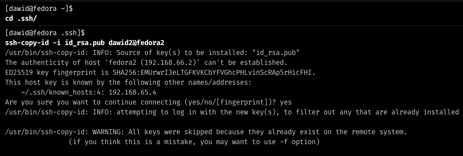
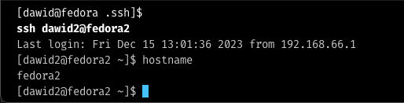
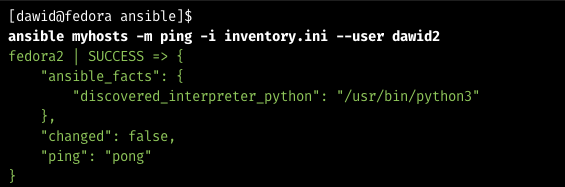
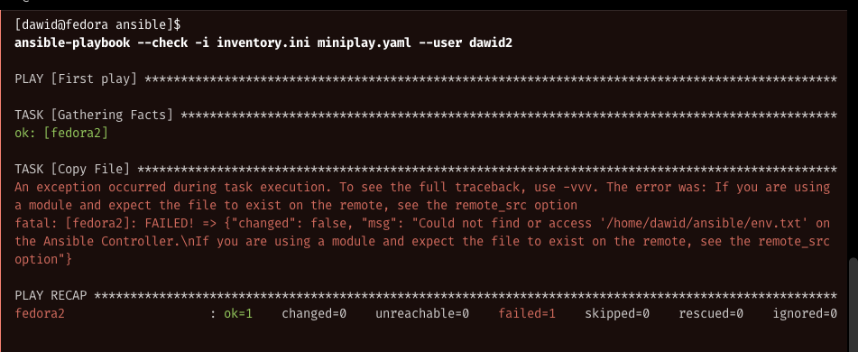
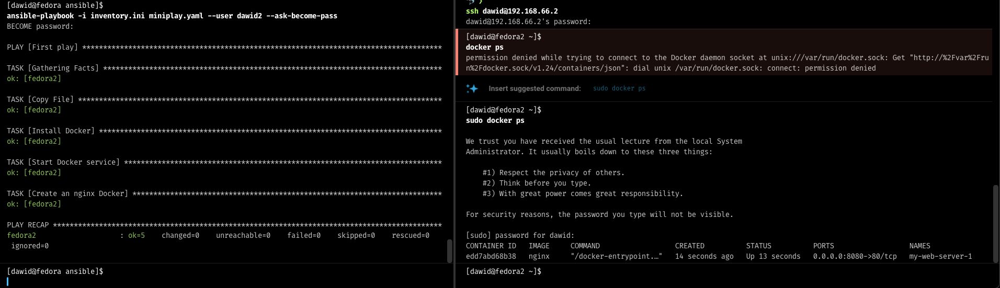

# Automatyzacja instalacji - Ansible

> ## Syllabus
>
> - Instalacja Ansible
> - Łączenie maszyn bez hasła 
> - Konfiguracja pliku inventory
> - Instalacja pakietów na zdalnej maszynie

**Spis treści**

<!-- TOC -->
* [Automatyzacja instalacji - Ansible](#automatyzacja-instalacji---ansible)
  * [Przygotowanie maszyn](#przygotowanie-maszyn)
  * [Konfiguracja połączenia pomiędzy maszynami](#konfiguracja-połączenia-pomiędzy-maszynami-)
    * [1. Zaczynamy od wygenerowania klucza SSH na maszynie `fedora`:](#1-zaczynamy-od-wygenerowania-klucza-ssh-na-maszynie-fedora)
    * [2. Klucz przesyłamy na drugą maszynę korzystając z komendy:](#2-klucz-przesyłamy-na-drugą-maszynę-korzystając-z-komendy)
    * [3. Testujemy połączenie z maszyną](#3-testujemy-połączenie-z-maszyną)
  * [Instalacja Ansible](#instalacja-ansible)
    * [Tworzenie pliku inventory](#tworzenie-pliku-inventory)
    * [Sprawdzamy połączenie Ansible](#sprawdzamy-połączenie-ansible)
  * [Tworzenie playbooków](#tworzenie-playbooków)
    * [Uruchamianie playbooków](#uruchamianie-playbooków)
    * [Własna konfiguracja nginx](#własna-konfiguracja-nginx)
<!-- TOC -->

## Przygotowanie maszyn

Na początku tworzymy nową pustą maszynę wirtualną, z którą będziemy się łączyć.
Przechodzimy przez standardowy proces instalacji, pamiętajmy o zmianie nazwy hosta.

W moim przypadku maszyna główna nazywa się `fedora` natomiast klient `fedora2`.

Natomiast użytkownicy to `dawid` dla `fedora` oraz `dawid2` dla `fedora2`. 

Aby móc korzystać z nazw maszyn zamiast adresów IP, musimy dodać je do pliku `/etc/hosts`, format jest następujący:

```sh
<adres IP> <nazwa hosta>
```

W naszym przypadku będzie to:

```sh
192.168.66.2 fedora2
```

- Adresy IP możemy sprawdzić za pomocą polecenia `ip a`.
- Edytuj plik `/etc/hosts` za pomocą `sudo nano /etc/hosts`.

> Pamiętaj, że adresy są dynamiczne (jeśli nie skonfigurowałeś inaczej) więc mogą po pewnym czasie się zmienić.


## Konfiguracja połączenia pomiędzy maszynami 

W tym celu skorzystamy z komendy **ssh-copy-id**, która automatycznie skonfiguruje połączenie pomiędzy naszymi maszynami, pozwoli nam to na nieużywanie hasła w przyszłości.

> Jest to istotne, ponieważ kiedy zaczniemy korzystać z Ansible, nie będziemy musieli podawać ręcznie hasła przy każdym połączeniu.

### 1. Zaczynamy od wygenerowania klucza SSH na maszynie `fedora`:

```sh
ssh-keygen
```

Powyższa komenda wygeneruje nam parę kluczy - prywatny oraz publiczny (ten z końcówką `.pub`).
Klucz domyślnie będzie w folderze `~/.ssh/` i będzie nazywał się `id_rsa` (metoda szyfrowania RSA)


### 2. Klucz przesyłamy na drugą maszynę korzystając z komendy:

```sh
ssh-copy-id -i id_rsa.pub dawid2@fedora2
```

> Flagą `-i` podajemy ścieżkę do klucza. Ja mogłem użyć tylko `-i id_rsa.pub` ponieważ znajdowałem się w folderze `~/.ssh/` gdzie znajdował się klucz.

Format komendy do skopiowania

```sh
ssh-copy-id -i ~/.ssh/NAZWA_KLUCZA.pub REMOTE_USER@REMOTE_IP
```

Nasz rezultat jest następujący.



### 3. Testujemy połączenie z maszyną

```sh
ssh dawid2@fedora2
```

Jak widać na screenie, udało nam się wejść na zdalną maszynę bez podawania hasła.




## Instalacja Ansible

W tym celu używamy komendy:

```sh
sudo dnf install ansible
```

Tworzymy sobie folder `ansible` w `~`, w którym będziemy przechowywać nasze pliki konfiguracyjne.

```sh
mkdir ansible
```

### Tworzenie pliku inventory

Plik inventory to plik, w którym definiujemy nasze maszyny, na których będziemy wykonywać polecenia.

```sh
touch inventory.ini
nano inventory.ini
```

- Wewnątrz zaczynamy od zdefiniowania grupy hostów, w naszym przypadku będzie to `myhosts`.
- Poniżej tej grupy definiujemy hosty, które do niej należą. Wypisujemy je po jednym w linii, możemy skorzystać z adresu IP lub nazwy hosta.


```ini
[myhosts]
fedora2
```

### Sprawdzamy połączenie Ansible

W tym celu skorzystamy z narzędzie `ping`, wbudowanego w ansible, które sprawdzi czy wszystkie hosty zdefiniowane w pliku inventory są dostępne.

```sh
ansible myhosts -m ping -i inventory.ini --user dawid2
```

- `myhosts` - nazwa grupy hostów
- `-m ping` - moduł, który chcemy wykonać
- `-i inventory.ini` - plik inventory
- `--user dawid2` - użytkownik, którym chcemy się zalogować na zdalną maszynę, jeśli jest taki sam jak lokalnie, możemy pominąć tą flagę.

Taki rezultat powinniśmy otrzymać:




## Tworzenie playbooków

> Playbooki to pliki, w których definiujemy zadania, które chcemy wykonać na zdalnej maszynie.

Tworzymy nowy plik `miniplay.yaml` w folderze `ansible`.

```sh
touch miniplay.yaml
nano miniplay.yaml
```

Wewnątrz pliku definiujemy zadania, które chcemy wykonać.

```yaml
- name: First play
  hosts: myhosts
  tasks:
    - name: Copy File
      copy:
        src: /home/dawid/ansible/env.txt
        dest: /home/dawid2/uploads/env.txt
    - name: Create an nginx Docker
      docker_container:
        name: my-web-server-1
        image: nginx
        state: started
        ports:
          - "8080:80"
```

- `name` - nazwa zadania
- `hosts` - grupa hostów, na których chcemy wykonać zadanie, zdefiniowana w pliku inventory
- `tasks` - zadania, które chcemy wykonać
- `copy` - moduł, który chcemy wykonać, w tym przypadku kopiowanie pliku
- `src` - ścieżka do pliku, który chcemy skopiować (obecna maszyna)
- `dest` - ścieżka, gdzie chcemy zapisać plik (docelowa maszyna)
- `docker_container` - tworzenie kontenera dockerowego
  - `name` - nazwa kontenera
  - `image` - obraz, który chcemy uruchomić
  - `state` - stan kontenera, w tym przypadku `started` czyli uruchomiony
  - `ports` - porty, które chcemy przekierować, format `HOST_PORT:CONTAINER_PORT`

Tworzymy najpierw folder na docelowej maszynie, w którym będziemy przechowywać pliki.

```sh
ssh dawid2@fedora2
mkdir ~/uploads
```

### Uruchamianie playbooków

> Playbooki możemy uruchamiać w trybie testowym, aby sprawdzić czy wszystko działa poprawnie.
> W tym celu dodajemy flagę `--check` do komendy.

Tryb testowy nie aplikuje zmian, a jedynie sprawdza czy wszystko działa poprawnie.

```sh
ansible-playbook --check -i inventory.ini miniplay.yaml --user dawid2
```

w naszym przypadku rezultat jest następujący:



Zapomnieliśmy stworzyć pliku `env.txt` na maszynie lokalnej, dlatego ansible wykrył, że plik nie istnieje.

Tworzymy go więc:

```sh
env > env.txt
```

I uruchamiamy playbooka ponownie.

```text
TASK [Create an nginx Docker] ************************************************************************************
fatal: [fedora2]: FAILED! => {"changed": false, "msg": "Error connecting: Error while fetching server API version: ('Connection aborted.', FileNotFoundError(2, 'No such file or directory'))"}
```

Teraz widzimy, że nie mamy zainstalowanego dockera na maszynie docelowej, dlatego ansible nie może uruchomić kontenera.

Dodajemy więc odpowiednią dyrektywę do playbooka przed odpaleniem kontenera.

```yaml
- name: First play
  hosts: myhosts
  tasks:
    - name: Copy File
      copy:
        src: /home/dawid/ansible/env.txt
        dest: /home/dawid2/uploads/env.txt
    - name: Install Docker
      become: true
      dnf:
        name: docker
        state: latest
    - name: Start Docker service
      become: true
      systemd:
        name: docker
        state: started
        enabled: yes
    - name: Create an nginx Docker
      become: true
      docker_container:
        name: my-web-server-1
        image: nginx
        state: started
        ports:
          - "8080:80"
```

- `become: true` - flaga, która pozwala nam na uruchomienie komendy jako root, ponieważ domyślnie ansible korzysta z użytkownika, którym się zalogowaliśmy na zdalną maszynę.
- `dnf` - moduł, który pozwala nam na instalację pakietów
  - `name` - nazwa pakietu
  - `state` - stan pakietu, w tym przypadku `latest` czyli najnowsza wersja
- `systemd` - moduł, który pozwala nam na uruchamianie usług
  - `name` - nazwa usługi
  - `state` - stan usługi, w tym przypadku `started` czyli uruchomiona
  - `enabled` - czy usługa ma być uruchamiana przy starcie systemu


Po dodaniu tej dyrektywy, uruchamiamy playbooka ponownie.

Tym razem, będzie problem, że nie podaliśmy hasła root, w tym celu musimy dodać flagę `--ask-become-pass` do komendy playbook.

```sh
ansible-playbook -i inventory.ini miniplay.yaml --user dawid2 --ask-become-pass
```

Komenda zadziałała pomyślnie, a my na maszynie obok możemy zobaczyć uruchomiony kontener.




### Własna konfiguracja nginx

Zacznijmy od zabicia poprzedniej instancji kontenera aby się nie kłóciły.

```sh
sudo docker kill my-web-server-1
```


Następnie tworzymy nowy plik `nginx.conf` w folderze `ansible`.

```conf
events {
    worker_connections  1024;
}

http {
    include       mime.types;
    default_type  application/octet-stream;

    sendfile        on;
    keepalive_timeout  65;

    server {
        listen       80;
        server_name  localhost;

        location / {
            echo "Devops is the best!";
        }
    }
}
```

- `events` - blok zdarzeń
  - `worker_connections` - maksymalna liczba połączeń
- `http` - blok http
  - `include` - plik z typami MIME
  - `default_type` - domyślny typ MIME
  - `sendfile` - czy serwer ma używać sendfile
  - `keepalive_timeout` - czas po jakim połączenie zostanie zamknięte
  - `server` - blok serwera
    - `listen` - port nasłuchiwania
    - `server_name` - nazwa serwera
    - `location` - blok lokalizacji
      - `echo` - moduł, który pozwala na wyświetlenie tekstu

Następnie tworzymy nowy plik `miniplay2.yaml` w folderze `ansible`.

Dodajemy w nim kopiowanie pliku `nginx.conf` na maszynę docelową.

```yaml
- name: First play
  hosts: myhosts
  tasks:
    - name: Copy File
      copy:
        src: /home/dawid/ansible/env.txt
        dest: /home/dawid2/uploads/env.txt
    - name: Copy Nginx Config
      copy:
        src: /home/dawid/ansible/nginx.conf
        dest: /home/dawid2/uploads/nginx.conf
    - name: Install Docker
      become: true
      dnf:
        name: docker
        state: latest
    - name: Start Docker service
      become: true
      systemd:
        name: docker
        state: started
        enabled: yes
    - name: Create an nginx Docker
      become: true
      docker_container:
        name: nginx_custom
        image: nginx
        state: started
        ports:
          - "8080:80"
        volumes:
          - /home/dawid2/uploads/nginx.conf:/etc/nginx/nginx.conf
```

