# Tworzenie Pipeline w Jenkins

> ## Syllabus
>
> - Instalacja Jenkinsa
> - Konfiguracja Jenkinsa
> - Budowanie flow od budowania aplikacji do jej wdrożenia

**Spis treści**

<!-- TOC -->
* [Tworzenie Pipeline w Jenkins](#tworzenie-pipeline-w-jenkins)
  * [Wprowadzenie](#wprowadzenie)
  * [Przygotowanie](#przygotowanie)
  * [Sprawdzenie plików Docker](#sprawdzenie-plików-docker)
    * [Build](#build)
    * [Test](#test)
    * [Deploy](#deploy)
  * [Jenkins](#jenkins)
    * [Instalacja](#instalacja)
    * [Konfiguracja](#konfiguracja)
  * [Pipeline](#pipeline)
    * [Jenkinsfile](#jenkinsfile)
      * [Clear](#clear)
      * [Clone](#clone)
      * [Build](#build-1)
      * [Test](#test-1)
      * [Deploy](#deploy-1)
    * [Publish](#publish-)
      * [Registry](#registry)
      * [Publish Jenkins](#publish-jenkins)
    * [Konfiguracja Jenkinsfile](#konfiguracja-jenkinsfile)
<!-- TOC -->

## Wprowadzenie

Będziemy tworzyć pipeline, który jest odzwierciedlony na poniższym diagramie.

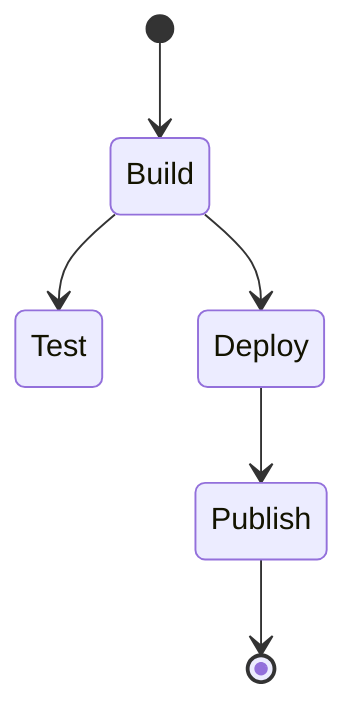

- Build
  - Pełna wersją Node
  - klonowanie repozytorium
  - instalacja zależności
  - budowanie aplikacji
- Test
  - uruchomienie testów
- Deploy
  - przygotowanie oczyszczonego obrazu docker poprzez skopiowanie niezbędnych plików z etapu budowania
  - uruchomienie aplikacji (w celu uruchomienia podstawowego testu czy aplikacja działa)
  - zatrzymanie aplikacji
- Publish
  - publikacja obrazu docker do registry


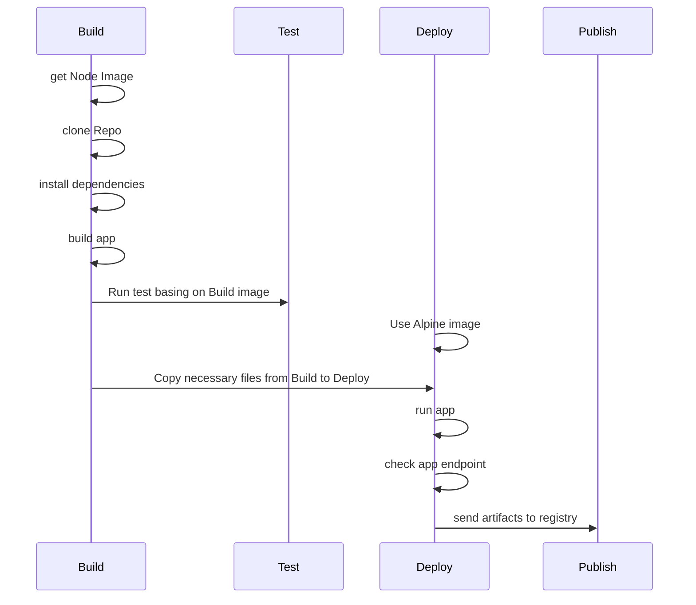


## Przygotowanie

Będziemy korzystać z innej aplikacji niż w poprzednich etapach, ponieważ był tam jedynie prosty skrypt oraz testy.

By móc zaprezentować coś ciekawszego, postawimy aplikację, która dostarczy nam prosty interfejs REST API.

W tym celu utworzymy 2 pliki docker, będzie to [docker-build](./Dockerfile-build) oraz [docker-test](./Dockerfile-test).
Pozwolę sobie nie omawiać, co się w nich znajduję, ponieważ kroki są analogiczne do poprzednich etapów.

- Stosując dobre praktyki, powinniśmy zdefiniować wersję `node` w naszym Dockerfile, w tym celu wybieramy najnowszą wersję LTS, jest to wersja, która będzie najdłużej wspierana i jest najlepiej sprawdzona.
- Dodatkowo do pliku [docker-build](./Dockerfile-build) na końcu dodamy komendę `npm run build`, która zbuduje naszą aplikację.

## Sprawdzenie plików Docker

Warto najpierw odpalić lokalnie swoje pliki docker w celu przetestowania ich działania.

W tym celu odpalamy kolejno pliki `build` -> `test` -> `deploy`.

### Build

```bash
sudo docker build -t nest-build . -f Dockerfile-build
```

### Test

```bash
sudo docker build -t nest-test . -f Dockerfile-test
```

### Deploy

```bash
sudo docker build -t nest-deploy . -f Dockerfile-deploy
```

A następnie uruchomić komendą:

```bash
sudo docker run -p 3000:3000 -d nest-deploy
```

- `-p 3000:3000` - przekierowanie portów, pierwszy port to port na którym nasłuchuje nasz docker, drugi to port na którym nasłuchuje nasza maszyna
- `-d` - uruchomienie w tle

Teraz możemy przetestować nasze API używając komendy `curl`:

```bash
curl localhost:3000
```

lub 

```bash
curl localhost:3000/fib/1
```

## Jenkins

### Instalacja

> W tym celu wystarczy zastosować domyślną konfigurację Jenkinsa, dostępną pod tym [adresem](https://www.jenkins.io/doc/book/installing/docker/#on-macos-and-linux).

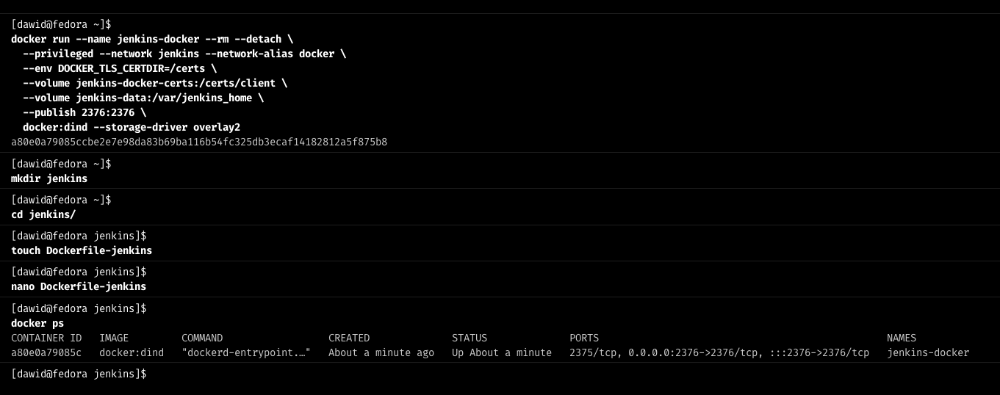

Tworzymy obraz jenkinsa z punktu 4 i odpalamy go.

Teraz za pomocą komendy 

```bash
docker ps
```

możemy sprawdzić czy nasz obraz działa.

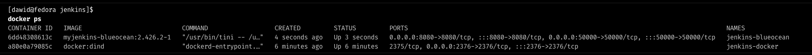

Teraz gdy wejdziemy na stronę `localhost:8080` powinniśmy zobaczyć ekran logowania.


### Konfiguracja

Aby dostać inicjacyjne hasło do jenkinsa, musimy przejrzeć logi kontenera. W tym celu odpalamy komendę:

```bash
docker logs jenkins-blueocean
```

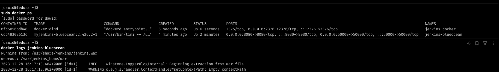

Na dole logów odnajdziemy nasze hasło

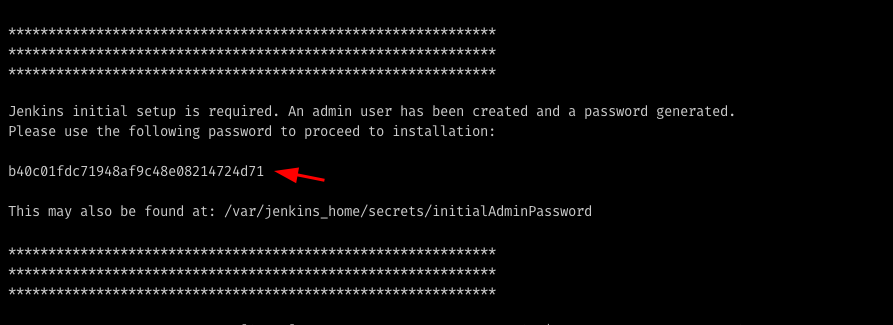

kopiujemy je i używamy do zalogowania się do jenkinsa.

> Jeśli chcesz korzystać ze strony konfiguracyjnej na maszynie hosta, wystarczy, że wejdzie na:
> `ADRES_IP_WIRTUALNEJ_MASKY:8080` w naszym przypadku `http://192.168.67.2:8080/`

- Następnie wybieramy "Zainstaluj sugerowane wtyczki".
- Tworzymy konto administratora
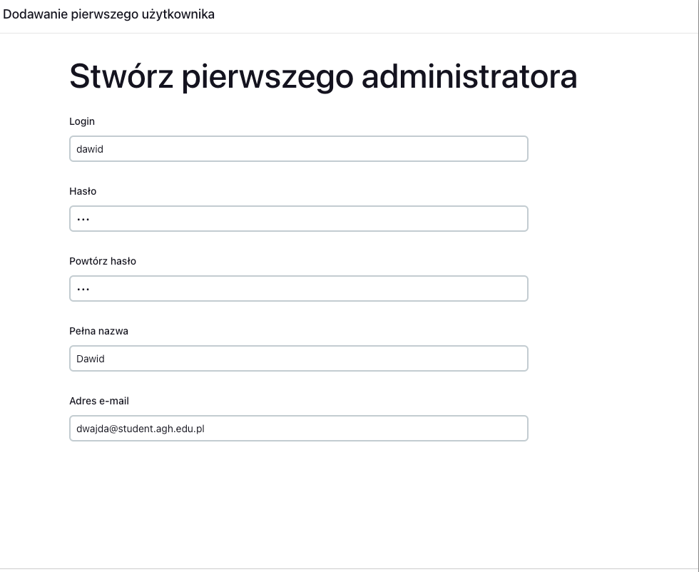


Po zalogowaniu, tworzymy nowy projekt "Ogólny".

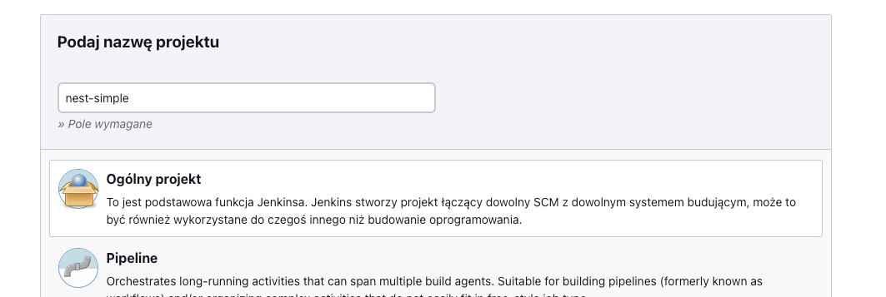


Wchodzimy tutaj
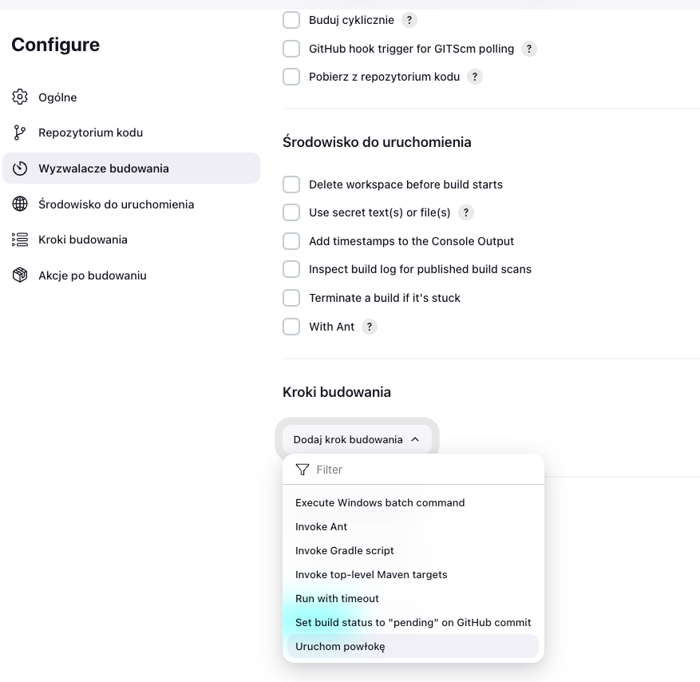

i wpisujemy kilka komend, aby dowiedzieć się kim jesteśmy i dokąd zmierzamy.

```bash
who -a
whoami
ls -lA
pwd
uname -a
```

Zapisujemy i uruchamiamy.
Następnie wchodzimy w Logi konsoli i sprawdzamy co dostaliśmy.

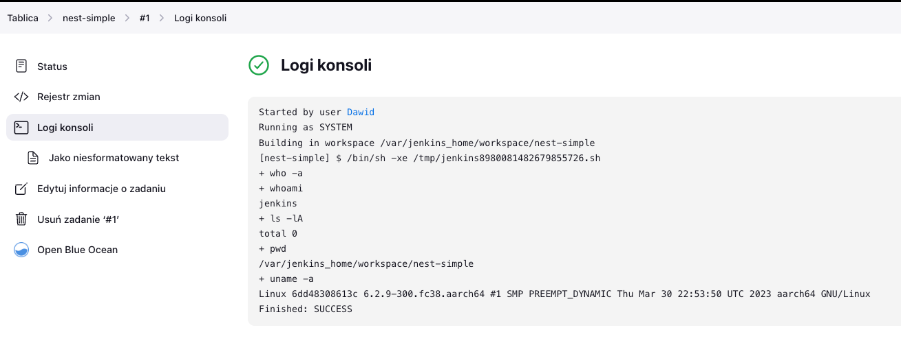

## Pipeline

Tworzymy nowy pipeline, i zaczniemy od odpalenia na nim hello world.

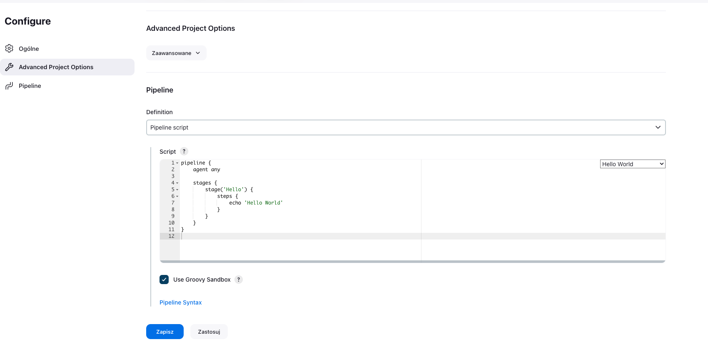

W logach zobaczyć możemy że wszystko się powiodło, domyślnie nasz plik będzie trzymany w repozytorium, więc zdefiniujemy ścieżkę pliku `Jenkinsfile`.

### Jenkinsfile

Zaczynamy teraz przygodę z pisaniem naszego pliku `Jenkinsfile`.

#### Clear

```groovy
stages {
    stage('Clear') {
        steps {
            echo 'Cleaning up'
            sh 'if [ -d MDO2024 ]; then rm -rf MDO2024; fi'
            sh 'docker system prune --all --force --volumes'
            sh 'docker rm -f $(docker ps -aq)'
        }
    }
```

W kolejnym kroku będziemy klonować katalog z repozytorium, w tym celu musimy usunąć go, jeśli już istnieje, aby nie mieć duplikatu.

Analogiczna sytuacja z obrazami oraz kontenerami docker, jeśli istnieją to chcemy się ich pozbyć.

#### Clone

```groovy
stage('Clone CI repo') {
    steps {
        sh 'git clone https://github.com/InzynieriaOprogramowaniaAGH/MDO2024.git'
        dir('MDO2024') {
            sh 'git checkout DW408167'
        }
    }
}
```

Teraz klonujemy repozytorium, wchodzimy do niego i przechodzimy na branch `DW408167`. Który jest naszym branchem.

#### Build

```groovy
stage('Build') {
    steps {
        echo 'Running the build container'
        dir('MDO2024/GCL3/DW408167/Lab04') {
            sh 'docker build -t nest-build . -f Dockerfile-build'
        }
    }
}
```

Odpalamy build naszą standardową komendą, omówioną w pierwszym rozdziale.

#### Test

```groovy
stage('Test') {
    steps {
        echo 'Running the test container'
        dir('MDO2024/GCL3/DW408167/Lab04') {
            sh 'docker build -t nest-test . -f Dockerfile-test'
        }
    }
}
```

Analogicznie jak w poprzednim kroku, odpalamy testy.


#### Deploy

```groovy
stage('Deploy') {
    steps {
        echo 'Running the deploy container'
        dir('MDO2024/GCL3/DW408167/Lab04') {
            sh 'docker build -t nest-deploy . -f Dockerfile-deploy'

            // Run the deploy container
            sh 'docker run -p 3000:3000 -d --name nest-deploy-container nest-deploy'

            // Wait a bit for the container to start up
            sh 'sleep 5'

            // Execute the existing validation script
            sh './validation_script.sh'

            // Clean up: stop and remove the container
            sh 'docker stop nest-deploy-container'
            sh 'docker rm nest-deploy-container'
        }
    }
}
```

Tutaj zaczyna robić się ciekawie, ponieważ chcemy aby w pliku deploy znalazły się pliki bez żadnych "śmieci".
W tym celu obraz jest budowany na `node` w wersji `alpine`, który jest bardzo lekką wersją node, która nie zawiera niepotrzebnych plików.

Do niego kopiujemy jedynie zbudowane pliki z obrazu `nest-build`.

Następnie uruchamiamy aplikację w kontenerze, aby przetestować czy działa.
W tym celu stworzyliśmy skrypt `validation_script.sh`, który robi zapytanie do aplikacji i weryfikuje czy odpowiedź jest zgodna z oczekiwaną.


### Publish 

#### Registry

Aby móc publikować nasze obrazy, musimy mieć gdzie je przechowywać.

W tym celu tworzymy własny registry, który będzie przechowywał nasze obrazy.

Bardziej rozbudowany opis możemy znaleźć pod tym [linkiem](https://www.docker.com/blog/how-to-use-your-own-registry-2/).

W celu stworzenia docker registry, wystarczy odpalić komendę:

```bash
docker run -d -p 5000:5000 --name registry registry:2.7
```

Następnie jeśli chcemy dodać obraz do naszego registry, musimy go najpierw zatagować, aby wskazywał na nasz registry, a następnie pushować obraz.

```bash
docker tag nest-deploy localhost:5000/nest-deploy:0.0.1
docker push localhost:5000/nest-deploy:0.0.1
```

Aby sprawdzić czy obraz został dodany do naszego registry, wystarczy odpalić komendę:

```bash
curl localhost:5000/v2/_catalog
```

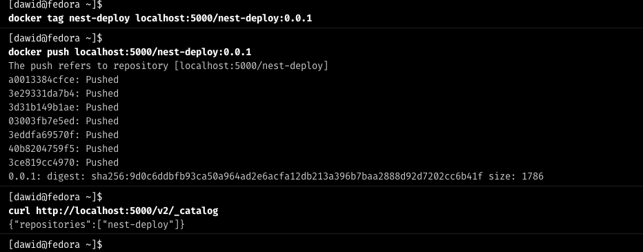

Natomiast jeśli chcemy użyć publicznego registry, ponieważ z jakiegoś powodu nie mamy dostępu
do lokalnego, to musimy stworzyć konto na docker hubie, a następnie podążać za [instrukcją](https://docs.docker.com/get-started/04_sharing_app/).

Szczegółową konfigurację jenkinsa w tym celu znajdziemy [tutaj](https://sweetcode.io/how-to-build-and-push-docker-images-to-docker-hub-using-jenkins-pipeline/)

#### Publish Jenkins

```groovy
stage('Publish') {
    steps {
        echo 'Publishing the image to the registry'
        dir('MDO2024/GCL3/DW408167/Lab04') {
            sh 'docker tag nest-deploy localhost:5000/nest-deploy:0.0.1'
            sh 'docker push localhost:5000/nest-deploy:0.0.1'
        }
    }
}
```

W tym kroku, tagujemy nasz obraz, aby wskazywał na nasz registry, a następnie pushujemy go.

### Konfiguracja Jenkinsfile

Aby nasza konfiguracja była pobierana automatycznie z napisanego przez nas Jenkinsfile, musimy wejść w konfigurację pipeline i wybrać następujące opcje:

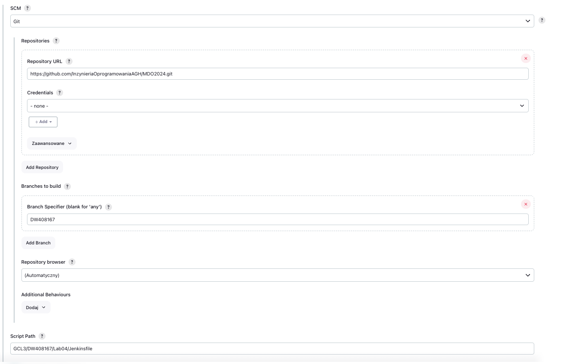