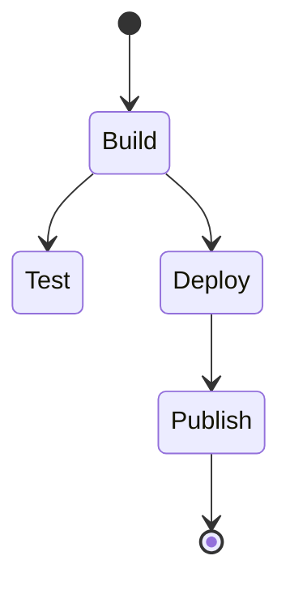
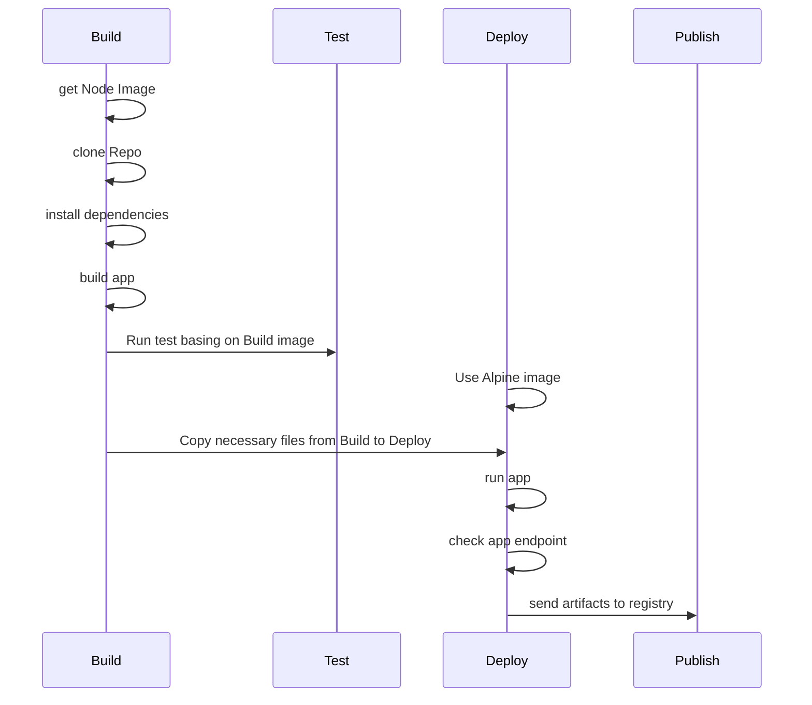

# Tworzenie Pipeline w Jenkins

> ## Syllabus
>
> - Instalacja Jenkinsa
> - Konfiguracja Jenkinsa
> - Budowanie flow od budowania aplikacji do jej wdrożenia

**Spis treści**

<!-- TOC -->
* [Tworzenie Pipeline w Jenkins](#tworzenie-pipeline-w-jenkins)
  * [Wprowadzenie](#wprowadzenie)
  * [Przygotowanie](#przygotowanie)
  * [Sprawdzenie plików Docker](#sprawdzenie-plików-docker)
    * [Build](#build)
    * [Test](#test)
    * [Deploy](#deploy)
  * [Jenkins](#jenkins)
    * [Instalacja](#instalacja)
    * [Konfiguracja](#konfiguracja)
  * [Pipeline](#pipeline)
<!-- TOC -->

## Wprowadzenie

Będziemy tworzyć pipeline, który jest odzwierciedlony na poniższym diagramie.



- Build
  - Pełna wersją Node
  - klonowanie repozytorium
  - instalacja zależności
  - budowanie aplikacji
- Test
  - uruchomienie testów
- Deploy
  - przygotowanie oczyszczonego obrazu docker poprzez skopiowanie niezbędnych plików z etapu budowania
  - uruchomienie aplikacji (w celu uruchomienia podstawowego testu czy aplikacja działa)
  - zatrzymanie aplikacji
- Publish
  - publikacja obrazu docker do registry





## Przygotowanie

Będziemy korzystać z innej aplikacji niż w poprzednich etapach, ponieważ był tam jedynie prosty skrypt oraz testy.

By móc zaprezentować coś ciekawszego, postawimy aplikację, która dostarczy nam prosty interfejs REST API.

W tym celu utworzymy 2 pliki docker, będzie to [docker-build](./Dockerfile-build) oraz [docker-test](./Dockerfile-test).
Pozwolę sobie nie omawiać, co się w nich znajduję, ponieważ kroki są analogiczne do poprzednich etapów.

- Stosując dobre praktyki, powinniśmy zdefiniować wersję `node` w naszym Dockerfile, w tym celu wybieramy najnowszą wersję LTS, jest to wersja, która będzie najdłużej wspierana i jest najlepiej sprawdzona.
- Dodatkowo do pliku [docker-build](./Dockerfile-build) na końcu dodamy komendę `npm run build`, która zbuduje naszą aplikację.

## Sprawdzenie plików Docker

Warto najpierw odpalić lokalnie swoje pliki docker w celu przetestowania ich działania.

W tym celu odpalamy kolejno pliki `build` -> `test` -> `deploy`.

### Build

```bash
sudo docker build -t nest-build . -f Dockerfile-build
```

### Test

```bash
sudo docker build -t nest-test . -f Dockerfile-test
```

### Deploy

```bash
sudo docker build -t nest-deploy . -f Dockerfile-deploy
```

A następnie uruchomić komendą:

```bash
sudo docker run -p 3000:3000 -d nest-deploy
```

- `-p 3000:3000` - przekierowanie portów, pierwszy port to port na którym nasłuchuje nasz docker, drugi to port na którym nasłuchuje nasza maszyna
- `-d` - uruchomienie w tle

Teraz możemy przetestować nasze API używając komendy `curl`:

```bash
curl localhost:3000
```

lub 

```bash
curl localhost:3000/fib/1
```

## Jenkins

### Instalacja

> W tym celu wystarczy zastosować domyślną konfigurację Jenkinsa, dostępną pod tym [adresem](https://www.jenkins.io/doc/book/installing/docker/#on-macos-and-linux).


Tworzymy obraz jenkinsa z punktu 4 i odpalamy go.

Teraz za pomocą komendy 

```bash
docker ps
```

możemy sprawdzić czy nasz obraz działa.


Teraz gdy wejdziemy na stronę `localhost:8080` powinniśmy zobaczyć ekran logowania.


### Konfiguracja

Aby dostać inicjacyjne hasło do jenkinsa, musimy przejrzeć logi kontenera. W tym celu odpalamy komendę:

```bash
docker logs jenkins-blueocean
```


Na dole logów odnajdziemy nasze hasło


kopiujemy je i używamy do zalogowania się do jenkinsa.

> Jeśli chcesz korzystać ze strony konfiguracyjnej na maszynie hosta, wystarczy, że wejdzie na:
> `ADRES_IP_WIRTUALNEJ_MASKY:8080` w naszym przypadku `http://192.168.67.2:8080/`

- Następnie wybieramy "Zainstaluj sugerowane wtyczki".
- Tworzymy konto administratora


Po zalogowaniu, tworzymy nowy projekt "Ogólny".


Wchodzimy tutaj


i wpisujemy kilka komend, aby dowiedzieć się kim jesteśmy i dokąd zmierzamy.

```bash
who -a
whoami
ls -lA
pwd
uname -a
```

Zapisujemy i uruchamiamy.
Następnie wchodzimy w Logi konsoli i sprawdzamy co dostaliśmy.


## Pipeline

Tworzymy nowy pipeline, i zaczniemy od odpalenia na nim hello world.


W logach zobaczyć możemy że wszystko się powiodło, domyślnie nasz plik będzie trzymany w repozytorium, więc zdefiniujemy ścieżkę pliku `Jenkinsfile`.

