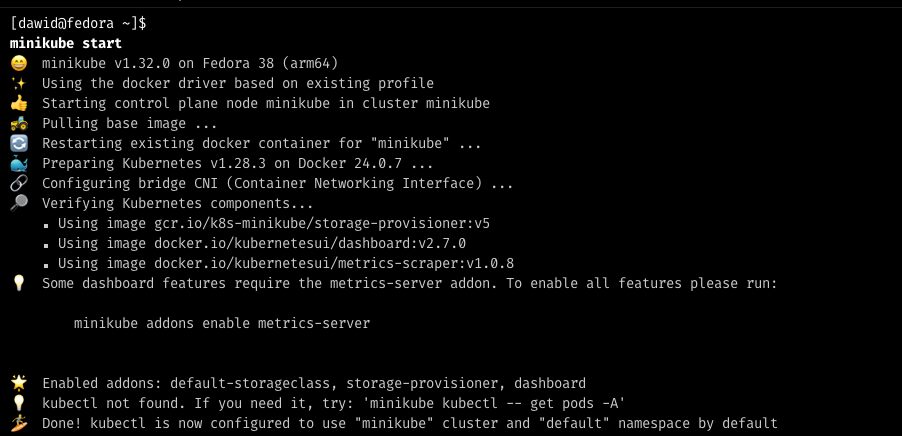
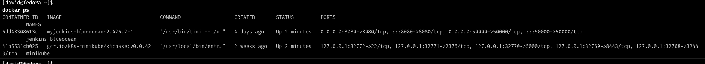

# Kubernetes

> ## Syllabus
>
> - Instalacja Kubernetes
> - Konfiguracja klastra
> - Uruchamianie aplikacji
> - Zmiany deploymentu i aktualizacja aplikacji


**Spis treści**

<!-- TOC -->
* [Kubernetes](#kubernetes)
  * [Instalacja Kubernetes](#instalacja-kubernetes)
    * [Wymagania](#wymagania)
<!-- TOC -->

## Instalacja Kubernetes

> MiniKube [docs](https://minikube.sigs.k8s.io/docs/start/)

Zaczynamy od instalacji minikube i ustawienia kubectl.

Wystarczy, że będziemy ślepo podążać za dokumentacją, pamiętajmy o ustawieniu aliasa dla kubectl.

```bash
alias kubectl="minikube kubectl --"
```

warto dodać tę linijkę do pliku `.bashrc` lub `.zshrc` aby alias był dostępny po ponownym uruchomieniu terminala.

### Wymagania

Pamiętajmy, że minikube wymaga przynajmniej 2 cpu i 2GB ramu.

Po uruchomieniu minikube (`minikube start`) możemy sprawdzić czy wszystko działa poprawnie:

---



Minikube jest aplikacją działającą w kontenerze, więc możemy sprawdzić czy uruchomiła się listując uruchomione kontenery



Jeśli posiadamy środowisko graficzne, to mozemy podejrzeć dashboard minikube:

```bash
minikube dashboard
```


