# Kubernetes

> ## Syllabus
>
> - Instalacja Kubernetes
> - Konfiguracja klastra
> - Uruchamianie aplikacji
> - Zmiany deploymentu i aktualizacja aplikacji


**Spis treści**

<!-- TOC -->
* [Kubernetes](#kubernetes)
  * [Instalacja Kubernetes](#instalacja-kubernetes)
    * [Wymagania](#wymagania)
  * [Testowanie prostego kontenera](#testowanie-prostego-kontenera)
  * [Deploy aplikacji](#deploy-aplikacji)
    * [Konfiguracja pliku deploymentu](#konfiguracja-pliku-deploymentu)
    * [Modyfikacje](#modyfikacje)
    * [Rollout](#rollout)
      * [Weryfikacja rollout:](#weryfikacja-rollout)
      * [Aktualizacja aplikacji](#aktualizacja-aplikacji)
      * [Undo rollout](#undo-rollout)
      * [Różnice pomiędzy strategiami wdrażania](#różnice-pomiędzy-strategiami-wdrażania)
    * [Skrypt sprawdzający czas wdrożenia](#skrypt-sprawdzający-czas-wdrożenia)
<!-- TOC -->

## Instalacja Kubernetes

> MiniKube [docs](https://minikube.sigs.k8s.io/docs/start/)

Zaczynamy od instalacji minikube i ustawienia kubectl.

Wystarczy, że będziemy ślepo podążać za dokumentacją, pamiętajmy o ustawieniu aliasa dla kubectl.

```bash
alias kubectl="minikube kubectl --"
```

warto dodać tę linijkę do pliku `.bashrc` lub `.zshrc` aby alias był dostępny po ponownym uruchomieniu terminala.

### Wymagania

Pamiętajmy, że minikube wymaga przynajmniej 2 cpu i 2GB ramu.

Po uruchomieniu minikube (`minikube start`) możemy sprawdzić czy wszystko działa poprawnie:

---


Minikube jest aplikacją działającą w kontenerze, więc możemy sprawdzić czy uruchomiła się listując uruchomione kontenery


Problemy, jakie mogą wystąpić, to np. brak odpowiednich uprawnień do odpalania kontenerów, 
(obowiązek używania zawsze `sudo` przed docker) wtedy minikube zamiast użyć dockera, użyje innego drivera,
czego nie chcemy.


Jeśli posiadamy środowisko graficzne, to możemy podejrzeć dashboard minikube:

```bash
minikube dashboard
```

Jeśli nie, to możemy użyć kubectl:

```bash
kubectl get pods -A
```

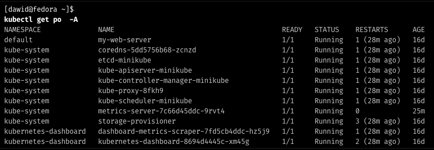


## Testowanie prostego kontenera

Warto sprawdzić czy wszystko działa poprawnie, możemy w tym celu uruchomić domyślną konfigurację nginx
i zobaczyć czy działa.

```bash
minikube kubectl run -- my-web-server --image=nginx --port=80 --labels app=my-web-server
```

W tym używamy takiej komendy, gdzie `my-web-server` to nazwa deploymentu, `--image=nginx` to obraz, który chcemy uruchomić,
`--port=80` to port, na którym nasłuchuje nasz kontener, a `--labels app=my-web-server` to etykiety, które możemy użyć

następnie używamy komendy

```bash
kubectl port-forward pod/my-web-server 8081:80
```

aby przekierować port 80 z kontenera na port 8081 naszej maszyny.

Po odpaleniu tych komend, gdy wejdziemy na stronę localhost:8081, powinniśmy ujrzeć stronę domyślną nginx.

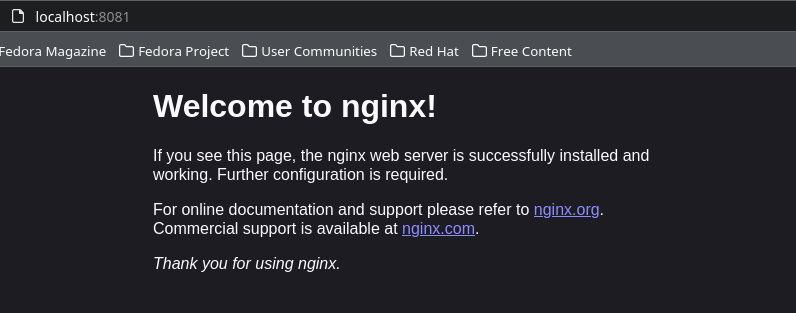

Jeśli wszystko działa możemy usunąć pod:

```bash
kubectl delete pod my-web-server
```

I przejść do deployu naszej prawdziwej aplikacji.


## Deploy aplikacji

> Pełną dokumentację można znaleźć [tutaj](https://kubernetes.io/docs/concepts/workloads/controllers/deployment/)

Zanim zaczniemy tworzyć deploy, musimy mieć skąd pobrać obraz naszej aplikacji, w tym celu tworzymy konto na docker hubie
[więcej informacji...](https://docs.docker.com/get-started/04_sharing_app/).

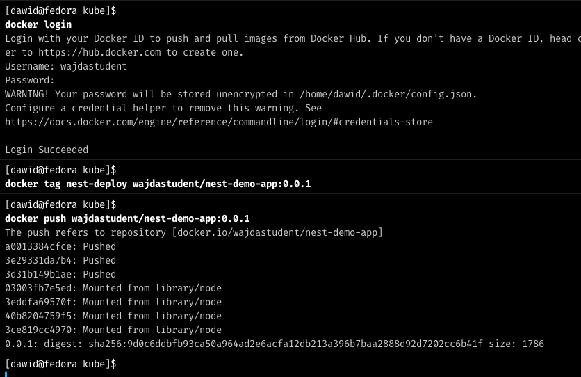

Powinien być już widoczny w docker hubie:
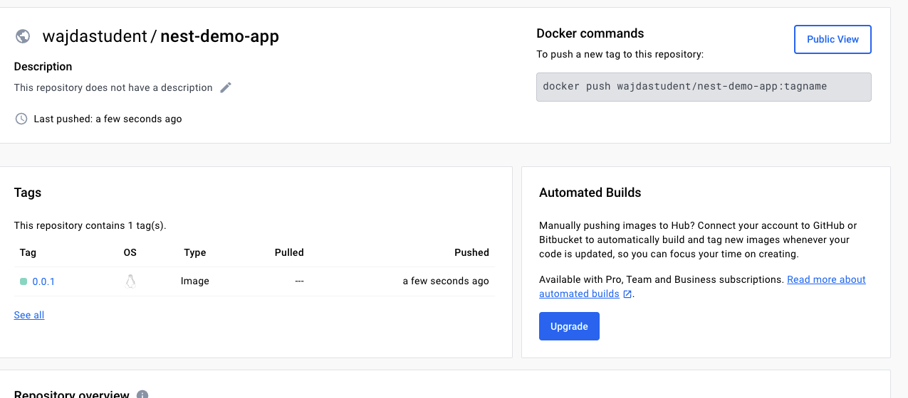

### Konfiguracja pliku deploymentu

Tworzymy plik `deployment-01.yaml` i wklejamy do niego:

```yaml
piVersion: apps/v1
kind: Deployment
metadata:
  name: nest-app
  labels:
    app: nest
spec:
  replicas: 3
  selector:
    matchLabels:
      app: nest
  template:
    metadata:
      labels:
	app: nest
    spec:
      containers:
      - name: nest-demo-app
        image: wajdastudent/nest-demo-app:0.0.1
        ports:
       	- containerPort: 3000
```

W tym pliku mamy zdefiniowany deployment, który ma 3 repliki, czyli 3 instancje naszej aplikacji,
obraz jest pobierany z docker huba, a port 3000 jest eksponowany na zewnątrz.

Deployment uruchamiamy komendą:

```bash
kubectl apply -f deployment-01.yaml
```

W dashboard możemy sprawdzić czy wszystko zadziałało poprawnie:

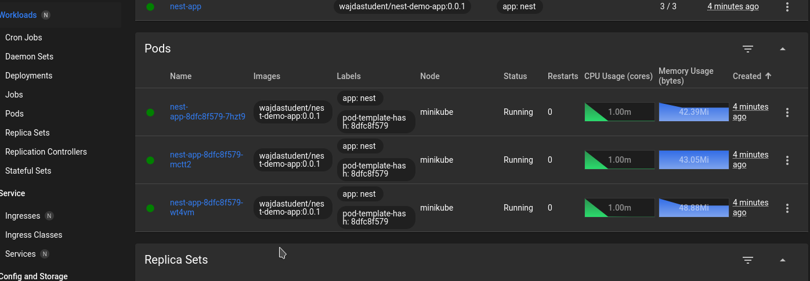

Lub za pomocą zapytania konsolowego

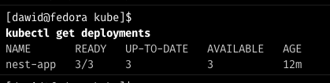


Następnie aby zweryfikować poprawność działania aplikacji, musimy zrobić port-forward na deploymencie:

```bash
kubectl port-forward deployment/nest-app 3000:3000
```

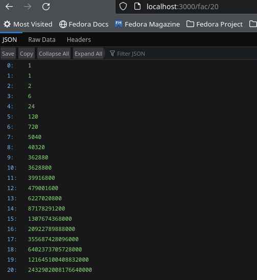

Po odpaleniu aplikacji, możemy zobaczyć że wszystko działa poprawnie.


### Modyfikacje

Jeśli zdecydujemy że chcemy wprowadzić jakieś zmiany, np zmienić liczbę replik, to wystarczy zmienić liczbę z `3` na `1` 
i ponownie użyć apply, on wtedy przeskaluje nasz deployment i usunie nadmiarowe instancje, natomiast musimy pamiętać,
że nie wykona on nowego wdrożenia, ponieważ **skalowanie nie jest zmianą wersji**.

Jeśli ustawimy 0 deploymentów, to deployment nadal będzie istniał, ale beż żadnej repliki, warto to używać, kiedy chcemy na przyszłość przygotować deployment
i jedynie czekamy na sygnał, by to zrobić.

Jeśli zmienimy wersję obrazu, to deployment automatycznie zrobi rollout, czyli zastąpi stare instancje nowymi.

Może powodować to szereg problemów (np brak zgodności interfejsu bazy danych), dlatego nasza aplikacja powinna być dobrze przygotowana do migracji pomiędzy wersjami.

### Rollout

#### Weryfikacja rollout:

```bash
kubectl rollout status deployment nest-app
```
dostaniemy odpowiedź _'deployment "nest-app" successfully rolled out'_.

Na ten moment posiadamy tylko jedną rewizję, możemy ją sprawdzić komendą:

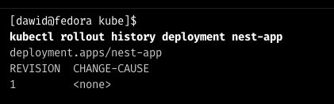

#### Aktualizacja aplikacji

Jak wspomnieliśmy wyżej, zmiana ilości replik nie spowoduje nowego rollouta, 
więc musimy zmienić wersję obrazu, aby to zrobić, wrzuacmy na dockerhub nową wersję obrazu, 
a następnie podmieniamy ją w pliku deploymentu:

```txt
wajdastudent/nest-demo-app:0.0.1 -> image: wajdastudent/nest-demo-app:0.0.2
```

ponownie robimy apply i sprawdzamy rollout:

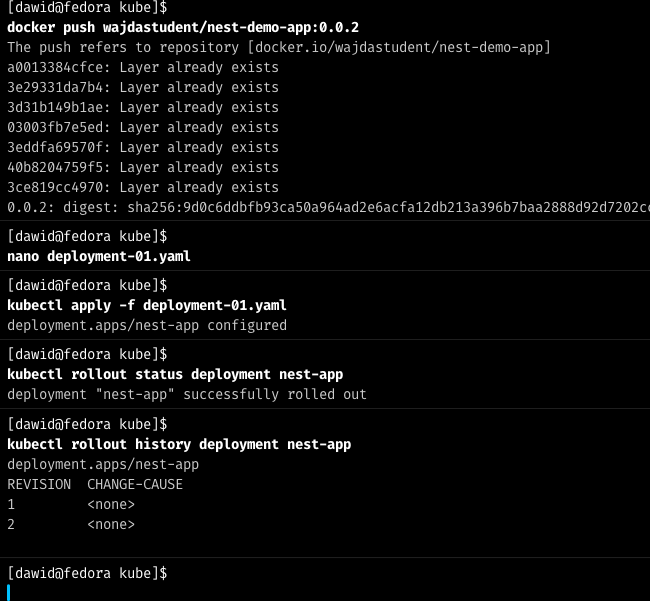

Dostrzec możemy, że po wprowadzeniu zmian, zrobiła się nowa rewizja, a wersja obrazu została zmieniona.

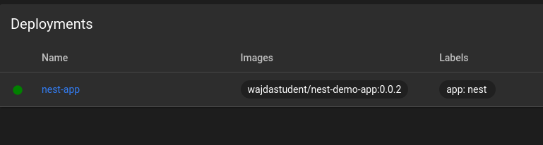

#### Undo rollout

Jeśli z jakiegoś powodu, chcemy cofnąć zmiany, to możemy użyć komendy:

```bash
kubectl rollout undo deployment nest-app
```

I powrócimy do poprzedniej wersji aplikacji.


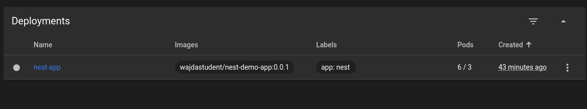

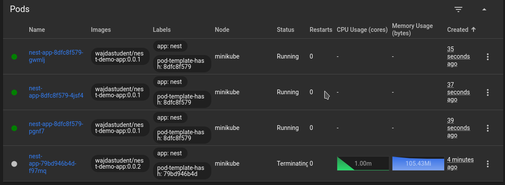

Zauważyć tutaj można ciekawą rzecz, ponieważ sukcesywnie usuwał stare instancje i tworzył nowe, dzięki czemu downtime
naszej aplikacji był minimalny.

#### Różnice pomiędzy strategiami wdrażania

- Recreate - usuwa wszystkie instancje i tworzy nowe, downtime jest maksymalny, ale nie ma problemów z migracją danych.
- Rolling Update - sukcesywnie usuwa stare instancje i tworzy nowe, downtime jest minimalny, ale może powodować problemy z migracją danych.
- Canary Deployment workload - tworzy nowe instancje, ale nie usuwa starych, pozwala na testowanie nowej wersji aplikacji, ale może powodować problemy z migracją danych.


### Skrypt sprawdzający czas wdrożenia

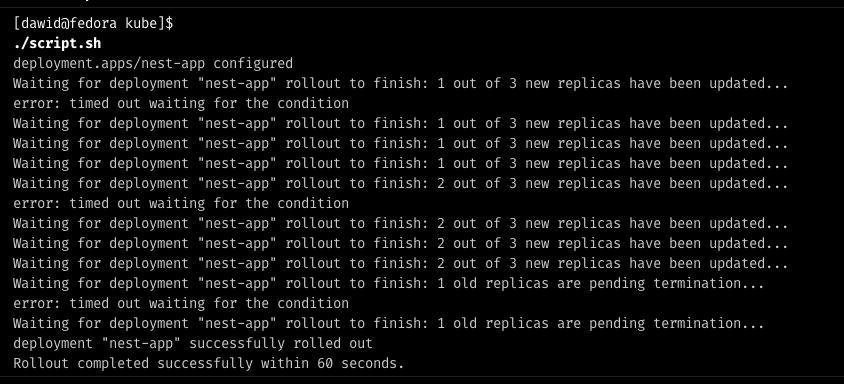

```bash
# Deploy application
minikube kubectl -- apply -f deployment-01.yaml

# Start timer
start_time=$(date +%s)

# Set a timeout for 60 seconds
timeout=60
end_time=$(($start_time + $timeout))

# Loop to check the rollout status
while true; do
    # Check if current time is greater than end time
    if [ $(date +%s) -gt $end_time ]; then
        echo "Rollout did not complete within 60 seconds."
        exit 1
    fi

    # Check the rollout status
    if minikube kubectl -- rollout status deployment/nest-app --timeout=1s; then
        echo "Rollout completed successfully within 60 seconds."
        exit 0
    fi

    # Wait for a short period before checking again
    sleep 1
done
```

Jeśli chcemy użyć innej aplikacji, możemy zmodyfikować skrypt aby brał parametr, który jest nazwą deploymentu,
lub po prostu podmienić wartość w skrypcie.

