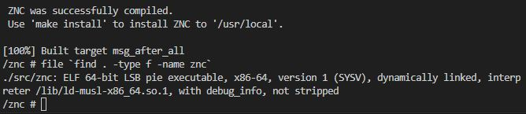

# Sprawozdanie 2

Wybrałem oprogramowanie [ZNC - An advanced IRC bouncer](https://github.com/znc/znc)

Jest oprogramowaniem na licencji Apache 2.0 i zostało zaakceptowane przez prowadzącego podczas zajęć.

W dokumentacji zawarta została instrukcja instalacji:


Oraz testy:


## Przygotowanie środowiska

Za pośrednictwem Oracle VM VirtualBox zainstalowałem Fedorę 39, do której dołączyłem mostkowaną kartą sieciową.

### SSH

Na maszynie potrzebujemy SSH, w tym celu wykonujemy polecenia:

```bash
sudo dnf install openssh-server
```

następnie uruchamiamy go i włączamy automatyczne uruchamianie przy starcie systemu:

```bash
sudo systemctl start sshd
sudo systemctl enable sshd
```

ewentualnie 

```bash
systemctl status sshd #w celu sprawdzenia 
```

Komendą 

```bash
ip a
```

Uzyskuję adres sieciowy maszyny wirtualnej.

W celu wygodniejszej edycji komend, za pośrednictwem Visual Studio Code, łączę się z nią przez SSH:


### Git

Do połączenia z naszym kontem GitHub (a co za tym idzie do autoryzacji przesyłanych plików na repozytorium), potrzebujemy też kluczy SSH, które generujemy komendą:

```bash
ssh-keygen
```

Klucz publiczny SSH należy dodać do swojego konta GitHub: [Adding a new SSH key to your GitHub account](https://docs.github.com/en/authentication/connecting-to-github-with-ssh/adding-a-new-ssh-key-to-your-github-account).

Celem sprawdzenia można wykonać polecenie:

```bash
ssh -T git@github.com
```

Którego oczekiwanym wynikiem jest 

```bash
Hi fwawrzen! You've successfully authenticated, but GitHub does not provide shell access.
```

Tu "fwawrzen", bo to nazwa mojego konta (co potwierdza nawiązanie połączenia z odpowiednim kontem).

Warto zainstalować też najnowszą wersję samego gita:

```bash
sudo dnf install git
```

Na końcu można sklonować nasze repozytorium przez HTTPS:

```bash
git clone https://github.com/InzynieriaOprogramowaniaAGH/MDO2024.git
```

lub SSH, używając nowo dodanego klucza:

```bash
git clone git@github.com:InzynieriaOprogramowaniaAGH/MDO2024.git
```

### Docker

W celu instalacji dockera wykonujemy:

```bash
sudo dnf install docker
```

po pomyślnej instalacji można wykonać polecenia:

```bash
docker pull hello-world
docker run hello-world
```

Które udowodnią, że wszystko działa jak należy.

W celu pracy z terminalem interaktywnym należy dodać argument "-it", np.:

```bash
docker run -it --tty busybox
```

## ZNC

Rozpoczynając pracę z ZNC klonujemy repoztorium z dostępnym kodem, w tym przypadku przez HTTPS:


Postępujemy zgodnie z dokumentacją:


Instalujemy wymagane zależności


Instalujemy wymagane zależności - ciąg dalszy (to IRC, więc wiadomo było, że nie będzie łatwo)


Używam też polecenia


W celu sprawdzenia zależności, ustawienia opcji konfiguracyjnych itd.


Postępuję zgodnie z poleceniami


I wkrótce...


Jesteśmy gotowi do kompilacji


Która szczęśliwie przebiegła pomyślnie


## ZNC w kontenerze docker

Najpierw należy uruchomić dockera poleceniem

```bash
sudo systemctl start docker
```


Możemy sprawdzić też jakie obrazy docker widzi na naszym systemie:


My natomiast uruchamiamy nowy kontener z terminalem TTY (co umożliwi interaktywność z powłoką). Do tego wybrałem lekką dystrybucję systemu Linux - alpine, ponieważ był to obraz zaproponowany w Dockerfile'u ZNC.


Wewnątrz kontenera klonuję repozytorium ZNC (argument --depth 1 pozwala na sklonowanie jedynie najnowszego commita)


Jak widać do tego potrzebny jest git...


Inicjuję rekursywne aktualizacje submodułów git, których wymaga ZNC


Po czym można już wykonać "cmake"


A następnie "make"


I tak wygląda ZNC zbudowane wewnątrz kontenera.



A tak ZNC poza kontenerem.


Następnie sprawdzam id kontenera, komituję do nowego buildera "znc-bldr", zyskując pożądany obraz.


Na tej podstawie napisałem własny Dockerfile do budowania ZNC - Dockerfile-zncbld.


Używając własnego buildera buduję nowy kontener:


Analogicznie powinien wyglądać Dockerfile-znctest, jednak w dokumentacji ZNC nie znalazłem informacji jak przeprowadzić testy (być może z użyciem Google Tests, które w Makefile'u się przewijają)

```bash
FROM Dockerfile-zncbld

RUN test
```