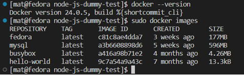

Sprawozdanie lab2
Zdecydowałem się na repozytorium [https://github.com/devenes/node-js-dummy-test], które nie tylko posiada otwartą licencję, plik Makefile oraz zestaw testów, ale także udostępnia w swojej dokumentacji szczegółowy opis procesu tworzenia plików Dockerfile. Wybór Node.js dla projektu ułatwia prostota korzystania z narzędzi, zwłaszcza dzięki łatwej instalacji zależności poprzez npm. Ten wybór doskonale spełnia postawione wymagania i umożliwi łatwą adaptację projektu zgodnie z naszymi potrzebami na zajęciach.

Skonfigurowałem środowisko Git, instalując Git za pomocą polecenia sudo dnf install git. Następnie, zainstalowałem obsługę SSH przy użyciu polecenia sudo dnf install openssh-server. Wygenerowałem klucz SSH za pomocą ssh-keygen i dodałem go do mojego konta na GitHubie. Następnie, sklonowałem repozytorium przedmiotu używając protokołu SSH za pomocą komendy git clone. Dodatkowo, utworzyłem swoją gałąź o nazwie MS262339 poleceniem git checkout -b MS262339, stworzyłem własny folder za pomocą mkdir, dodałem plik readme.md i wypchnąłem zmiany do repozytorium przy użyciu git push --set-upstream origin MS262339. Wszystkie te kroki zostały wykonane zgodnie z wymaganiami. 

Skonfigurowałem środowisko Docker na moim systemie operacyjnym Fedora, co zostało potwierdzone przez wynik polecenia docker --version pokazującego zainstalowaną wersję Dockera. Dodatkowo, za pomocą polecenia sudo docker images udowodniłem skuteczność działania Dockera, prezentując dostępne obrazy w lokalnym rejestrze.

Następnie stworzono kontener budujący.

Ten kontener ma za zadanie przygotować środowisko, sklonować repozytorium node-js-dummy-test z GitHuba oraz zainstalować zależności przy użyciu narzędzia npm.

W ramach spełnienia wymagań, przeprowadzono udany build wybranej aplikacji w kontenerze. Kontener został skonfigurowany jako narzędzie do budowania, nie posiada entry pointa, co zwiększa jego użyteczność wyłącznie w kontekście procesu budowy aplikacji.

Następnie stworzono plik Dockerfile.test, który używa wcześniej zbudowanego obrazu (build-container) jako bazowego, a następnie uruchamia testy aplikacji zgodnie z dokumentacją, wykorzystując narzędzie npm.

Obraz zbudowana przy wykorzystaniu poniższego polecenia.

Stworzono dwa kluczowe obrazy Docker: pierwszy, kontener budujący, automatyzuje proces przygotowania aplikacji; drugi, kontener testujący, bazuje na poprzednim i przeprowadza testy sprawdzające poprawność funkcji oprogramowania. Ta strategia pozwala na spójne i efektywne tworzenie oraz testowanie aplikacji w różnych środowiskach deweloperskich.

Obrazy są statycznymi plikami, przechowującymi informacje o zależnościach i aplikacji, zapewniając spójne środowisko. Kontenery, dynamicznymi instancjami obrazów, umożliwiają pracę w elastycznym środowisku, bez naruszania pierwotnego obrazu, co ułatwia testowanie i dostosowywanie aplikacji. Kontenery są efektywnym narzędziem do utrzymania niezależności środowiskowej aplikacji.
