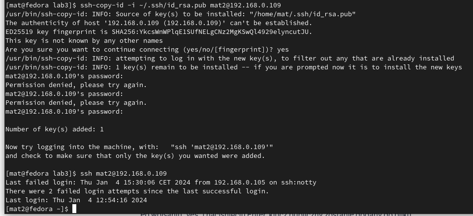
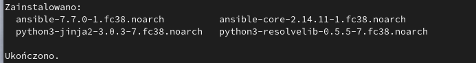
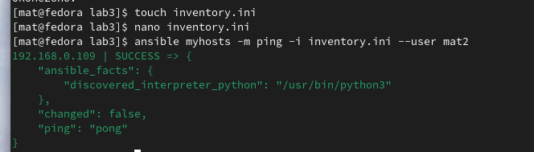
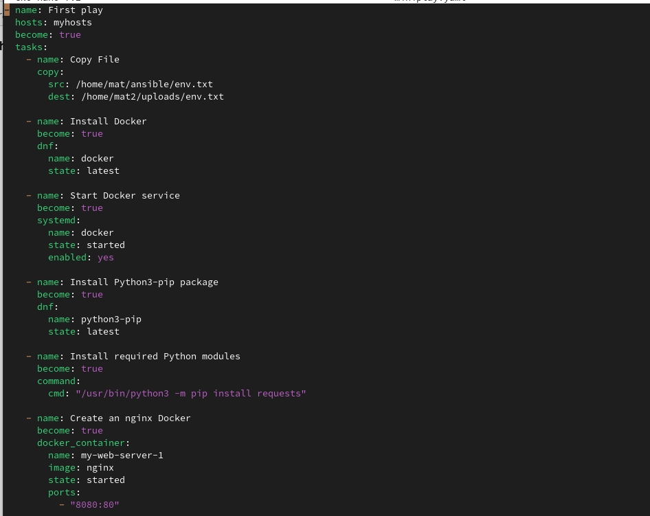
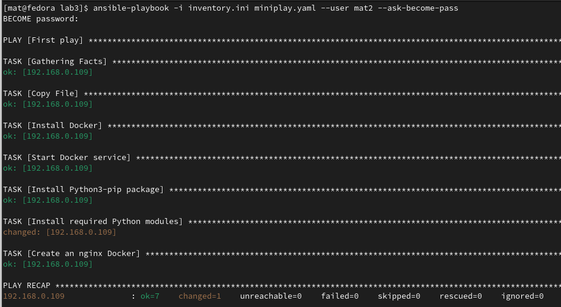
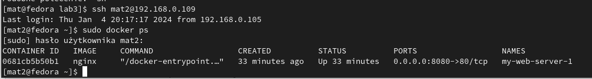
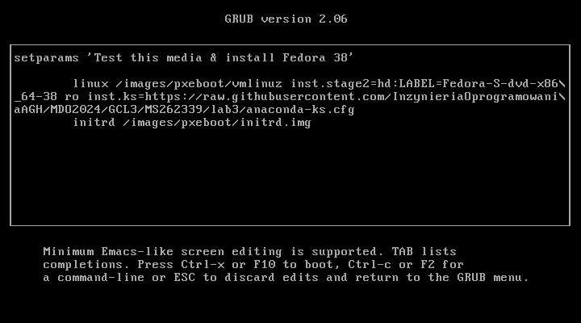

# Sprawozdanie lab 3

## Cel ćwiczenia
Celem zadania jest zapoznanie się z narzędziem Ansible oraz procesem automatyzacji konfiguracji maszyn wirtualnych. Pierwszym krokiem jest zainstalowanie Ansible, a następnie stworzenie drugiej maszyny wirtualnej z systemem Fedora, zawierającym minimalny zestaw oprogramowania. Kolejnym etapem jest utworzenie inwentarza systemów, ustanowienie łączności SSH oraz finalne wykonanie zadań na zdalnych maszynach przy użyciu Ansible. Dodatkowo, w ramach zadania Kickstart, należy zaimplementować zautomatyzowaną instalację maszyny wirtualnej z systemem Fedora, wykorzystując plik odpowiedzi.

## Przygotowanie maszyn i konfiguracja połączenia pomiędzy maszynami
  
Do tego zadania użyjemy polecenia ssh-copy-id, które automatycznie skonfiguruje połączenie między naszymi maszynami. 
Zaczynamy od wygenerowania klucza SSH na maszynie  `fedora` przy pomocy polecenia ssh-keygen.   Ta instrukcja spowoduje stworzenie pary kluczy dla nas - jeden będzie prywatny, a drugi publiczny (plik z rozszerzeniem .pub).
Następnie wykonano polecenie przesłania na zdalną maszynę klucza przy pomocy komendy ssh-copy-id z odpowiednimi flagami oraz łączenie z maszyną przy użyciu SSH. Powyżej wykonane kroki przedstawia zdjęcie:


## Instalacja Ansible
Instalacja Ansible wykonano przy pomocy komendy sudo dnf install ansible.

Następnie stworzono folder o nazwie 'ansible' w katalogu domowym oraz plik inventory.ini, w którym definiujemy grupy hostów. 
W celu sprawdzenia połączenia Ansible skorzystano z narzędzia ping wbudowanego w Ansible, który sprawdza wszystkie hosty zdefiniowane w pliku inventory.ini. Polecenia te przestawiono poniżej na zdjęciu.


## Tworzenie playbooków
Tworzymy nowy plik miniplay.yaml odpowiedzialny za zadania wykonane na maszynie zdalnej. Zawartość pliku przedstawiono poniżej.

Nasz kod wykonuje kilka zadań na zdalnej maszynie. Po pierwsze, kopiuje plik `env.txt` z lokalnej maszyny do folderu `uploads` na zdalnej. Następnie instaluje Docker, uruchamia usługę Docker,  dodatkowo instaluje odpowiedni pakiet oraz moduł. Ostatnim krokiem jest utworzenie kontenera Docker z serwerem nginx na zdalnej maszynie.
## Uruchamianie playbooków
Playbooki w trybie testowym mogą być uruchamiane z dodatkową flagą --check, co pozwala sprawdzić poprawność działania bez faktycznego wprowadzania zmian. W trybie tym Ansible dokonuje weryfikacji, ale nie stosuje rzeczywistych modyfikacji, umożliwiając sprawdzenie, czy wszystko funkcjonuje zgodnie z oczekiwaniami przed zastosowaniem rzeczywistych zmian. Poniżej przedstawiono zdjęcia:



## Kickstart
Kickstart to narzędzie umożliwiające zautomatyzowaną instalację systemu operacyjnego.
Zamieniamy w pliku konfiguracyjnym linijkę clearpart --none --initlabel na clearpart --all --initlabel, co pozwoli nam na instalację systemu na maszynie, na której już jest zainstalowany system. Dodatkowo do pliku dodaliśmy:
```bash
url --mirrorlist=https://mirrors.fedoraproject.org/mirrorlist?repo=fedora-38&arch=aarch64
repo --name=updates --mirrorlist=http://mirrors.fedoraproject.org/mirrorlist?repo=updates-released-f38&arch=aarch64
```
Na głównej maszynie, na której jest większa ilość pakietów, wykonujemy polecenie:
```bash
rpm -qa > packages.txt
```
Dzięki temu plik packages.txt zawiera listę wszystkich zainstalowanych pakietów na tej maszynie. Aby te pakiety automatycznie zainstalowały się podczas instalacji za pomocą pliku kickstart.

## Tworzenie ISO wraz z plikiem kickstart
  
Ściągamy obraz systemu w formie pliku ISO, lub w przypadku posiadania go na dysku, przenosimy go za pomocą polecenia scp.
```python
sudo dnf install -y lorax pykickstart

sudo ksflatten -c anaconda-ks.cfg -o flatten.ks

sudo livemedia-creator --make-iso --ks flatten.ks --no-virt --iso-only --iso-name image.iso --releasever 38
```
