Piotr Micek
# Sprawozdanie 1   Docker files, kontener jako definicja etapu

## Wstęp
* Celem projektu, było zbudowanie programu w konterze oraz przeprowadzenie pomyślnych testów. 
* Znalazłem program, który może być zbudowany w kontenerze, zainstalowałem zależności których wymagał a następnie przeprowadziłem pomyślnie build programu oraz testy. Następnie przetestowałem jakich zależności wymaga do powtórzenia tego w kontenerze.
* Stworzyłem dwa pliki Dockerfile, które zautomatyzowały proces tworzenia obrazów kontenerów.

## Wykonanie zadania
### Wybór oprogramowania na zajęcia
* Użyłem repozytorium z kodem oprogramowania ze środowiskiem Makefile oraz gotowymi testami. https://github.com/alt-romes/programmer-calculator   Sklonowałem je na mój dysk   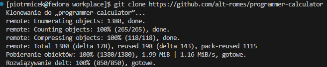
* Pobrałem wymagane programy oraz paczki systemowe zgodnie z plikiem README. Było to gcc oraz ncurses, które należy pobrać w wersji devel.   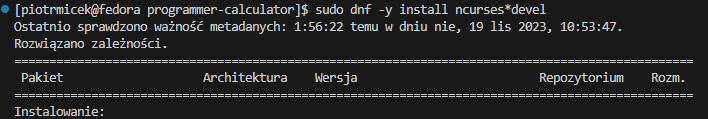   Następnie zbudowałem program.   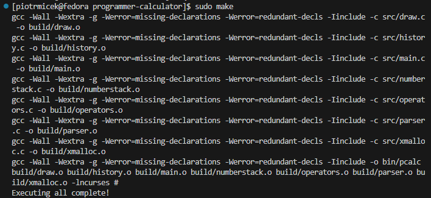 
* Przeprowadziłem testy, które zakończyły się pomyślnie.   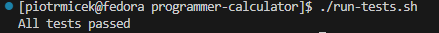
  
### Przeprowadzenie buildu w kontenerze
1. Przeprowadziłem build i test wewnątrz kontenera
   * Uruchomiłem kontener z obrazem Fedory, ponieważ oprogramowanie, które wybrałem jest napisane w języku C++, sam też testowałem je na maszynie z Fedorą.   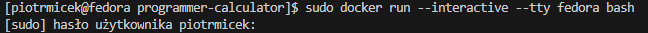
   * Pobrałem te same zależności, które były wcześniej potrzebne do uruchomienia aplikacji na mojej Fedorze, wraz z git, którego użyję do pobrania repozytorium   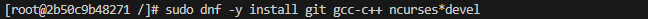
   * Sklonowałem repozytorium w kontenerze   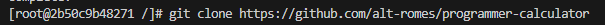
   * Uruchomiłem build   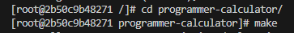
   * Uruchomiłem testy.   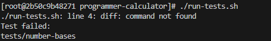   Okazało się, że testy nie kończą się sukcesem, występuje błąd z komendą diff. Należy pobrać jeszcze jedną paczkę - diffutils.   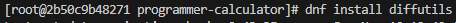   Teraz testy zakończyły się sukcesem.   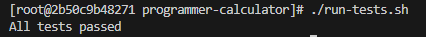
2. Stworzyłem dwa pliki Dockerfile automatyzujące kroki
    * W pierwszym pliku wprowadziłem kroki prowadzące do zbudowania kontenera, obraz Fedory który należy otworzyć, pobranie wymaganych zależności wynikających z doświadczeń z interaktywnym kontenerem uwzględnionych powyżej oraz zbudowanie programu.   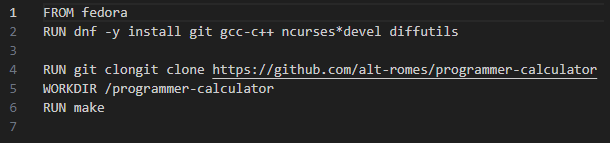
    * W drugim pliku wprowadziłem kroki odpowiedzialne za przeprowadzenie testów na podstawie poprzednio utworzonegoo obrazu   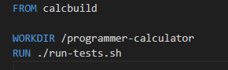
3. Wykazałem, że kontenery wdrażają się prawidłowo
   * Stworzyłem obraz kontenera za pomocą pierwszego pliku Dockerfile   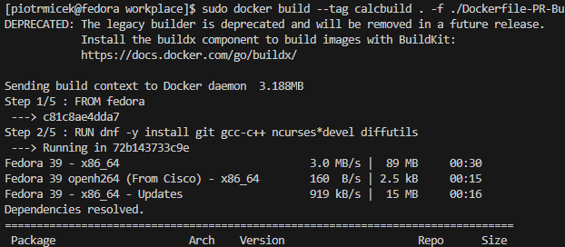   po jego zainiconowaniu obraz calcbuild znajduje się na liście   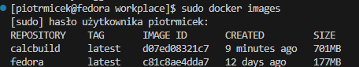
   * Nastepnie stworzylem kolejny obraz za pomocą drugiego pliku dockerfile, który przeprowadził pomyślnie testy   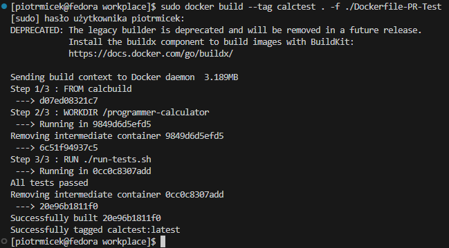   który również trafił na listę stworzonych obrazów. 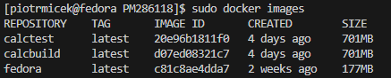
