Piotr Micek
# Sprawozdanie 2   Automatyzacja instalacji i scenariuszy poleceń

## Wstęp
* Celem projektu, było zainstalowanie Ansible i połączenie się z drugą maszyną oraz stworzenie pliku kickstart.
* Zainstalowałem Ansible, pobrałem klucz ssh z drugiej maszyny i mogłem logować się bez potrzeby wpisywania hasła. Za pomocą pliku konfiguracyjnego *.yaml automatycznie uruchomiłem dockera na drugiej maszynie i wystartowałem kontener z nginx.
* Na podstawie pliku anaconda-ks.cfg z zainstalowanej maszyny stworzyłem plik kickstart, którego użyłem do zautomatyzowanego zainstalowania się Fedory na nowej maszynie.

## Wykonanie zadania
### Ansible
1. Instalacja zarządcy Ansible
   * Zainstalowałem Fedorę z minimalistyczną liczbą pakietów na drugiej maszynie      Zawiera tylko 657 pakietów a instalator pobiera 578MB   
   * Zainstalowałem Ansible na pierwszej maszynie   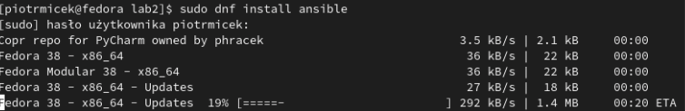
2. Zapewnienie łączność SSH
   * Utworzyłem klucz SSH na nowej maszynie   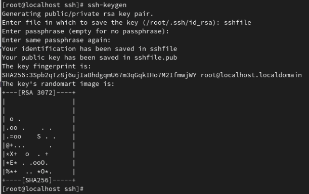
   * Dokonałem wymiany kluczy między maszynami   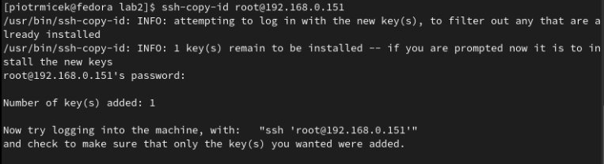
   * Teraz do połączenia nie są wymagane hasła   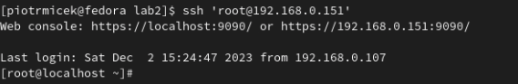
3. Inwentaryzacja systemów
   * Utworzyłem plik inwenteryzacji do którego wpisałem ip drugiej maszyny oraz nadałem nazwę dla grupy w której będzie się znajdowao "myhosts"   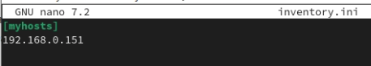   i zweryfikowałem go   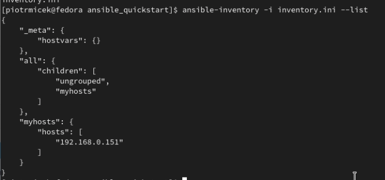
   * Zweryfikowałem łączność za pomocą ansible -m ping   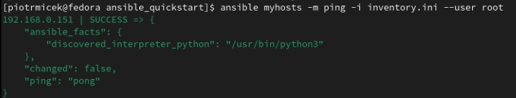
4. Zadanie
   * Utworzyłem plik playbook o nazwie miniplay.yaml który posłuży do automatycznego uruchomienia kontenera na drugiej maszynie   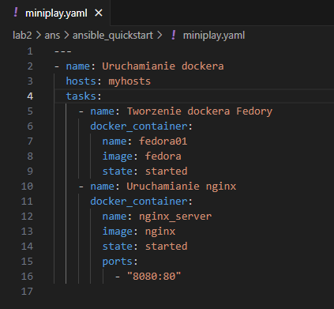
   * Użyłem playboook żeby automatycznie uruchomić nginx na drugiej maszynie co zakończyło się sukcesem   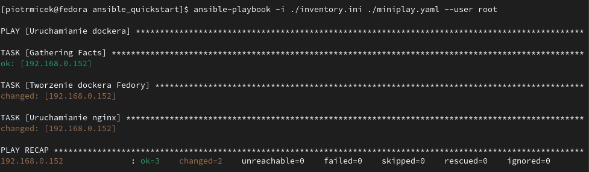

   
### Kickstart
1. Wykorzystałem plik odpowiedzi do stworzenia kickstart
   * Po zainstalowaniu drugiej maszyny znalazłem plik anaconda-ks.cfg, który zawierał opcje, które wybierałem podczas instalacji. Ten plik posłuży jako baza do pliku kickstar   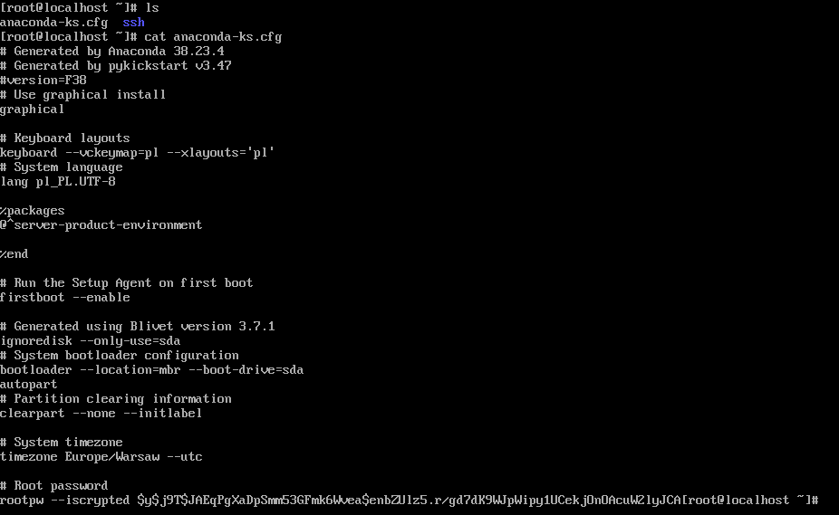
   * Komenda rpm -qa wyświetla mnóstow plików, więc skupiłem się na kilku np. ansible albo docker i dodałem je do pakietów w pliku kickstart.
   * dodałem do pliku repozytoria online 
     * url --mirrorlist=http://mirrors.fedoraproject.org/mirrorlist?repo=fedora-38&arch=x86_64
     * repo --name=updates --mirrorlist=http://mirrors.fedoraproject.org/mirrorlist?repo=updates-released-f38&arch=x86_64
   * zmiana clearpart na opcję -all sprawi, że dysk zawsze będzie formatowany.
   * wpisałem proste hasło za pomocą zwykłego tekstu, które będzie można edytować po instalacji systemu.
   * Na końcu dodałem komendę reboot aby system po instalacji zresetował się.
   * Po zmianach plik kickstart wygląda tak:   
   * Teraz mogę użyć go do zautomatyzowanej instalacji nowego systemu dodając komendę inst.ks="link do kickstart" do podstawowych komend instalatora. Wyjątkowo wykorzystałem, stronę pastebin, gdyż oferuje krótsze linki, które łatwiej wpisać w instalator.   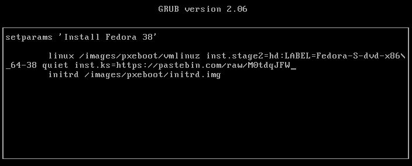
   * Dzięki temu instalator sam uzupełnia wszystkie opcje zgodnie z tym jak uzupełniłem je wcześniej i nie wymaga żadnej interakcji od użytkownika.   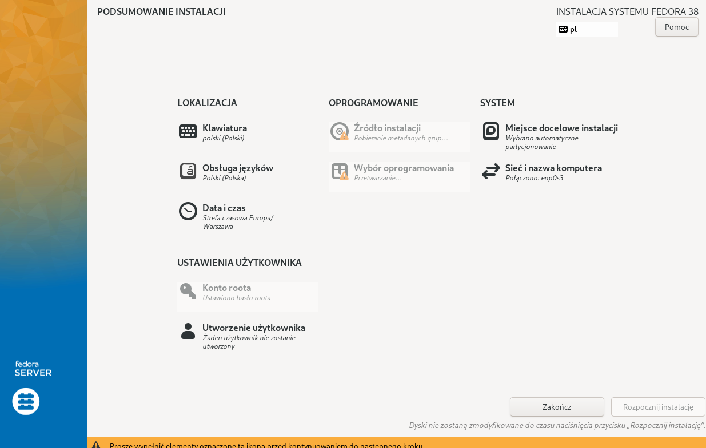

