 Wstęp

Celem zadania jest stworzenie dwóch kontenerów, które automatyzują proces budowy i testowania wybranej przez siebie aplikacji. W moim przypadku wybrałem niewielką aplikację redis-om-node, która spełnia wymogi zadaniu: otwarta licencja, narzędzie npm, zdefiniowane testy. Przed stworzeniem kontenerów zbudowałem i przetestowałem aplikację lokalnie w Fedora 38. 

* Na początku sklonowałem repozytorium wybranej aplikacji z github, za pomocą git clone.
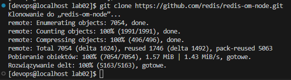

* Następnie wszedłem do utworzonego folderu (cd *nazwa_folderu*) i doinstalowałem zależności, które są zdefiniowane w package.json, są one potrzebne do poprawnego uruchomienia aplikacji. Użyłem do tego npm install.
  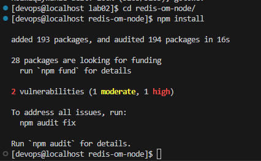

* Przeprowadziłem build aplikacji, który służy do tworzenia zoptymalizowanej kompilacji produkcyjnej. Wykorzystałem do tego npm run build.
  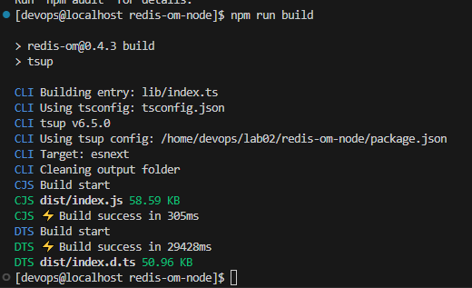

* W celu uruchomienia testów dołączonych do aplikacji, skorzystałem z npm test.
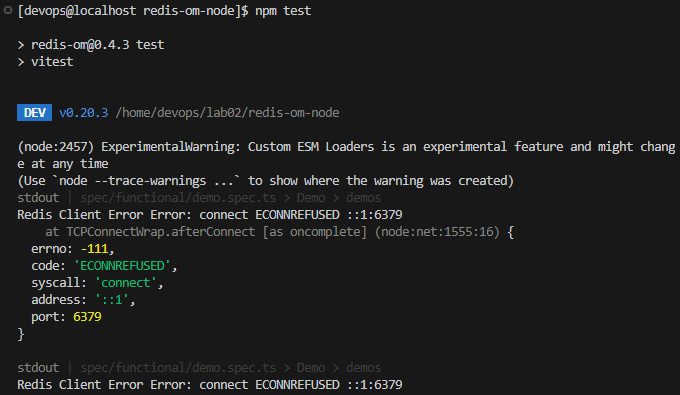

 Przeprowadzenie buildu w kontenerze

1. W związku z tym, że wybrana przez mnie aplikacja jest napisana w typescript, na obraz kontenera wybrałem najnowszą wersję node. Aby pobrać obraz node, użyłem komendy docker pull node.
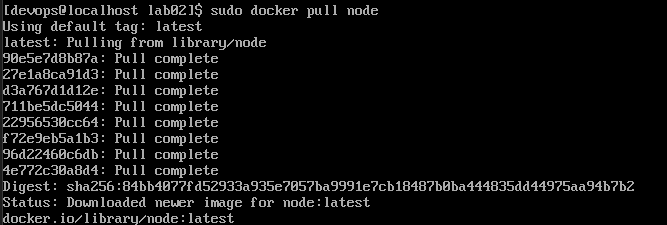

- W celu uruchomienia kontenera w trybie z podłączonym TTY, użyłem komendy docker run -it node sh. docker run - uruchamia kontener, -it - odpowiada za podłączenie TTY, node - obraz kontenera, sh - uruchomienie powłoki Shell 
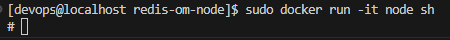

- W poniższych podpunktach wykorzystałem polecenia z wcześniejszego zadania, tyle że w kontenerze. 
Klonowanie aplikacji w kontenerze.
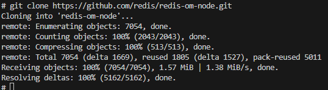

- Instalacja zależności w kontenerze.  
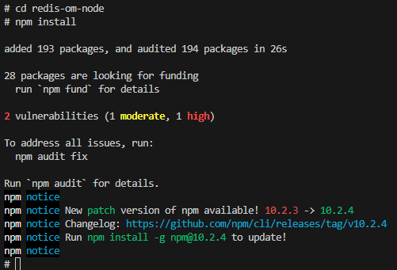

- Budowa aplikacji w kontenerze.    
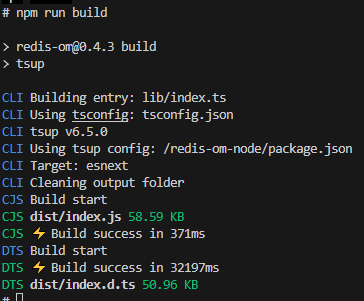

- Testowanie aplikacji w kontenerze. 

  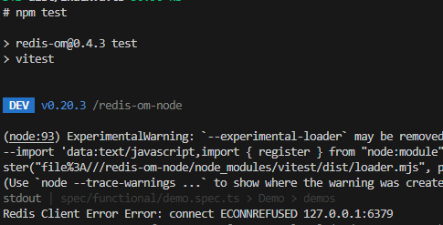

2. Stworzyłem plik Dockerfile-redisbld, odpowiedzialny za automatyczne przeprowadzenie wszystkich kroków od sklonowania repozytorium, do budowy aplikacji. 

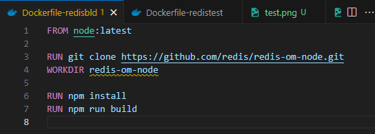
- FROM node:latest - określa obraz bazowy, w tym przypadku najnowsza wersja node.
- RUN git clone https://github.com/redis/redis-om-node.git - uruchomienie klonowania repozytorium aplikacji.
- WORKDIR redis-om-node - ustala katalog, w ktróym będą wykonywane następne instrukcje.
- RUN npm install - uruchomienie instalacji zależności aplikacji.
- RUN npm run build - uruchomienie budowy aplikacji.

* Dockerfile-redistest - to plik, który bazuje na pierwszym i  wykonuje testy aplikacji. 
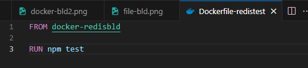
- FROM docker-redisbld - określa obraz bazowy. 
- RUN npm test - uruchomienie testów aplikacji.

3. Wdrażanie kontenerów przedstawione jest na poniższych zdjęciach.
- Wdrażanie konteneru z budową aplikacji. Kontener automatycznie wykonuje zadane mu polecenia w pliku Dockerfile i instaluje zależności. 
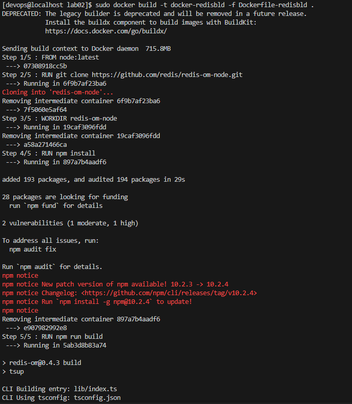
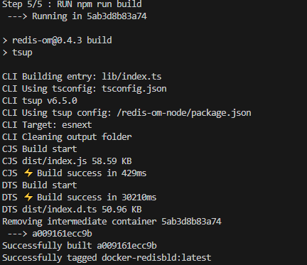
- Wdrażanie konteneru z testowaniem.

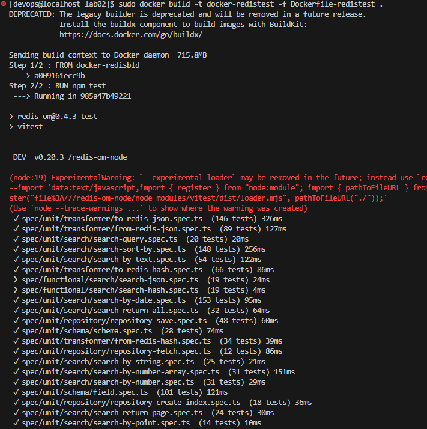
- Uruchomienie konteneru z budową. W tym kontenerze pracuje aplikacja redis-node.
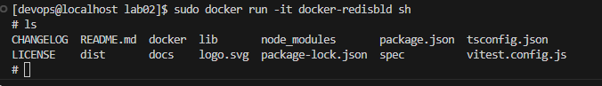

 

