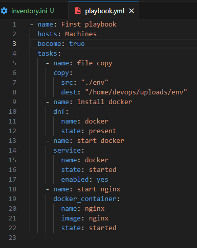

# Sprawozdanie 3
### Wstęp
Celem zajęć było zaznajomienie się z narzędziami Ansible i Kickstart poprzez praktyczne ćwiczenia, polegające na automatyzacji procesu instalacji i konfiguracji środowiska Docker oraz uruchomienia serwera WWW, a także na całkowicie nienadzorowanej instalacji maszyny wirtualnej.

### Instalacja zarządcy Ansible
W części z Ansible moim zadaniem było zainstalować na innej maszynie wirtualnej środowisko Docker, a następnie uruchomić w nim serwer WWW z własną konfiguracją.

W zadaniu wykorzystałem dwie wirtualne maszyny Fedora 38 z obrazu server netinst. Główną maszyną jest maszyna stworzona na wcześniejszych zajęciach (mainMachine), a drugą (subMachine) utworzyłem z domyślnymi parametrami konfiguracji. W ustawieniach sieciowych wybrałem swoją karte sieciową, aby maszyna mogła być podłączona do sieci. Dodałem również konto administratora o takiej samej nazwie jaką mam na głównej maszynie - devops. 

Na głównej maszynie zainstalowałem Ansible, za pomocą polecenia `sudo dnf install ansible`.

### Inwenteryzacja systemów
W celu dokonania inwetaryzacji systemów, na początku ustaliłem przewidywalne nazwy komputerów stosując polecenie `hostnamectl set-hostanme --nazwa_hosta`.

Maszyna główna z ansible
Maszyna klienta

W obydwu maszynach dodałem adresy ip i nazwy hostów maszyn w pliku `/etc/hosts`, aby mogły się rozpoznawać po nazwach. 

Na maszynie z ansible dodałem plik inventory.ini w wybranym katalogu i go skonfigurowałem, w celu identyfikacji oraz grupowania hostów. Grupa Machines to maszyny, z którymi będę się łączył.

Następnie sprawdziłem łączność pomiędzy maszynami za pomocą komend: `ping --nazwa_hosta` , `ansible --nazwa_grupy_hostow -i --sciezka_inventory -m ping`

### Zapewnianie łączności SSH
Na subMachine utworzyłem klucz SSH przy użyciu polecenia `ssh-keygen -t --rodzaj_klucza -b --dlugosc_klucza`, na maszynie głównej posiadam stworzony klucz z ostanitch zajęć.

Za pomocą polecenia `cat sciezka_klucza` można sprawdzić czy klucz został utworzony.

Następnie przesłałem między maszynami utworzone klucze publiczne, aby było możliwe wzajemne łączenie bez podawania haseł. Korzystam z polecenia:`ssh-copy-id -i --sciezka_klucza --nazwa_hosta`

Jak można zauważyć na poniższych ss, łączenie za pomocą ssh odbywa się bez podawania haseł.

Następnie przeszedłem do utworzenia playbooku na głównej maszynie. Playbook to zbiór instrukcji do wykonania przez wybrane hosty, zapisywany jest w formacie YAML. Przed playbookiem, stworzyłem jeszcze plik `env` przechowujący przykładowe zmienne środowiskowe. 

W tym zadaniu, playbook na wybranych maszynach ma wykonać:
* skopiowanie pliku env 
* instalacje Dockera
* uruchomienie kontenera nginx 

`name` - nazwa playbooku/zadania
`hosts` - grupa hostów
`become: true` - praca z uprawnineiami administratora
`tasks` - zadania do wykonania 

Przed uruchomieniem playbooka, w subMachine utworzyłem folder `uploads`.

Aby uruchomić playbook należy użyć komendy: `ansible-playbook -i --sciezka_inventory --sciezka_playbook` 

Jak można zauważyć, wszystkie zadania się wykonały, nginx na subMachine działa poprawnie.

### Kickstart
W tej części miałem wykonać instalacje w trybie całkowicie nienadzorowanym maszyny wirtualnej z Fedorą, zawierającą dokładnie to oprogramowanie, które było potrzebne na zajęciach.

### Plik odpowiedzi, wybrane usprawnienie
Na początku na maszynie z minimalnym zbiorem oprogramowania (subMachine), wydobyłem plik odpowiedzi anaconda-ks.cfg za pomocą polecenia `sudo cat /root/anaconda-ks.cfg`

Modyfikacja pliku anaconda: 
- zmieniłem `clearpart --none` na `clearpart --all`, aby zapewnić, że maszyna zawsze będzie formatować całość. 
- w sekcji `%packages` dodałem kilka pakietów z zainstalowanych na maszynie głównej. Można je zobaczyć używając polecenia `rpm -qa`
- dodałem również sekcje `%post` z instalacją i uruchomieniem `lighttpd`
- w sekcji `rootpw` można zmienić hasło administratora 
- w przypadku korzystania z minimalnej wersji netinst należy dodać repozytoria online 
`url --mirrorlist=https://mirrors.fedoraproject.org/mirrorlist?repo=fedora-38&arch=aarch64`
`repo --name=updates --mirrorlist=http://mirrors.fedoraproject.org/mirrorlist?repo=updates-released-f38&arch=aarch64`

Plik anacondy umieściłem na github pod linkiem: `https://raw.githubusercontent.com/InzynieriaOprogramowaniaAGH/MDO2024/WS409262/GCL3/WS409262/Lab03/anaconda-ks.cfg`. Ważne aby wczytywać plik w formacie raw.

### Instalacja
Aby zainstalować system z utworzonego pliku odpowiedzi, utworzyłem nową maszynę w VirtualBox i uruchomiłem ją. W instalatorze wybrałem install Fedora, kliknąłem przycisk `e`, dodałem komende `inst.ks=`,  wprowadziłem link do mojego pliku odpowiedzi i uruchomiłem bootowanie za pomocą przycisku `F10`.

Instalacja systemu przebiegła bez mojej ingerencji, wszystkie właściwości konfiguracyjne automatycznie się uzupełniły. Na końcu instalacji wcisnąłem jedynie przycisk ponownego uruchomienia. Po ponownym uruchomieniu należy usunąć obraz z napędu maszyny, aby maszyna nie bootowała obrazu na nowo.

Jak widać na poniższym ss, zdefioniowane przez mnie pakiety do instalacji w pliku odpowiedzi, zostały automatycznie zainstalowane w systemie.

 
 Niestety `Lighttpd` nie uruchomił się automatycznie, więc sam go uruchomiłem poleceniem `systemctl start lighttpd`. 

