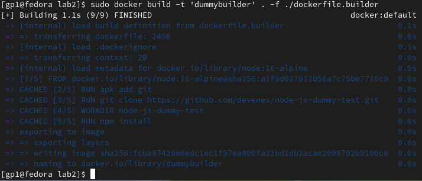
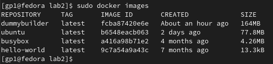
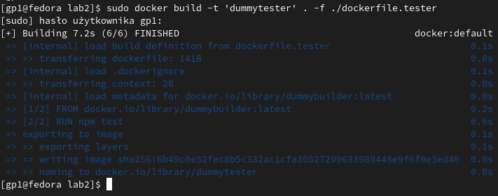

# Sprawozdanie Lab 2
## Cel ćwiczenia
Celem zadania było zdobycie praktycznej wiedzy na temat struktury kontenerów za pomocą narzędzia Docker oraz plików Dockerfile.
## Wykorzystane narzędzia
- Oracle VM VirtualBox -> do stworzenia wirtualnej maszyny z systemem Fedora Linux 38, na której została wykonana całość zadania
- Git -> do pracy na repozytorium umieszczonym w serwisie Github, do którego połączenie zostało wykonane przy użyciu poświadczeń klucza SSH, domyślnie zainstalowany na Fedora Linux 38.
- Docker -> do konteneryzacji, został zainstalowany, uruchomiony oraz przetestowany za pomocą poniższych komend:
```bash
sudo dnf install docker-ce docker-ce-cli containerd.io docker-buildx-plugin docker-compose-plugin
sudo systemctl start docker
sudo docker run hello-world
```
- SSH -> do klonowania repozytorium z Github'a.
- NPM-> Menadżer pakietów dla środowiska Node.js jest domyślnie zainstalowany w kontenerze, który został skonfigurowany z systemem Alpine 16.
- Stackedit.io -> do pracy nad sprawozdaniem.
## Wybrane repozytorium
W ramach zajęć konieczne było znalezienie repozytorium spełniającego następujące kryteria:
- Posiadanie licencji open source
- Obecność pliku Makefile oraz testów

Zdecydowałem się na repozytorium https://github.com/devenes/node-js-dummy-test. Wybrane źródło spełnia wszystkie wymienione wyżej kryteria, a dodatkowo w swojej dokumentacji zawiera opis tworzenia plików Dockerfile, co znacznie ułatwi proces tworzenia własnych plików tego typu.
## Tworzenie dockerfile.builder
Dockerfile.builder zawiera instrukcje służące do utworzenia środowiska z zainstalowaną wybraną aplikacją:
```bash
FROM node:16-alpine
RUN apk add git
RUN git clone https://github.com/devenes/node-js-dummy-test.git
WORKDIR node-js-dummy-test
RUN npm install
```
Zgodnie z dokumentacją aplikacji, wybieramy obraz Alpine 16 jako bazowy dla naszego kontenera. Instalujemy pakiet git w naszym środowisku, a następnie klonujemy wybrane repozytorium z naszą aplikacją. Zmieniamy bieżący folder na ten zawierający nasze repozytorium. Uruchamiamy proces budowy aplikacji, korzystając z menedżera pakietów do Node.js (npm), zgodnie z instrukcjami dostępnymi w dokumentacji.
## Budowa obrazu z pliku dockerfile.builder
Do zbudowania obrazu należy wykorzystać następującą komendę:
```bash
sudo docker build -t 'dummybuilder' . -f ./Dockerfile.builder
```
Do budowy obrazu Dockera należy wybrać plik dockerfile.builder i przypisać mu tag 'dummybuilder'. To ułatwi wygodne odwoływanie się do niego w poleceniach i skryptach, a także ułatwi wyszukiwanie. W przypadku braku taga, należałoby korzystać z identyfikatora ID do odnalezienia właściwego obrazu.

Żeby się upewnić czy obraz został utworzony należy skorzystać z komendy:
```bash
sudo docker images
```


## Tworzenie dockerfile.tester
Dockerfile.tester jako obraz testowy wykorzystuje wcześniej utworzony przez nas obraz Dockerowy z pliku dockerfile.builder i uruchamia na nim testy:
```bash
FROM dummybuilder:latest
RUN npm test
```

Obraz bazowy to najnowsza wersja naszego kontenera budującego. Uruchamiamy testy zgodnie z dokumentacją aplikacji, w tym przypadku przy użyciu narzędzia npm.
## Budowa obrazu z pliku dockerfile.tester
Do zbudowania obrazu należy wykorzystać następującą komendę:
```bash
sudo docker build -t 'dummytester' . -f ./Dockerfile.tester
```
Do budowy obrazu należy wykorzystać plik dockerfile.tester oraz dla ułatwienia nadać mu tag dummytester.

Na zrzucie ekranu widać, że testy przy budowaniu wyszły pomyślnie.
## Podsumowanie
W opisany powyżej sposób utworzyliśmy dwa obrazy kontenerów: jeden do budowy, a drugi do testowania wybranej przez nas aplikacji. Dla każdej aplikacji zawartość plików Dockerfile będzie się różnić, zależnie od wymagań danego środowiska i charakterystyki aplikacji. Niemniej jednak, sam proces tworzenia obrazów pozostaje niezmienny. Dzięki takiemu podejściu, niezależnie od hosta, na którym pracujemy, możemy łatwo tworzyć środowiska dostosowane do konkretnych potrzeb naszych aplikacji.
