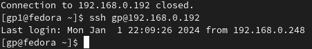
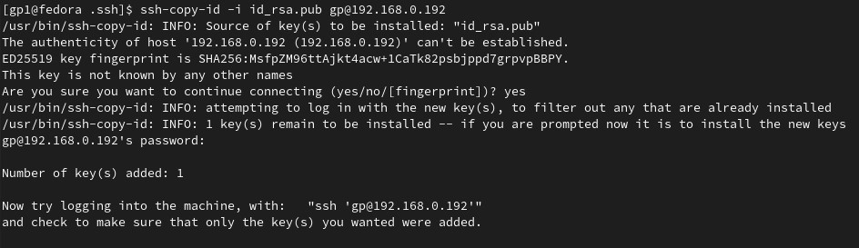
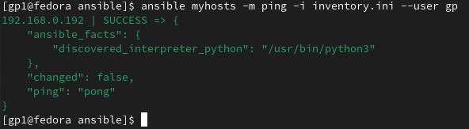
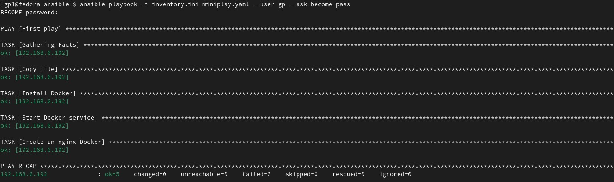
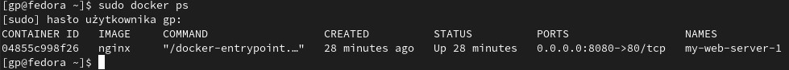
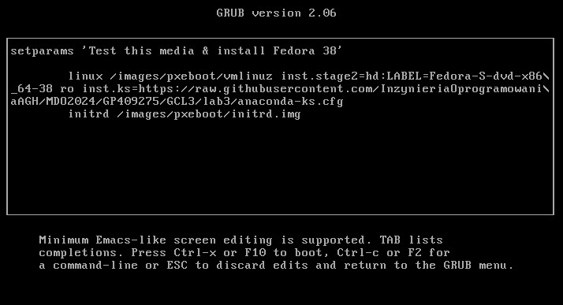

# Automatyzacja instalacji i scenariuszy poleceń
## Cel ćwiczenia
Ćwiczenie ma na celu zaznajomienie się z narzędziem Ansible oraz procesem automatyzacji konfiguracji maszyn wirtualnych. Główne etapy obejmują instalację Ansible, utworzenie drugiej maszyny wirtualnej z systemem Fedora o minimalnym zestawie oprogramowania, inwentaryzację systemów, zapewnienie łączności SSH, i ostatecznie wykonanie zadań na zdalnych maszynach za pomocą Ansible. Dodatkowo, zadanie Kickstart polega na zautomatyzowanej instalacji maszyny wirtualnej z Fedorą przy użyciu pliku odpowiedzi.
## Konfiguracja połączeń między maszynami
W tym celu skorzystamy z komendy **ssh-copy-id**, która automatycznie skonfiguruje połączenie pomiędzy naszymi maszynami, pozwoli nam to na nieużywanie hasła w przyszłości.
1. Generowanie klucza SSH na maszynie bazowej
```bash
ssh-keygen
``` 
Podana komenda wygeneruje dla nas parę kluczy - prywatny oraz publiczny (ten z rozszerzeniem .pub). Klucz zostanie automatycznie umieszczony w folderze ~/.ssh/ i otrzyma domyślną nazwę id_rsa (zastosowana metoda szyfrowania RSA).

2. Przesłanie na zdalną maszynę klucza
```bash
ssh-copy-id -i id_rsa.pub gp@192.168.0.192
```
Za pomocą flagi -i podajemy ścieżkę do klucza. W moim przypadku mogłem skorzystać z krótszej formy -i id_rsa.pub, ponieważ już znajdowałem się w folderze ~/.ssh/, gdzie przechowywany był klucz.
Komenda do skopiowania:
```bash
ssh-copy-id -i ~/.ssh/NAZWA_KLUCZA.pub REMOTE_USER@REMOTE_IP
```


3. Łączenie z maszyną przy użyciu SSH

Za pomocą poniższej komendy łączymy się zdalnie z drugą maszyną. Dzięki poprawnemu wykananiu poprzedniego kroku nie ma potrzeby podania hasła przy każdym połączeniu.
```bash
ssh gp@192.168.0.192
```



## Instalacja Ansible
1. Używany poniższej komendy do instalacji
```bash
sudo dnf install ansible
```
2. Tworzymy folder o nazwie 'ansible' w katalogu domowym, w którym będziemy przechowywać nasze pliki konfiguracyjne.
```bash
mkdir ansible
```
3. Tworzenie pliku inventory

Plik inventory to plik, w którym definiujemy nasze maszyny, na których będziemy wykonywać polecenia.
```bash
touch inventory.ini
nano inventory.ini
```

Wewnątrz rozpoczynamy od zdefiniowania grupy hostów, w naszym przypadku nazwanej 'myhosts'. Poniżej tej grupy definiujemy poszczególne hosty, które do niej należą. Wypisujemy je po jednym w linii, korzystając zarówno z adresów IP, jak i nazw hostów.

4. Sprawdzamy połączenie Ansible

W tym celu skorzystamy z narzędzia ping wbudowanego w Ansible. To narzędzie sprawdzi, czy wszystkie hosty zdefiniowane w pliku inventory są dostępne.
```bash
ansible myhosts -m ping -i inventory.ini --user gp
```

-   myhosts  - nazwa grupy hostów
-   -m ping  - moduł, który chcemy wykonać
-   -i inventory.ini  - plik inventory
-   --user dawid2  - użytkownik, którym chcemy się zalogować na zdalną maszynę, jeśli jest taki sam jak lokalnie, możemy pominąć tą flagę.

Rezultat przy poprawnym wykonaniu powinien być taki:

 

## Tworzenie playbooków
Playbooki to pliki, w których definiuje się zadania, które mają być wykonane na zdalnej maszynie.
Tworzymy nowy plik miniplay.yaml w folderze ansible.
```bash
touch miniplay.yaml
nano miniplay.yaml
```
Wewnątrz pliku należy zdefiniować zadania, które mają się wykonać.
```bash
 - name: First play
  hosts: myhosts
  tasks:
    - name: Copy File
      copy:
        src: /home/gp1/ansible/env.txt
        dest: /home/gp/uploads/env.txt
    - name: Install Docker
      become: true
      dnf:
        name: docker
        state: latest
    - name: Start Docker service
      become: true
      systemd:
        name: docker
        state: started
        enabled: yes
    - name: Create an nginx Docker
      become: true
      docker_container:
        name: my-web-server-1
        image: nginx
        state: started
        ports:
          - "8080:80"
```
 - become: true - flaga, która pozwala nam na uruchomienie komendy jako root, ponieważ domyślnie ansible korzysta z użytkownika, którym się zalogowaliśmy na zdalną maszynę.
- dnf - moduł, który pozwala nam na instalację pakietów
- state - stan pakietu, w tym przypadku latest czyli najnowsza wersja
- systemd - moduł, który pozwala nam na uruchamianie usług
- state - stan usługi, w tym przypadku started czyli uruchomiona
enabled - czy usługa ma być uruchamiana przy starcie systemu
 - name - nazwa zadania
 - hosts - grupa hostów, na których chcemy wykonać zadanie, zdefiniowana w pliku inventory
 - tasks - zadania, które chcemy wykonać
 - copy - moduł, który chcemy wykonać, w tym przypadku kopiowanie pliku
 - src - ścieżka do pliku, który chcemy skopiować (obecna maszyna)
 - dest - ścieżka, gdzie chcemy zapisać plik (docelowa maszyna)
 - docker_container - tworzenie kontenera dockerowego
 - List item
	- name - nazwa kontenera
	- image - obraz, który chcemy uruchomić
	- state - stan kontenera, w tym przypadku started czyli uruchomiony
	- ports - porty, które chcemy przekierować, format 		HOST_PORT:CONTAINER_PORT

Na początku należy stworzyć folder na docelowej maszynie, w którym będą przechowywane pliki.
```bash
ssh gp@192.168.0.192
mkdir ~/uploads
```
## Uruchamianie playbooków
Playbooki można uruchamiać w trybie testowym, aby sprawdzić czy wszystko działa poprawnie. W tym celu należy dodać flagę --check do komendy.
Tryb testowy nie aplikuje zmian, a jedynie sprawdza czy wszystko działa poprawnie.

```bash
ansible-playbook -i inventory.ini miniplay.yaml --user gp --ask-become-pass
```




## Kickstart - automatyczna instalacja systemu
Kickstart to narzędzie, które pozwala na automatyczną instalację systemu operacyjnego.
Podmieniamy w configu linijkę clearpart --none --initlabel na clearpart --all --initlabel, pozwoli nam to instalować system na maszynie, która już ma zainstalowany system.
Do pliku dodaliśmy również:
```bash
url --mirrorlist=https://mirrors.fedoraproject.org/mirrorlist?repo=fedora-38&arch=aarch64
repo --name=updates --mirrorlist=http://mirrors.fedoraproject.org/mirrorlist?repo=updates-released-f38&arch=aarch64
```

Na maszynie głównej, z większą ilością pakietów, odpalamy komendę:

```bash
rpm -qa > packages.txt
```
Dzięki czemu w pliku packages.txt jest lista wszystkich pakietów zainstalowanych na mazynie.
Aby automatycznie doinstalowały się pakiety podczas instalacji z kickstartem musimy dopisać np.:
```bash
# Custom packages
moby-engine
docker-compose
ansible
```



## Tworzenie ISO wraz z plikiem kickstart
Pobieramy obraz systemu w wersji iso lub jeśli mamy go na dysku, możemy skopiować go używając scp.
```bash
sudo dnf install -y lorax pykickstart

sudo ksflatten -c anaconda-ks.cfg -o flatten.ks

sudo livemedia-creator --make-iso --ks flatten.ks --no-virt --iso-only --iso-name image.iso --releasever 38
```
