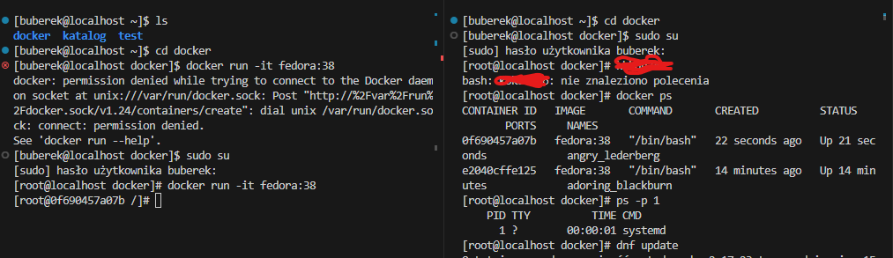

# Sprawozdanie z Laboratorium

## Wstęp

Sprawozdanie to dokumentuje wszystkie kroki i etapy przeprowadzonego projektu związane z instalacją i konfiguracją narzędzi takich jak Git i Docker. Celem projektu było pozyskanie umiejętności pracy z systemem kontroli wersji Git oraz platformą do konteneryzacji aplikacji Docker. Wszystkie etapy projektu są  opisane w kolejnych sekcjach tego sprawozdania.


Następnie w procesie przygotowania środowiska do zajęć wybieramy oprogramowanie z otwartą licencją, zawierające narzędzia Makefile i testy jednostkowe. Następnie tworzymy dwa pliki Dockerfile: pierwszy do budowy oprogramowania, a drugi do uruchamiania testów, co pozwala na automatyczne zarządzanie budową i weryfikacją jakości oprogramowania w izolowanych kontenerach.

---

## Kroki Wykonane w Projekcie

### 1. Instalacja klienta Git i obsługi kluczy SSH

W celu instalacji gita użyto komendy

```
sudo dnf install git
```

W celu odpalenia servera ssh komend:

```
sudo systemctl enable sshd.service
```

```
sudo systemctl start sshd.service
```

Klucze ssh wygenerowano za pomocą komendy
`ssh-keygen`Po czym umieszczono je w ustawieniach konta github
Dostęp do maszyny przez ssh za pomocą programu Visual Studio Code 
Wybrałem Visual Studio Code do połączenia się przez SSH do mojej Fedory ze względu na jego zaawansowane funkcje, w tym wbudowane narzędzia do pracy zdalnej i obsługę rozszerzeń.

#### Zrzuty ekranu:


---

### 2. Klonowanie repozytorium za pomocą HTTPS

Repozytorium sklonowano za pomocą poniższej komendy

#### Zrzut ekranu:


---

### 3. Dostęp do repozytorium i klonowanie za pomocą SSH
### 4. Tworzenie kluczy SSH, praca na nowej gałęzi

Procesu dokonano za pomocą poniższych komend

#### Zrzut ekranu:


---

### 5. Ćwiczenia z Dockerem, Busybox

Punkt rozpoczęto od zainstalowania dockera komendą 

```
sudo dnf install docker
```

#### Zrzut ekranu:


Podczas próby pobrania busyboxa natknięto się na problem z prawami rozwiązany poprzez zalogowanie się jako administrator


System w kontenerze uruchomiono, pakiety pokazano i zaktualizowano za pomocą komend:
```
docker run -it fedora:34
ps -p 1
docker ps
dnf update
```





### 6. Wybór oprogramowania

---

W dalszej części do ćwiczenia wybrano oprogramowanie

` https://github.com/soveran/clac  `

Repozytorium jest licencjonowane na podstawie licencji MIT, która jest otwartą i elastyczną licencją, pozwalającą na swobodne użycie, modyfikację i dystrybucję kodu źródłowego.

Zawiera ono również narzędzia Makefile, które umożliwiają budowanie oraz uruchamianie testów, co spełnia wymagania projektu. Jest to prosty kalkulator co ułatwia proces budowania i testowania.


### 7. Dalszy Przebieg

Rozpoczynamy oczywiście od uruchomienia kontenera oraz instalujemy gita oraz gcc wymagane do kompilacji programu napisanego w C.

` docker run -ut fedora bash `

` dnf install -y gcc `

` dnf install -y git `


klonujemy repozytorium

``` 
git clone https://github.com/soveran/clac
```


Kolejno w kontenerze zbudowano program i odpalono testy, które nie wykazały problemów, więc można była odpalić program

` make install `

` ./tests.sh `


Jako, że testy były z innym katalogu to oczywiście przenosimy je do katalogu z programem

` mv tests.sh .. `


### Pliki Dockerfile 

Na końcu powtarzamy kroki z punktu 8 za pomocą plików Dockerfile

Pierwszy - powtarza wszystko do builda, a drugi odpala test na kontenerze.

```
 FROM fedora
    RUN dnf -y install git gcc 
    RUN git clone https://github.com/soveran/clac
    WORKDIR /clac
    Run make install
```

Odpalamy go komendą

`sudo docker build -t clac -f Dockerfile . `


Podobnie z drugim Dockerfilem

` sudo docker build -t clactest -f Dockerfile2 . `


