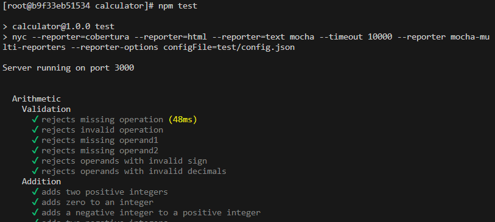

Michał Starzyk
# Sprawozdanie 2   Docker files, kontener jako definicja etapu

## Cel projektu
* Celem projektu, było zbudowanie programu w kontenerach, a następnie sprawdzenie poprawności testów. 

## Wykonanie zadania
### Wybór oprogramowania
* Użyłem repozytorium kompilujące się przez „npm” oraz gotowymi testam, a następnie sklonowałem je na mój dysk. https://github.com/actionsdemos/calculator.git
  
* Następnie zgodnie z plikiem README zainstalowałem i zbudowałem program poprzez npm.
  
  
  
*  Na koniec przeprowadziłem testy, które zakończyły się pomyślnie.
  
  
### Build w kontenerze
1. Na początek zrobiłem build i test wewnątrz kontenera
   * Stworzyłem kontener z obrazem Fedory, ponieważ sam też testowałem je na maszynie z Fedorą.
    
   * Pobrałem Gita, który był potrzebny do sklonowania aplikacji na mojej Fedorze oraz sklonowałem repozytorium, a następnie pobrałem nodejs do uruchomienia npm.
    
  
   * Uruchomiłem npm install
    
  
   * Kolejnym krokiem było uruchomienie testów, które przeszły pomyślnie.
  
  
2. Stworzenie dwóch plików Dockerfile automatyzujących kroki
    * Pierwszy plik był builderem dla mojej aplikacji, poprzez pobranie najnowszego noda następnie sklonowanie repozytorium oraz zbudowanie go przez npm install.
    
    * Natomiast drugi plik służył do testów mojego programu poprzez użycie npm test.
        
        
        
3. Pokazanie, że kontenery działają prawidłowo
   * Stworzyłem obraz kontenera za pomocą pierwszego pliku Dockerfile calculatorbld
       
   * Nastepnie stworzylem kolejny obraz za pomocą drugiego pliku dockerfile calculatortest, który przeprowadził pomyślnie testy
    
  
   * Po ich zainiconowaniu obraz calculatorbld oraz calculatortest znajdują się na liście 
  

