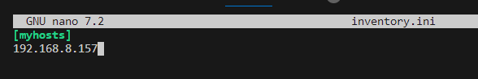

Michał Starzyk
# Sprawozdanie 2   Automatyzacja instalacji i scenariuszy poleceń
## Wstęp
* Celem projektu, było zainstalowanie Ansible i połączenie się z drugą maszyną oraz stworzenie pliku kickstart.
* Zainstalowałem Ansible, pobrałem klucz ssh z drugiej maszyny i mogłem logować się bez potrzeby wpisywania hasła. Za pomocą pliku konfiguracyjnego *.yaml automatycznie uruchomiłem dockera na drugiej maszynie i wystartowałem kontener z nginx.
* Na podstawie pliku anaconda-ks.cfg z zainstalowanej maszyny stworzyłem plik kickstart, którego użyłem do zautomatyzowanego zainstalowania się Fedory na nowej maszynie.
## Wykonanie zadania
### Ansible
1. Instalacja zarządcy Ansible
   * Zainstalowałem Fedorę Server na drugiej maszynie 
     
   - Następnie zainstalowałem Ansible na pierwszej maszynie
   
2. Zapewnienie łączność SSH
   * Kolejnym krokiem było utworzenie klucza SSH na nowej maszynie 
  
   * Oraz wymiana kluczy między maszynami 
  
   * Sprawdziłem i do połączenia nie są wymagane hasła
   
3. Utworzenie pliku inventory 
   * Utworzyłem plik inwenteryzacji, w którym definiujemy nasze maszyny, wpisałem do niego ip drugiej maszyny oraz nadałem nazwę dla grupy w której będzie się znajdowło "myhosts" 
     
  
i zweryfikowałem go
   
   * Następnie sprawdziłem połączenie za pomocą ansible przy użyciu ansible myhosts -m ping -i inventory.ini --user mstarzyk2
  
4. Playbook (To pliki, w których definiujemy zadania, które chcemy wykonać na zdalnej maszynie)
   * Na początek utworzyłem plik playbook o nazwie miniplay.yaml, który będzie służył do automatycznego uruchomienia kontenera na drugiej maszynie, oraz zdefiniowałem zadanie które będzie wykonywać.
   
  
   * Następnie użyłem playbook, zgodnie z zadaniem, poprzez komendę ansible-playbook -i inventory.ini miniplay.yaml --user mstarzyk2 --ask-become-pass
  

  ### Kickstart (narzędzie pozwalające na automatyczną instalacje systemu operacyjnego)
1.	Na drugiej maszynie znalazłem plik anaconda-ks.cfg, za pomocą komendy, sudo cat /root/anaconda-ks.cfg, zawiera on opcje, które wybierałem podczas instalacji. Posłuży jako baza do pliku kickstar
   
  
   * Przez komendę rpm -qa wyświetliłem pakiety zainstalowane na głownej maszynie i dodałem do pliku kickstart ansible oraz docker.
  
   *Następnie dodałem do pliku repozytoria online 
     * url --mirrorlist=http://mirrors.fedoraproject.org/mirrorlist?repo=fedora-38&arch=x86_64
     * repo --name=updates --mirrorlist=http://mirrors.fedoraproject.org/mirrorlist?repo=updates-released-f38&arch=x86_64
   * zmieniłem clearpart na opcję -all co sprawi, że dysk zawsze będzie formatowany.
   * zamieniłem hasło na abc0, które będzie można edytować po instalacji systemu.
   * Ostateczna wersja pliku kickstart wygląda tak:
   
   * Po ukończeniu tworzenia pliku kick start mogłem użyć go do zautomatyzowanej instalacji nowego systemu, więc na maszynie wirtualnej zainstalowałem dysk z Ferdorą oraz zrestartowałem maszynę, następnie po załadowaniu kliknąłem na klawiaturze e co mnie przeniosło do edycji GRUB tam dodałem komendę inst.ks=https://raw.githubusercontent.com/InzynieriaOprogramowaniaAGH/MDO2024/MS409229/MS409229/config.cfg do podstawowych komend instalatora, oraz uruchomiłem instalację przez ctrl+x.
  
   * Instalator sam uzupełnił wszystkie opcje zgodnie z moim plikiem kickstart i nie wymaga żadnej interakcji od użytkownika.
   
  
* Z usprawnień wybrałem dodanie do pliku odpowiedzi instalacji i uruchomienia kontenera lighttpd. Więc po przerobieniu pliku kickstart wygląda on ostatecznie tak.
  

