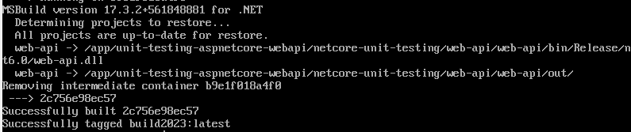
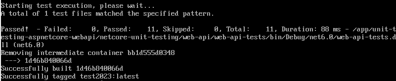
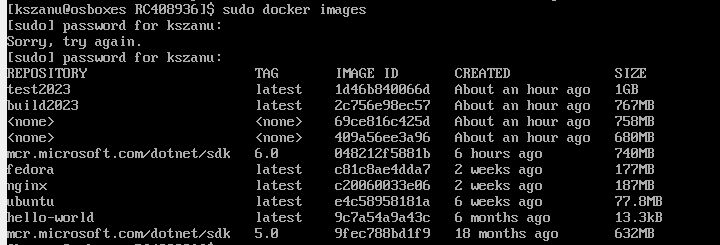

## Sprawozdanie z MTG02

### Do wykonania tego ćwiczenia użyłem:

- git
- Visual Studio Code
- VirtualBox, na którym mam zainstalowaną Fedorę
- Docker, który zainstalowaliśmy na Fedorze na wcześniejszych zajęciach.

### Na tych zajęciach miałem znaleźć:

Repozytorium z kodem dowolnego oprogramowania, które:
- Dysponuje otwartą licencją.
- Jest umieszczone wraz ze swoimi narzędziami Makefile tak, aby możliwe był uruchomienie w repozytorium czegoś na kształt `make build` oraz `make test`. Środowisko Makefile jest dowolne. Może to być automake, meson, npm, maven, nuget, dotnet, msbuild...
- Zawiera zdefiniowane i obecne w repozytorium testy, które można uruchomić np. jako jeden z "targetów" Makefile'a. Testy muszą jednoznacznie formułować swój raport końcowy (gdy są obecne, zazwyczaj taka jest praktyka).

### I wybrałem: [unit-testing-aspnetcore-webapi](https://github.com/CodeMazeBlog/unit-testing-aspnetcore-webapi)

Powodami wybrania takiego repozytorium to, że spełnia ono wszytskie wymagania, nie ma w nim dużo testów, jest w języku, w którym piszę, no i najważniejsze, pojawiło mi się jako pierwsze w Google.

### Następnie zgodnie z instrukcją sklonowałem to repozytorium i przeprowadziłem build programu

Kroki, w jakich tego dokonałem:

1. Włączyłem VirtualBoxa i uruchomiłem Fedorę, na której się zalogowałem.
2. Kolejno połączyłem się za pomocą SSH w Visual Studio Code do tej Fedory za pomocą kodu: `ssh -p 3022 kszanu@127.0.0.1` (kszanu to moja nazwa użytkownika na Fedorze).
3. Dalej stworzyłem plik `Dockerfile.build`.

```Dockerfile
# Obraz bazowy .NET
FROM mcr.microsoft.com/dotnet/sdk:6.0 AS build

# Tworzenie folderu
RUN mkdir app

# Wchodzimy do katalogu
WORKDIR /app

# Aktualizacja
RUN apt-get update && \
    apt-get install -y git

# Klonowanie repo
RUN git clone https://github.com/CodeMazeBlog/unit-testing-aspnetcore-webapi.git

# Restore
RUN dotnet restore ./unit-testing-aspnetcore-webapi/netcore-unit-testing/web-api/web-api/web-api.csproj

# Build
WORKDIR /app/unit-testing-aspnetcore-webapi/netcore-unit-testing/web-api/web-api
RUN dotnet build -c Release

# Publish
FROM build as publish
WORKDIR /app/unit-testing-aspnetcore-webapi/netcore-unit-testing/web-api/web-api
RUN dotnet publish -c Release -o out
```
Wytłumaczenia do kodu:
-Wybrałem taki Obraz bazowy, ponieważ mój program jest w .NET i jest to najszybszy sposób najmniej trzeba doinstalowywać.
-Klonowanie repo to klonowanie repozytorium które sobie wybrałem.
# Do zbudowania , użyłem komendy:
```
docker build -t build2023 . -f ./Dockerfile.build
```
Wytłumacznia do polecenia:
-"build2023" to nazwa mojego builda, z której będe korzystał w uruchomieniu testów jednostkowych.

4. Następnym punktem było stworzenie pliku `Dockerfile.test`.
```Dockerfile
FROM build2023
#testy
WORKDIR /app/unit-testing-aspnetcore-webapi/netcore-unit-testing/web-api/web-api-tests
RUN dotnet test
```
Wytłumaczenia do kodu:
- FROM build2023, używamy wcześniej zbudowanego.
- a po "#testy" urchamiamy testy
5. ScreenShoty 

Poprawne wykonanie builda


Poprawne wykonanie testów


Stworzone image


6. A odnośnie pytania "Pamiętaj o różnicy między obrazem a kontenerem. Co pracuje w takim kontenerze?"

Kontener jest dynamiczną instancją obrazu aplikacji. Obraz zawiera wszystkie niezbędne zależności i kod aplikacji. Kontener to konkretne wykonywalne środowisko, które powstaje w wyniku uruchomienia obrazu. Każdy kontener działa jako izolowany proces systemowy na hostingu. Dzięki tej izolacji, kontenery umożliwiają jednolite wdrażanie aplikacji między różnymi środowiskami, eliminując potencjalne problemy związane z różnicami w konfiguracjach i zależnościach systemowych.