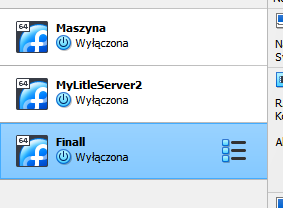
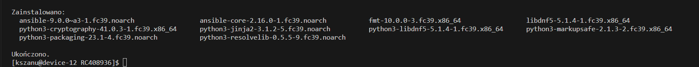
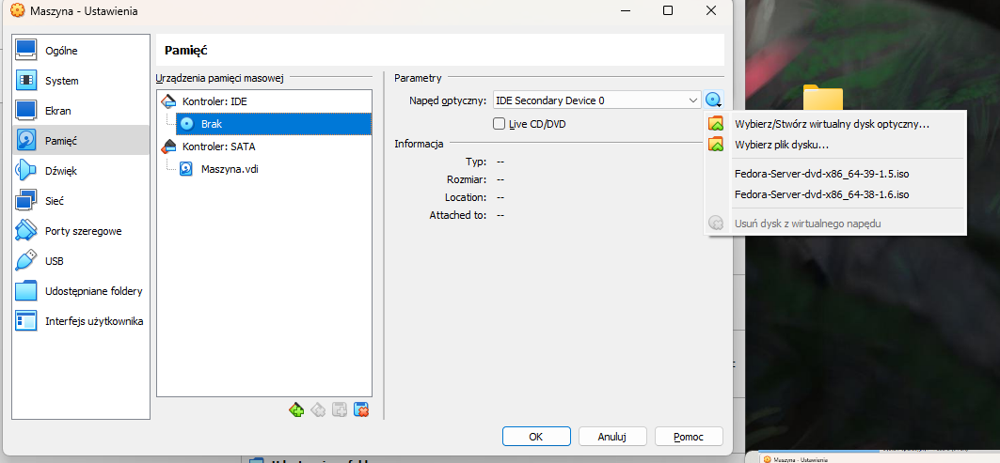
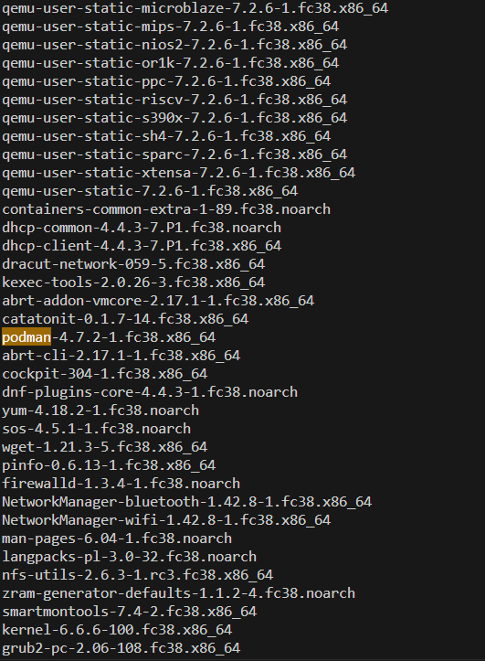

## Sprawozdanie z MTG03

### W tym ćwiczeniu miałem zrobić:
Z Ansible:
-Zainstalować zarządcy Ansible
-Utworzyć Inwentaryzację systemów
-Zapewnić łączność ssh
Z Kickstart:
-Utworzyć plik odpowiedzi
-Przeprowadić instalację z tego pliku odpwoiedzi

#### Ansible
1.Utworzyłem drugą maszynę z Fedorą

2.Zastosowałem taką samą nazwę i hasło dla użytkownika jak na maszynie pierwszej
3.I kolejno zainstalowałem na tej maszynie Ansible komendą: 
```bash 
sudo dnf install ansible
```
Oraz za radą korzystałem z  https://docs.ansible.com/ansible/2.9/installation_guide/intro_installation.html#installing-ansible-on-rhel-centos-or-fedora


4.Dokonałem inwetryzacji systemów


-kolejno stworzyłem plik inventory.ini i dodałem do niego nazwy i ip serwerów

-następnie pingowałem te maszyny by zobaczyć czy jest między nimi komunikacja


-Spingowałem te serwery za pomocą 
```bash 
ansible -m ping
```


5.Zapewnianiłem łączności SSH
-użyłem do tego polecenia, między maszynami
```bash 
ssh-copy-id
```
6.Zadanie
-Utwórzyłem plik zawierający lokalne środowisko env i skopiuj go na maszynę, do katalogu ~/uploads

-kolejno zainstalowałem dockera

-stworzyłem plik anaconda.cfg
```bash 
# Generated by Anaconda 38.23.4
# Generated by pykickstart v3.47
# version=F38

# Use text mode install
text

# Keyboard layouts
keyboard --vckeymap=pl --xlayouts='pl'

# System language
lang pl_PL.UTF-8

# Network configuration
network --bootproto=dhcp --device=link --onboot=on --activate

#Root password
user --groups=wheel --name=kszanu --password=Chrzanu312

# System timezone
timezone Europe/Warsaw --utc

# System bootloader configuration
bootloader --location=mbr --boot-drive=sda

# Clear the Master Boot Record
zerombr

# Partition clearing information
clearpart --all --initlabel

# Disk partitioning information
autopart

url --mirrorlist=http://mirrors.fedoraproject.org/mirrorlist?repo=fedora-38&arch=x86_64
repo --name=updates --mirrorlist=http://mirrors.fedoraproject.org/mirrorlist?repo=updates-released-f38&arch=x86_64

%packages
@^server-product-environment
@headless-management
# Dodaj tutaj dodatkowe pakiety z maszyny Fedora-2
podman

# Additional repositories
%end

%post --nochroot --log=/mnt/sysimage/root/ks-post.log
#!/bin/bash

# Tworzenie pliku usługi systemd dla kontenera lighttpd w zainstalowanym systemie
cat <<EOF > /mnt/sysimage/etc/systemd/system/lighttpd-container.service
[Unit]
Description=Lighttpd Container
Wants=network-online.target
After=network-online.target

[Service]
Restart=always
ExecStart=/usr/bin/podman run --name my-lighttpd-container -p 80:80 --rm docker.io/jitesoft/lighttpd
ExecStop=/usr/bin/podman stop my-lighttpd-container

[Install]
WantedBy=multi-user.target
EOF
%end

%post --log=/root/ks-post-script.log
#!/bin/bash

# Włączanie usługi, aby startowała przy każdym uruchomieniu systemu
chroot /mnt/sysimage /usr/bin/systemctl enable lighttpd-container.service
%end

# Run the Setup Agent on first boot
firstboot --enable
```
w którym zrobiłem:
-Na maszynie z minimalnym zbiorem oprogramowania, z zadania Ansible, wydobądź plik odpowiedzi (anaconda-ks.cfg)
-Na maszynie głównej, używanej do pozostałych zadań, znajdź zainstalowane pakiety (rpm -qa)
-Stwórz nowy plik odpowiedzi:
    *Bazuj na pliku z "małej maszyny"
    *Dodaj do niego listę pakietów z "dużej maszyny" (użyj tylko nazw, bez architektur i wersji, czyli np. ansible-9.0.0~a3-1.fc39.noarch wystarczy ansible). Przejrzyj listę manualnie, identyfikując samodzielnie doinstalowywane pakiety
    *Dodaj repozytoria online:
        **url --mirrorlist=http://mirrors.fedoraproject.org/mirrorlist?repo=fedora-38&arch=x86_64
        **repo --name=updates --mirrorlist=http://mirrors.fedoraproject.org/mirrorlist?repo=updates-released-f38&arch=x86_64
-Plik odpowiedzi może zakładać pusty dysk. Upenmij się, że zawsze będzie formatować całość, stosując clearpart --all zamiast clearpart --none-

To moje :
```bash 
rpm -qa
```

i umieściłem ten plik na moim repozytorium z githuba
7.Tworzenie nowej maszyny za pomocą pliku anaconda.cfg
-Do stowrzenia nowego serwa używamy tego samego obrazu iso
-Po uruchomieniu maszyny zobaczymy GRUB, wybieramy strzałkami opcję Install Fedora 38 i klikamy przycisk e
-Podajemy tutaj flagę inst.ks i raw naszego pliku

-Następuje instalacja


- najczęściej po instalacji może dojść do sytuacji, że zobaczymy ponownie GRUB z opcjami jak gdyby system się nie zainstalował. W takiej sytuacji wysuwamy w ustawieniach virtual box, dysk ISO z wirtualnego napędu

i sprawdzamy czy zainstalowało nam pakiety w szczególności podmana
